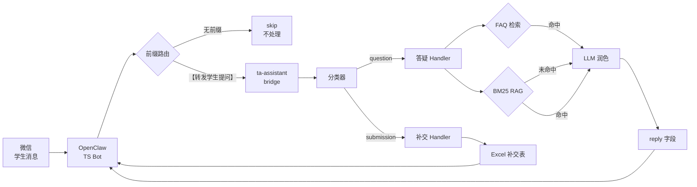

# TA Assistant — 课程助教自动化工具

> 基于 RAG + 规则分类的助教自动化工具,对接微信 Bot(OpenClaw),实现作业补交自动登记 + 学生提问智能回答。

<!-- TODO: 截图占位:微信消息 → OpenClaw 回复示例 -->
## 效果展示

<p align="center">
  
</p>

上图演示了三种场景：
- **学生提问**（加 `【转发学生提问】` 前缀）→ 走 FAQ / RAG 检索，返回带来源的答复
- **补交登记**（加 `【转发学生提问】` 前缀 + 姓名/学号/作业次数）→ 自动写入 Excel 补交表
- **闲聊**（无前缀）→ 不触发助教逻辑，由上游 MinMax 正常回答

## 功能特性

- **前缀路由隔离闲聊**:只有带 `【转发学生提问】` 前缀的消息才进入处理,其余直接跳过(`type=skip`)
- **三级混合检索**:FAQ 精确匹配(BM25 on Q) → 资料语义检索(BM25 on 分块) → LLM 兜底生成
- **补交自动登记**:正则抽取学号/姓名/作业次数,写入 Excel,不手工维护
- **多格式文档解析**:PDF / DOCX / DOC( LibreOffice) / XLSX / TXT / MD
- **子进程 IPC 契约**:bridge stdout 只输出一行 JSON,TS 端不因日志污染而 JSON.parse 失败
- **跨平台数据路径**:Windows 开发 + WSL 运行,路径全在 `config.py`,`.env` 可覆盖

## 架构图



## 技术栈

| 层级 | 技术 | 说明 |
|------|------|------|
| 语言 | Python 3.10+ | 主体实现 |
| 接入层 | OpenClaw | 微信 Bot 网关 |
| IPC | subprocess bridge | stdout JSON + exit code |
| 分类 | 规则引擎 + MinMax LLM 兜底 | 关键词 → LLM fallback |
| 检索 | BM25 + jieba 分词 | 无需向量模型 |
| 文档解析 | pdfplumber / python-docx / openpyxl | 多格式支持 |
| LLM | MinMax API | 生成答复 |
| 框架 | FastAPI (可选 HTTP) | `/process` 端点 |

## 快速开始

### WSL / Linux

```bash
# 1. 克隆项目
git clone <your-repo-url> ~/ta-assistant
cd ~/ta-assistant

# 2. 一键部署(同步代码 + 装依赖 + 建索引)
bash ~/ta-assistant/scripts/deploy.sh

# 3. 配置 API Key
nano ~/.ta-assistant/.env   # 填 MINMAX_API_KEY / MINMAX_GROUP_ID

# 4. 冒烟测试
python -m src.main --message "【转发学生提问】Proteus 在哪下载?"
```

### macOS / 纯 Linux(无 WSL)

```bash
git clone <your-repo-url> ~/ta-assistant
cd ~/ta-assistant
python3 -m venv .venv
source .venv/bin/activate
pip install -r requirements.txt

# 配置数据路径(编辑 .env)
# WINDOWS_ROOT=~/ykt_questions

python scripts/build_index.py
python -m src.main --message "【转发学生提问】Proteus 在哪下载?"
```

## 目录结构

```
ta-assistant/
├── src/
│   ├── config.py           # 所有配置,路径/API Key/阈值
│   ├── main.py             # CLI + HTTP 入口
│   ├── handlers/
│   │   ├── classifier.py   # 消息分类:submission/question/skip
│   │   ├── submission.py   # 补交:抽取学号/姓名/次数 → 写 Excel
│   │   └── qa.py           # 答疑:FAQ → RAG → LLM
│   ├── rag/
│   │   ├── indexer.py     # 一次性构建 BM25 索引
│   │   └── retriever.py   # FAQRetriever + BM25Retriever
│   ├── llm/
│   │   └── minmax.py      # MinMax API 封装,重试+超时+日志
│   └── utils/
│       ├── doc_parser.py   # PDF/DOCX/DOC/XLSX/TXT 解析
│       ├── excel_ops.py    # 花名册/补交表读写
│       ├── stderr_log.py   # 统一 stderr 输出
│       └── logger.py       # JSON Lines 日志
├── scripts/
│   ├── build_index.py      # python scripts/build_index.py
│   ├── openclaw_bridge.py  # OpenClaw 子进程入口
│   ├── setup.sh            # 依赖安装(WSL)
│   └── deploy.sh           # 一键部署(WSL)
├── tests/                   # pytest 单元测试
├── docs/                    # 需求/设计/部署文档
├── data/
│   ├── index/              # BM25 索引(自动生成)
│   └── logs/               # JSON Lines 日志(自动生成)
├── requirements.txt
├── .env.example
└── LICENSE
```

## 测试

```bash
# 全部测试
pytest test/ -v

# 单独回归:bridge stdout 清洁
pytest test/test_bridge_stdout_clean.py -v
```

测试覆盖:分类器规则、姓名抽取(含反例)、FAQ 解析、文本分块、bridge IPC 契约。

## 下一步

1. 把 `常问问题.txt` 和数电资料放到配置的数据目录
2. `python scripts/build_index.py` 构建索引
3. 按 `docs/deployment.md` 配置 OpenClaw 接入
4. 简历参考 `TECH_STACK.md`

---

## ⭐ 求个 Star

如果这个项目对你有帮助，或者你觉得思路有意思，点一下右上角的 Star 就是对我最大的鼓励：

<p align="center">
  
</p>

---

[LICENSE](LICENSE) · [TECH_STACK.md](TECH_STACK.md) · [CONTRIBUTING.md](CONTRIBUTING.md)
