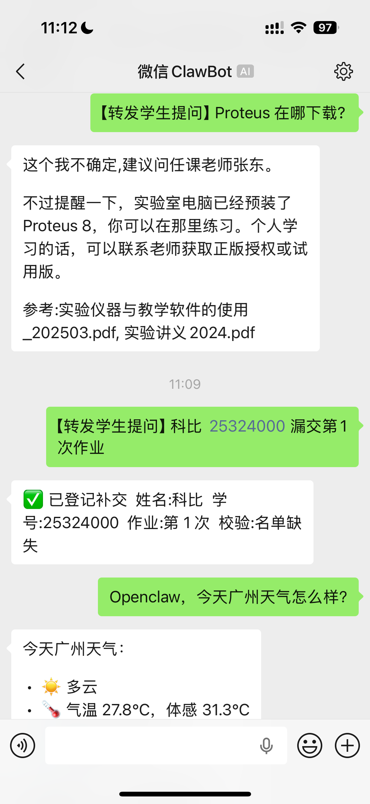
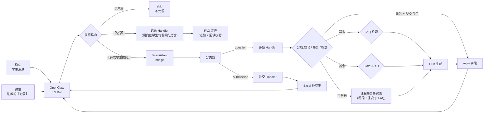
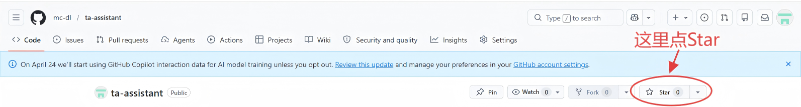

# TA Assistant — 课程助教自动化工具

> 基于 RAG + 规则分类的助教自动化工具,对接微信 Bot(OpenClaw),实现作业补交自动登记 + 学生提问智能回答。

<!-- TODO: 截图占位:微信消息 → OpenClaw 回复示例 -->
## 效果展示

<p align="center">
  
</p>

上图演示了三种场景：
- **学生提问**（加 `【转发学生提问】` 前缀）→ 走 FAQ / RAG 检索，返回带来源的答复
- **补交登记**（加 `【转发学生提问】` 前缀 + 姓名/学号/作业次数）→ 自动写入 Excel 补交表
- **闲聊**（无前缀）→ 不触发助教逻辑，由上游 MinMax 正常回答

## 功能特性

- **前缀路由隔离闲聊**:只有带 `【转发学生提问】` 前缀的消息才进入处理,其余直接跳过(`type=skip`)
- **分档答疑**:先判提问类型(**具体题号** / **课程事务** / **学科概念**),再决定走 FAQ 快路还是查资料;
  概念题**以教材/课堂讲义为准**讲解,并挂上库里相关作业题当例子;两者都没有才用通用教材知识(会自报);
  事务题(截止/成绩/考试)则只认资料、绝不猜
- **知识库含教材正文**:中文版第 6 版教材(扫描件)经 OCR 进库,**答复能引用书上页码**;
  公式是 OCR 出来的,提示词要求"看不清就说看不清,不许猜"
- **`【记录】` —— 助教在微信里加 FAQ**(唯一一条"助教→系统"的写通路):
  发 `【记录】问题:… 标准答案:…` 就把这一条**追加**进 FAQ,下一条提问即生效。
  含个人信息 / 太长 / 格式拿不准 / 重复 —— **一律拒收,且一个字都不写**;
  落盘走"临时文件 + 原子替换"并**回读校验**,不对就按原字节回滚
- **课程事务事实表**(带生效期):截止时间/提交方式这类口径单独维护在
  `~/ykt_questions/课程事务.txt`,**高于** FAQ 与资料,过期自动失效 ——
  解决"FAQ 条目不会过期,旧答案继续被自信命中"
- **从日志里挖 FAQ 候选**:`scripts/mine_faq_candidates.py` 把"学生真问过、FAQ 没接住"的问法
  按被问次数排出来,用真实问法决定下一条该补什么(而不是靠猜)
- **补交自动登记**:正则抽取学号/姓名/作业次数,写入 Excel,不手工维护;
  花名册**换版式也读得出来**(按表头文字定位,不写死行列号),
  自检 `python scripts/check_roster.py` 一条命令报出人数与是否可用
- **多格式文档解析**:PDF / DOCX / DOC(LibreOffice) / XLSX / TXT / MD / PPTX
  (扫描版 PDF 走 `scripts/ocr_textbook.py` 单独 OCR,不做进解析器 —— 它是一次性语料生产)
- **子进程 IPC 契约**:bridge stdout 只输出一行 JSON,TS 端不因日志污染而 JSON.parse 失败
- **跨平台数据路径**:Windows 开发 + WSL 运行,路径全在 `config.py`,`.env` 可覆盖

## 架构图



> ⚠️ 图里"事务 + FAQ 命中"那条快路**快在"不查资料",不是"不调大模型"** ——
> 答复仍由 LLM 润色(实测见 [`docs/knowledge_base.md`](docs/knowledge_base.md) §5.4,
> 四份文档曾同时把这句话写反)。

## 技术栈

| 层级 | 技术 | 说明 |
|------|------|------|
| 语言 | Python 3.10+ | 主体实现 |
| 接入层 | OpenClaw | 微信 Bot 网关 |
| IPC | subprocess bridge | stdout JSON + exit code |
| 分类 | 规则引擎 + LLM 兜底 | 关键词 → LLM fallback |
| 检索 | BM25 + jieba 分词 | 无需向量模型;IDF 用 Lucene 写法(见下) |
| 文档解析 | pdfplumber / python-docx / openpyxl / python-pptx | 多格式支持 |
| LLM | OpenCode Go(OpenAI 兼容) | **默认通道**;`LLM_API_KEY` 留空则退回 MinMax(回滚用) |
| 框架 | FastAPI (可选 HTTP) | `/process` 端点 |

## 快速开始

### WSL / Linux

```bash
# 1. 克隆项目
git clone <your-repo-url> ~/ta-assistant
cd ~/ta-assistant

# 2. 一键部署(同步代码 + 装依赖 + 建索引)
bash ~/ta-assistant/scripts/deploy.sh

# 3. 配置 API Key(默认通道 OpenCode Go;留空则退回 MinMax)
nano ~/.ta-assistant/.env   # 填 LLM_API_KEY 等,见 .env.example

# 4. 冒烟测试
.venv/bin/python -m src.main --message "【转发学生提问】Proteus 在哪下载?"

# 5. 验一下【记录】通路(刻意用一条**会被拒收**的:带假学号,
#    既证明路由到了后端,又不会往手写的 FAQ 里写坏数据)
.venv/bin/python -m src.main --message '【记录】问题:测试 20259999999 在哪交作业
标准答案:交给学委'
```

### macOS / 纯 Linux(无 WSL)

```bash
git clone <your-repo-url> ~/ta-assistant
cd ~/ta-assistant
python3 -m venv .venv
source .venv/bin/activate
pip install -r requirements.txt

# 配置数据路径(编辑 .env)
# WINDOWS_ROOT=~/ykt_questions

python scripts/build_index.py
python -m src.main --message "【转发学生提问】Proteus 在哪下载?"
```

## 目录结构

```
ta-assistant/
├── src/
│   ├── config.py           # 所有配置,路径/API Key/阈值
│   ├── main.py             # CLI + HTTP 入口(【记录】闸门在学生转发闸门之前)
│   ├── handlers/
│   │   ├── classifier.py   # 消息分类:submission/question/skip
│   │   ├── submission.py   # 补交:抽取学号/姓名/次数 → 写 Excel
│   │   ├── record.py       # 【记录】助教写 FAQ:解析 → 四道检查 → 原子追加 → 回读校验
│   │   └── qa.py           # 答疑:分档 → FAQ / RAG → LLM
│   ├── rag/
│   │   ├── indexer.py     # 一次性构建 BM25 索引
│   │   └── retriever.py   # FAQRetriever(实词闸门) + BM25Retriever(Lucene IDF)
│   ├── llm/
│   │   ├── __init__.py    # 对外统一入口:chat(system, user)
│   │   └── minmax.py      # 供应商实现(OpenCode Go / MinMax),重试+超时+日志
│   └── utils/
│       ├── doc_parser.py   # PDF/DOCX/DOC/XLSX/TXT/MD/PPTX 解析
│       ├── excel_ops.py    # 花名册/补交表读写
│       ├── course_facts.py # 课程事务事实表(带生效期,高于 FAQ)
│       ├── chunker.py      # 文本分块
│       ├── stderr_log.py   # 统一 stderr 输出
│       └── logger.py       # JSON Lines 日志
├── scripts/
│   ├── build_index.py      # python scripts/build_index.py
│   ├── import_circuit_basic.py    # 英文版作业答案 → 带中文锚点的语料
│   ├── import_circuit_theory.py   # 中文版作业答案 + 课堂讲义 + 错误集锦 → 语料
│   ├── enhance_circuit_basic.py   # 调大模型补【中文详细解析】
│   ├── audit_enhanced_numbers.py  # 审计:解析里的数字有没有被改
│   ├── ocr_textbook.py     # 扫描版教材 OCR(需 ocr-venv;按页缓存可续跑)
│   ├── import_textbook.py  # OCR 结果 → 分章语料 + 印刷页码标记
│   ├── check_roster.py     # 花名册自检(退出码 0/1,换学期必跑)
│   ├── eval_retrieval.py   # 检索质量评测(存基线 / --compare 查回归)
│   ├── eval_admin_fidelity.py     # 事务答复的数字保真度(**会真调 API**)
│   ├── mine_faq_candidates.py     # 从日志挖"学生真问过、FAQ 没接住"的问法
│   ├── openclaw_bridge.py  # OpenClaw 子进程入口
│   ├── md2html.py          # Markdown → 单文件 HTML(带目录/图/表格;--all --hub 生成整套)
│   ├── install_openclaw_skill.sh  # 把接入件装进 OpenClaw workspace
│   ├── setup.sh            # 依赖安装(WSL)
│   └── deploy.sh           # 一键部署(WSL)
├── deploy/openclaw/         # 接入件:技能 + AGENTS.md 路由规则(装到 OpenClaw 侧)
├── test/                    # pytest 单元测试
├── docs/                    # 需求/设计/部署/端到端文档(+ knowledge_base.md)
│   └── *.html               # 上面的 md 渲染出来的网页版(脚本生成,别手改)
├── data/
│   ├── index/              # BM25 索引(自动生成)
│   ├── eval/               # 检索评测基线 JSON(随代码提交)
│   └── logs/               # JSON Lines 日志(自动生成)
├── requirements.txt
├── .env.example
└── LICENSE
```

## 测试

```bash
# 全部测试(离线可跑,约 4 秒)
.venv/bin/python -m pytest test/ -q

# 单独回归:bridge stdout 清洁
.venv/bin/python -m pytest test/test_bridge_stdout_clean.py -v

# 检索质量:17 条「学生真会问的」提问,各自必须召回到对的资料
.venv/bin/python -m pytest test/test_retrieval_recall.py -v
```

共 **338 个测试**,覆盖:分类器规则、姓名抽取(含反例)、FAQ 解析与实词闸门、
文本分块与页码标记、bridge IPC 契约、提问分档、题号识别、中文版作业答案切题边界、
PPTX 解析(含组合形状与表格)、扫描版教材装配、BM25 的 IDF、检索召回、评测基线、
课程事务事实表(生效期)、花名册换版式后的读取韧性、文档渲染(图/表/目录构件),
以及 `【记录】` 的解析 / 拒收 / 原子写 / 回读回滚。

其中几项是**表驱动**的 —— 要加新问法,往表里加一行就行,不用写新测试:

| 表 | 表内用例 | 在哪 |
|---|---|---|
| 提问分档(概念/事务/题号) | 29 条问法 | `test/test_query_kind.py` |
| 题号识别(该不该走资料通路) | 22 条问法 | `test/test_problem_ref.py` |
| 教材章表与页码不变量 | 25 个测试 | `test/test_import_textbook.py` |
| 检索召回(每问期望命中哪些资料) | 17 条提问 | `scripts/eval_retrieval.py` 的 `CASES`,与 `test/test_retrieval_recall.py` **共用** |
| `【记录】` 的正例/反例 | 49 个测试 | `test/test_record.py` |
| 花名册版式(雨课堂导出 / 旧记分册 / 坏 `<dimension>`) | 11 个测试 | `test/test_roster.py` |
| 文档渲染(mermaid 转图 / 表格包裹 / 图题 / 提示块上色 / 导航页) | 13 个测试 | `test/test_md2html.py` |

**测试绝不写生产数据**:`test/conftest.py` 里的 `isolated_logs` / `isolated_faq` /
`isolated_course_facts` / `isolated_submission_table` 都是 autouse 的 ——
日志、FAQ、事务表、花名册与补交表一律被指到临时目录。
这不是洁癖,是**踩过两次**:
- 生产日志被测试写脏(543 条问句里 521 条是测试字符串,`test/test_log_isolation.py` 守着);
- **补交表被写进 398 行假数据**(1 个学号、1 个姓名、4 种原文,全部逐字来自 `test/`)——
  那是要交给助教登记的正式记录,而且它还盖住了"花名册读不出来"这个真故障
  (`test/test_submission_table_isolation.py` 守着,见 [`docs/knowledge_base.md`](docs/knowledge_base.md) §8 第 13 条)。

**同一个 bug 会在你没检查的每一种资源上各长一遍** —— 所以这两条线是按"会被写的东西"
逐个数出来的(日志、FAQ、事务表、补交表、花名册),不是一次设计好的。

检索那 17 条不只是单测:**改动语料/锚点/分块参数前后跑一次
`python scripts/eval_retrieval.py --compare`**,它能报出"某条提问的名次从第 2 掉到第 6"
这种**还能过、但已经在退化**的信号 —— 细节见
[`docs/knowledge_base.md`](docs/knowledge_base.md) §3.6。

基线文件 `data/eval/retrieval_baseline.json` **随代码走**(不在 `.gitignore` 里)。
`--compare` 在基线缺失时**退出码 1** —— 检查没做成要当成失败报,不能静默放过。

## 文档的网页版

`docs/*.html` 是 `docs/*.md` 渲染出来的**网页版**,刻意**不做成 markdown 的翻版**:

- **图**:` ```mermaid ` 围栏渲染成**真的架构图 / 流程图 / 时序图 / 饼图**
  (知识库那张"索引 3165 块都是什么"的饼图、微信端到端的时序图都在这里)。
  离线时退化成一张代码块,源码另存一份在折叠区里,信息不丢。
- **表**:所有表格自动横向滚动 + 表头吸顶,44 张表的长文档也不会把版心撑破。
- **导航**:侧边目录跟随滚动高亮,顶部有「本页速览」胶囊条,右下角回到顶部。
- **提示块**:`>` 引用按开头 emoji 上色(⚠️ 警告 / ✅ 通过 / ❌ 禁止)。
- **首页**:`docs/index.html` 是导航页,每篇一张卡片(小节数 / 表格行数 / 图数)。

双击 `docs/index.html` 就能看,纯静态、零依赖(只有 mermaid 走一个可选 CDN)。重新生成:

```bash
python scripts/md2html.py --all docs/ --hub     # 改完 md 跑这一条
```

> **只改 `.md`,别手改 `.html`** —— 下次生成会整份覆盖。
> GitHub 上直接看 `.md` 就行,它原生渲染 mermaid,两边看到的是同一张图。

## 下一步

1. 把 `常问问题.txt` 和课程资料放到配置的数据目录(现在有**数电实验**和**电路基础**两门课,
   知识库的内容、来源、重建步骤见 [`docs/knowledge_base.md`](docs/knowledge_base.md))
2. `python scripts/build_index.py` 构建索引
3. **接入 OpenClaw(微信端到端)**:`bash scripts/install_openclaw_skill.sh`,细节见
   [`docs/wechat_end_to_end.md`](docs/wechat_end_to_end.md)(附 HTML 版)
4. 简历参考 `TECH_STACK.md`

---

## ⭐ 求个 Star

如果这个项目对你有帮助，或者你觉得思路有意思，点一下右上角的 Star 就是对我最大的鼓励：

<p align="center">
  
</p>

---

[LICENSE](LICENSE) · [TECH_STACK.md](TECH_STACK.md) · [CONTRIBUTING.md](CONTRIBUTING.md)
