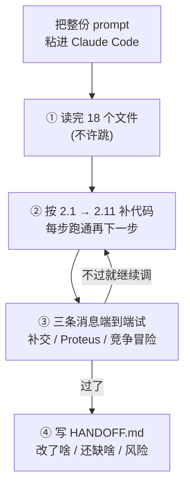

# 交给 Claude Code 的 Prompt

> 使用方法:在 `C:\Users\YOUR_USERNAME\Downloads\ta-assistant\` 目录下打开 Claude Code(命令行 `claude` 或 VS Code 插件),把下面**全部内容**复制粘贴进去。Claude Code 会按文档完成剩余实现、安装依赖、跑测试。

> ⚠️ **时效性(2026-09-20 校订)**
> 这是 **2026-04 项目启动时**交给 Claude Code 的那份 prompt,是"当时提了什么"的原始记录。
> **不要再照着重跑一遍** —— 系统早已建成,重跑只会把后来改对的地方改回 4 月的形状。
> 其中几处**已经被实测推翻**,现状以 [`knowledge_base.md`](knowledge_base.md) 和
> [`design.md`](design.md) 为准:
>
> | 这份 prompt 要求 | 后来怎么改了 | 为什么 |
> |---|---|---|
> | 2.3 LLM 层只做 MinMax | 默认通道换成 **OpenCode Go**,MinMax 留作回滚 | 见 `design.md` §3.7 |
> | 2.6 `search(query, top_k=5)` | 改成 **7**(`RAG_TOP_K`) | 一份语料的中位分块数是 5、最长 11,取 5 会把同一条解答的后面几块切掉 |
> | 2.8 "FAQ 命中就短路" | 只有**事务题**短路;概念题把 FAQ 当**补充材料** | 一刀切会让概念题被"作业怎么提交"那条 FAQ 截胡 |
> | 第三步 `pytest tests/ -v` | 目录是 **`test/`**(单数),现在 **389 个测试** | 见根 `README.md` 的「测试」 |
> | 最后一条:中文路径 + `mklink` 软链接 | 数据已搬到 **WSL 原生目录** `~/ykt_questions/`,不再需要软链接 | 见 `deployment.md` §0 / §5 |
> | "FAQ 命中就短路" 隐含"不调大模型" | 只是**不查资料**,答复**仍由大模型润色** | 四份文档曾同时把这句话写反,实测见 `knowledge_base.md` §5.4 |
>
> 另外:本文从头到尾**没有提向量检索**("可选 sentence-transformers 升级"那句是
> [`README.md`](README.md) 技术栈里的旧设想),那个升级**没有做**,也不需要 ——
> 检索就是 BM25,只是 IDF 换成了 Lucene 写法(见 `knowledge_base.md` §3.6)。

:::stats
- **18** | 第一步要读的文件 | 4 份 md + 14 个源码/脚本
- **11** | 第二步的小节 | 从配置层一路排到脚本,顺序不能换
- **6** | 被实测推翻的要求 | 就是上面那张表,现状以 `knowledge_base.md` 为准
- **389** | 最终测试数 | prompt 里写的是 `pytest tests/`,实际目录是 `test/`
:::



:::note 为什么这份 prompt 现在还能读
它记录的**不是**"系统长什么样",而是"一个零上下文的 Claude Code 需要被告知什么
才能动手"。这个信息今天依然有用 —— 需求文档该写到什么颗粒度、
哪些决定必须写死、哪些要留给实现者,全在这份 prompt 的取舍里。
::: 

---

## (从这里开始复制)

你好 Claude Code。请在当前目录(`ta-assistant/`)下帮我完成一个数电课助教自动化工具。

### 你的背景信息

- 我是数电课助教,每周要手工登记作业补交 + 回答学生重复提问,很累
- 这个项目的目标是:学生通过微信发消息 → OpenClaw 微信 Bot → 本项目自动分类并处理
- 我电脑是 Windows 11,WSL 装了 Ubuntu,OpenClaw 在 WSL 里,本项目也将在 WSL 里跑
- 我已经写好了**需求文档**、**设计文档**、**部署文档**、**项目骨架代码**,你的任务是**把骨架代码补全、装依赖、跑通测试**

### 第一步:阅读所有已有文档和代码(必做)

请按顺序读完以下文件,不要跳过:

1. `README.md` — 项目概览
2. `docs/requirements.md` — 需求文档(权威,以此为准)
3. `docs/design.md` — 系统设计
4. `docs/deployment.md` — 部署指南
5. `src/config.py` — 配置
6. `src/main.py` — 主入口骨架
7. `src/handlers/classifier.py` — 分类器骨架
8. `src/handlers/submission.py` — 补交 Handler 骨架
9. `src/handlers/qa.py` — 答疑 Handler 骨架
10. `src/rag/indexer.py` — 索引构建
11. `src/rag/retriever.py` — 检索
12. `src/llm/minmax.py` — MinMax 客户端
13. `src/utils/doc_parser.py` — 文档解析
14. `src/utils/excel_ops.py` — Excel 操作
15. `scripts/build_index.py` — 索引构建脚本
16. `scripts/openclaw_bridge.py` — OpenClaw 入口
17. `scripts/setup.sh` — 环境安装
18. `requirements.txt`、`.env.example`

### 第二步:按以下顺序完善代码

**顺序很重要,每一步跑通再下一步。**

:::steps
- 2.1 配置层 | 路径 / 参数 / 模型名全集中到 `config.py`,`.env` 可覆盖
- 2.2 工具层 | 文档解析(pdf/docx/doc/xlsx)+ Excel 的读-改-存
- 2.3 LLM 层 | MinMax 客户端,3 次重试 + 指数退避,调用记日志
- 2.4 分类器 | 规则优先(关键词 ∧ 8 位学号),LLM 兜底
- 2.5 补交 Handler | 抽学号 / 姓名 / 次数 → 花名册校验 → 写补交表
- 2.6 RAG 模块 | 按段切块 + BM25 建索引,pickle 落盘
- 2.7 FAQ 检索 | `常问问题.txt` 单独建索引,不持久化(它很小)
- 2.8 答疑 Handler | 先 FAQ 后 RAG,拼 prompt 交给大模型
- 2.9 主入口 | CLI `--message` + 可选 HTTP `POST /process`
- 2.10 OpenClaw Bridge | stdout **只许有一行** JSON
- 2.11 脚本 | `build_index.py` + `setup.sh`
:::

#### 2.1 配置层 (`src/config.py`)
- 把所有路径、参数、模型名集中在这里
- 支持 `.env` 覆盖(用 `python-dotenv`)
- 用 `pathlib.Path`,不要用裸字符串
- 日志目录、索引目录不存在时自动创建

#### 2.2 工具层
- `utils/doc_parser.py`:实现 pdf/docx/doc/xlsx/txt 的文本提取;`.doc` 调 `libreoffice --headless --convert-to docx` 先转,再用 `python-docx`
- `utils/excel_ops.py`:
  - `ensure_submission_table(path)`:不存在则创建,写表头
  - `load_roster()`:从花名册 xlsx 的"学号""姓名"两列(注意表头在第 5 行,学生数据从第 7 行开始,详见我上传的成绩记分册样例)读成 `dict[str, str]`
  - `append_submission_row(path, row)`:读-改-存

#### 2.3 LLM 层 (`src/llm/minmax.py`)
- MinMax API 端点:`https://api.minimax.chat/v1/text/chatcompletion_v2`
- 实现 `chat(system: str, user: str, temperature=0.3, timeout=20) -> str`
- 3 次重试,指数退避;超时返回空字符串并记日志
- 所有调用记入 `data/logs/llm.log`(JSON Lines:入参 hash + 输出长度 + 耗时)

#### 2.4 分类器 (`handlers/classifier.py`)
- 规则优先:关键词 `["漏交","补交","没交","忘了交","作业漏","作业没"]` ∧ 8 位学号 → `submission`
- 含疑问词 → `question`
- 否则调 LLM 兜底,prompt 要求返回 JSON `{"type": "submission|question|other"}`
- 写 10 个单元测试覆盖常见情况

#### 2.5 补交 Handler (`handlers/submission.py`)
- 抽学号:`re.search(r"\b\d{8}\b", msg)`
- 抽姓名:先找"姓名:XXX""我是 XXX"模式,否则用学号反查花名册;姓名必须是 2-4 个中文字符
- 抽作业次数:正则匹配`第?(\d+|一|二|...)次`、`实验\s*\d+`、`作业\s*\d+`、`chapter\s*\d+`(大小写不敏感)
- 校验:学号是否在花名册 + 姓名是否匹配
- 写补交表,返回成功消息
- 写 8 个单元测试

#### 2.6 RAG 模块 (`rag/`)
- `indexer.py`:
  - 遍历 `MATERIALS_DIR` 下所有支持格式的文件
  - 解析文本,按段落切块(目标 400 字,重叠 50 字,中文按标点切分)
  - 每块带元信息 `{text, source_file, chunk_id, section_hint}`
  - 用 `rank_bm25.BM25Okapi` + `jieba` 分词建索引,pickle 到 `data/index/bm25_index.pkl`
- `retriever.py`:加载索引,`search(query, top_k=5)` 返回带分数和元信息的结果列表

#### 2.7 FAQ 检索
- 在 `rag/retriever.py` 里另做一个 `FAQRetriever`,专门吃 `常问问题.txt`
- 解析规则:连续的 `Q:`/`A:` 块为一条,空行分隔;`Q:` 可以多行
- 单独建 BM25 索引,**不**持久化(每次启动现建,FAQ 很小,快)

#### 2.8 答疑 Handler (`handlers/qa.py`)
- 先 FAQ 搜,`faq_score >= FAQ_HIT_THRESHOLD` 视为命中
- 否则 RAG 搜
- 拼 prompt:
  ```
  system = "你是中山大学数字电路与逻辑设计实验课的助教,用简洁中文回答学生问题。
            优先基于给定资料作答,资料中没有的内容要明确说明。"
  user = f"【学生问题】{query}\n\n【相关资料】\n{context}\n\n【你的回答】"
  ```
- 调 MinMax,返回答复(末尾追加"参考:{来源}")

#### 2.9 主入口 (`main.py`)
- CLI 模式:`argparse` 接 `--message`,打印 JSON
- HTTP 模式(可选):FastAPI `POST /process`,body `{"message": "..."}`,返回相同 JSON
- 所有请求写 `data/logs/YYYY-MM.log`

#### 2.10 OpenClaw Bridge (`scripts/openclaw_bridge.py`)
- 极简:读 `--message`,调 `main.process`,打印 JSON 到 stdout
- 任何异常也以 JSON 形式输出:`{"type": "error", "reply": "系统错误,请稍后再试: ..."}`

#### 2.11 脚本
- `scripts/build_index.py`:调 `indexer.build_index()`,打印进度
- `scripts/setup.sh`:apt 装 libreoffice/poppler-utils,建 venv,pip install,cp .env.example .env

### 第三步:测试

```bash
source .venv/bin/activate
pytest tests/ -v
python scripts/build_index.py
python -m src.main --message "我作业漏交了 张三 20230001 第1次"
python -m src.main --message "Proteus 在哪下载?"
python -m src.main --message "什么是竞争冒险?"
```

三条消息都应该成功返回合理的 JSON。**如果不行,继续调试到能跑通为止。**

### 第四步:写一份完成汇报

在项目根目录写一个 `HANDOFF.md`,内容:
- 你改了哪些文件、加了哪些文件
- 跑测试的输出截图(文字形式)
- 还有哪些东西需要我手动做(比如填 `.env` 的 API Key)
- 已知的风险或 TODO

### 重要约定

- **代码风格**:类型注解 + docstring + 有意义的变量名;每个模块顶部加一行中文注释说明"这个模块干啥"
- **不要**擅自改我的需求文档或设计文档。如果需求不明确,在 `HANDOFF.md` 里写 TODO,不要自行脑补
- **不要**装超出 `requirements.txt` 的重量级依赖(比如不要装 torch、transformers、langchain)。如果需要新依赖,先问我
- **不要**把学生真实姓名、学号 hardcode 进代码(除了我给你的测试用例 `张三 20230001`)
- 中文路径问题:如果 WSL 读不到 `/mnt/c/Users/YOUR_USERNAME/Downloads/雨课堂问题/`,按 `docs/deployment.md §5` 用 `mklink` 软链接方案,**在 `HANDOFF.md` 提醒我去 Windows CMD 里跑那条命令**

准备好了就开始吧,每完成一个模块就 run 一次测试,确认绿再走下一个。谢谢!

## (复制到这里结束)
