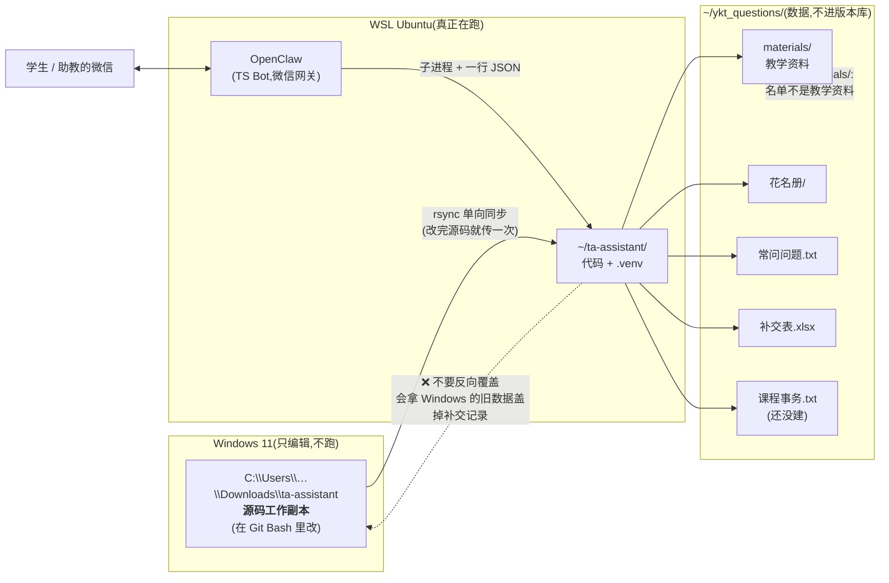

# 部署与 OpenClaw 接入指南

> ⚠️ **时效性(2026-09-20 校订)**
> 这份是 **2026-04 的初版部署说明**,§4 的 OpenClaw 接入方式(子进程 / HTTP)没有变;
> 但**数据放哪**(§0)、**`.env` 填什么**(§1)、**建索引会看到什么**(§2)、
> **日常怎么维护**(§6)都已经不一样了 —— 逐处改过,改了的地方标 `【当前】`。
> **端到端跑通与排障请看 [`wechat_end_to_end.md`](wechat_end_to_end.md)**;
> **知识库怎么重建请看 [`knowledge_base.md`](knowledge_base.md) §7**(那份是最新的)。

## 0. 目录放置

**【当前】代码和数据是分开的,别再往 `Downloads` 里的中文目录放。**

**三方关系一张图**(左边是"编辑",中间是"跑",右边是"存";箭头方向就是数据流向,
**只有一条固定方向,反着传会丢业务数据**):



> **换学期别忘**:把新名单覆盖 `花名册/电路基础理论课_学生名单.xlsx`,再跑
> `.venv/bin/python scripts/check_roster.py` —— **退出码 0 才算换好**。
> (补交表的文件名还是**数电实验**时期的 `数字电路与逻辑设计实验（一）补交表.xlsx`,
> 那是历史遗留,**不用改名** —— 它现在是"本学期唯一那份补交登记表",
> 改名要连 `.env`/代码一起动,收益为零。)

| | 位置 | 说明 |
|---|---|---|
| 代码 | `~/ta-assistant/`(WSL 原生目录) | 在 WSL 里跑,不要直接在 `/mnt/c/...` 下跑 |
| 数据 | `~/ykt_questions/`(`WINDOWS_ROOT`) | `materials/`(教学资料)+ `花名册/` + `常问问题.txt` + 补交表 + `课程事务.txt`(还没有,见下) |

> **名单单独放 `花名册/`,不要放进 `materials/`。** `materials/` 是 RAG 语料目录,
> `build_index.py` 会把里面每个文件解析进索引 —— 名单不是教学资料。
> (原先那份成绩记分册就躺在 `materials/` 里,被解析进去了,见 §3.1。)
>
> **换学期**:把新导出的名单覆盖 `~/ykt_questions/花名册/电路基础理论课_学生名单.xlsx`
> 这个文件名,然后 `.venv/bin/python scripts/check_roster.py` —— **退出码 0 才算换好了**。
> 只是"把文件拷过去"不够:名单读不出来时补交**照样登记成功**,只是校验状态永远写
> 「名单缺失」,不跑这条就发现不了。始末见 [`knowledge_base.md`](knowledge_base.md) §8 第 12 条。
>
> `课程事务.txt`(现行事务口径)目前**还没建**,功能处于休眠状态 ——
> 助教写一份就有,格式见 `knowledge_base.md` §6.6,不用重建索引。
| 大文件 | `/public/tmp/...`(服务器侧)、OCR 缓存在 `~/ykt_questions/_ocr_cache/` | 与代码解耦 |

**为什么不用 `/mnt/c/...`:** 一是跨文件系统 IO 慢(索引/OCR 都吃这个),
二是原来的 Windows 路径含中文与全角括号,在 WSL 里容易出编码问题。
`config.WINDOWS_ROOT` 默认就是 `~/ykt_questions`,**不用改任何代码**。

> **历史遗留提醒**:`C:\Users\52880\Downloads\ykt_questions\` 那份是**旧位置,运行时不再读**。
> 唯一的判据是「补交表在谁那儿」—— 运行时用的那份目录下有 `补交表.xlsx`
> (工作表 `补交记录`);旧那份还是 4 月的成绩记分册。
> **要改回去必须先合并补交记录,否则丢业务数据。**
> Windows 侧那份仍然是**编辑源码的工作副本**(改完同步到 `~/ta-assistant/`)。

## 1. 环境安装(一次性)

```bash
cd ~/ta-assistant
bash scripts/setup.sh
```

`setup.sh` 会做:
1. `apt install libreoffice-core poppler-utils`(用来转 `.doc` 和 pdf 解析)
2. 创建 `.venv` 虚拟环境
3. `pip install -r requirements.txt`
4. 预下载 jieba 词典
5. 从 `.env.example` 复制一份 `.env`

**【当前】然后编辑 `.env`,填大模型的 key:**
```
LLM_API_KEY=你的_OPENCODE_GO_API_KEY
LLM_MODEL=deepseek-v4.1-flash
```

默认通道是 **OpenCode Go**(OpenAI 兼容接口,key 在 <https://opencode.ai/auth> 拿)。
**`LLM_API_KEY` 留空会自动退回旧的 MiniMax 通道**(保留作回滚),那条才需要
`MINMAX_API_KEY` / `MINMAX_GROUP_ID`。业务代码只认 `LLM_*`,换供应商 = 改 `.env`。

> **别把 key 写进任何会进版本库的文件** —— `.env` 已在 `.gitignore` 里,
> 用它就行;不要写进脚本、文档或日志。

## 2. 构建知识库索引(一次性 / 资料更新后)

```bash
cd ~/ta-assistant
source .venv/bin/activate

# 【当前】先备份旧索引,出问题能一键回退
cp data/index/bm25_index.pkl data/index/bm25_index.pkl.bak.$(date +%Y%m%d-%H%M%S)

python scripts/build_index.py
```

成功后会看到(数字随语料变化,**看的是"文件数和块数是不是符合预期",不是背数字**):
```
扫描目录: /home/<user>/ykt_questions/materials
解析文件: 114 个  | 生成片段: 3165 块
BM25 索引已保存: data/index/bm25_index.pkl
```

> **改了语料光重建索引还不够 —— 要跑一遍检索评测**确认没把原来的资料挤掉:
> ```bash
> python scripts/eval_retrieval.py --compare     # 有回归则退出码 1
> ```
> **完整的资料更新流程(语料生成 → 数字审计 → 重建索引 → 评测 → 抽查)
> 见 [`knowledge_base.md`](knowledge_base.md) §7**,那里是按顺序排好的七步。

## 3. 本地冒烟测试

```bash
# 测试 1:补交
python -m src.main --message "我作业漏交了 张三 20230001 第1次"

# 测试 2:FAQ
python -m src.main --message "Proteus 在哪下载?"

# 测试 3:RAG
python -m src.main --message "什么是竞争冒险?怎么消除?"

# 测试 4:【记录】通路(**刻意用一条会被拒收的**:带假学号)
#   既证明路由到了后端,又不会往手写的常问问题.txt 里写坏数据
.venv/bin/python -m src.main --message '【记录】问题:测试 20259999999 在哪交作业
标准答案:交给学委'
# 预期:{"type": "record", "reply": "❌ 没记: 问题里有学号 …"}
```

每次都应该看到 JSON 返回和 `data/logs/YYYY-MM.log` 里新增一行。

**【当前】注意前缀**:走 `openclaw_bridge.py` 时消息**必须带前缀**
(`【转发学生提问】`),不带会被当成非学生消息直接跳过。
`src/main.py` 的 `--message` 入口不受这个限制,所以上面三条不带前缀也能测。

**`【记录】` 是个例外,它本来就不带学生转发前缀** —— 它是助教自己发的。
所以 `main.process()` 里它的闸门在**学生转发闸门之前**,顺序反了会被判成
"非学生消息"丢掉,而且**看起来一切正常**。改 `main.py` 时注意这条(回归测试
`test/test_record.py` 里有两条专门钉这个顺序)。

⚠️ **自检 `【记录】` 千万不要拿一条正常的问答去试** —— 那会真的写进助教手写的
`常问问题.txt`(那份文件没有版本库兜底)。用上面那条带假学号的,它会被拒收。

```bash
# 端到端(带前缀),这才是 OpenClaw 实际走的那条路:
./.venv/bin/python scripts/openclaw_bridge.py --message '【转发学生提问】什么是叠加原理'
```

**离线自检(不联网、不调 API,约 5 秒)**:
```bash
.venv/bin/python -m pytest test/ -q            # 全绿(当前 338 例)
.venv/bin/python scripts/eval_retrieval.py --compare   # 退出码 0
.venv/bin/python scripts/check_roster.py               # 退出码 0,并报出名单人数
```

> **`check_roster.py` 必须看退出码,不能只看它有没有崩。** 名单读不出来时
> 补交**照样登记成功**,只是校验状态永远写「名单缺失」—— 这个缺陷就是这样
> 藏了几个月的(`knowledge_base.md` §8 第 12 条)。换学期换名单之后尤其要跑。

## 4. OpenClaw 接入

### 方案 A:子进程调用(最简单,推荐先用这个)

在 OpenClaw 的"接收到助教转发"的钩子里,把整条消息透传给:
```bash
/home/<你的用户名>/ta-assistant/.venv/bin/python \
  /home/<你的用户名>/ta-assistant/scripts/openclaw_bridge.py \
  --message "<转发内容>"
```

脚本会在 `stdout` 打印 JSON:
```json
{"type": "question", "reply": "Proteus 需要自己找激活版..."}
```

OpenClaw 把 `reply` 字段发回微信即可。

### 方案 B:HTTP 服务(需要长连接)

启动:
```bash
cd ~/ta-assistant
source .venv/bin/activate
uvicorn src.main:app --host 127.0.0.1 --port 8765
```

OpenClaw 调用:
```
POST http://127.0.0.1:8765/process
Content-Type: application/json
{"message": "转发内容"}
```

响应:
```json
{"type": "submission", "reply": "✅ 已登记..."}
```

### 在 OpenClaw 端的伪代码示例

假设 OpenClaw 支持 Python 插件:
```python
import subprocess, json

def on_teacher_forward(message: str) -> str:
    result = subprocess.run(
        ["/home/ta/ta-assistant/.venv/bin/python",
         "/home/ta/ta-assistant/scripts/openclaw_bridge.py",
         "--message", message],
        capture_output=True, text=True, timeout=30
    )
    data = json.loads(result.stdout)
    return data["reply"]
```

## 5. 路径提示词(重要!)

**【当前】默认已经绕开了中文路径**(数据在 `~/ykt_questions`),所以下面这条**只在
你非要用 Windows 侧中文目录时**才需要看。项目里所有路径都已在 `src/config.py` 用
`Path` 封装,**不要**在 shell 里裸写中文路径,会挂。

真要指到 Windows 侧,推荐用 `.env` 覆盖而不是改代码:
```bash
# .env
WINDOWS_ROOT=/mnt/c/Users/YOUR_USERNAME/Downloads/ykt_questions
```
(迁移前先合并补交记录,理由见 §0。)

## 6. 日常维护

| 场景 | 操作 |
|---|---|
| 加新 FAQ | 在 `常问问题.txt` 里按 `Q:\nA:\n\n` 格式新增,**不需要**重建索引(每次启动现建) |
| **加/改课程资料** | **不是"拖进去跑一下 build_index"这么简单** —— 语料要先过生成/增强/审计,见 [`knowledge_base.md`](knowledge_base.md) §7 的七步流程 |
| 重建索引 | 先备份,再 `python scripts/build_index.py`,然后 `python scripts/eval_retrieval.py --compare` |
| 补交表想导出 | 直接打开 Excel(路径见 `config.py`) |
| 看日志 | `tail -f ~/ta-assistant/data/logs/$(date +%Y-%m).log` |
| 清空当月日志 | `rm ~/ta-assistant/data/logs/$(date +%Y-%m).log` |

**改完提示词后必做的一步**:抽查几个真实提问(见 `knowledge_base.md` §7 的 ⑧)。
大模型唯一真正危险的地方是**悄悄改一个数值**,而那是最不容易被一眼看出来的错误。

## 7. 故障排查

| 症状 | 原因 | 解决 |
|---|---|---|
| `FileNotFoundError: ...ykt_questions...` | 数据目录不对 / 没放到 `WINDOWS_ROOT` | 看 `.env` 里的 `WINDOWS_ROOT`,或用 §5 覆盖 |
| `ImportError: no module named jieba` | 未激活 venv | `source .venv/bin/activate` |
| LLM 401 / 403 | key 错或没填 | 查 `.env` 的 `LLM_API_KEY`;留空会退回 MinMax 通道,报错可能是**旧通道**的 key |
| LLM 返回 `400 MissingSessionID` | OpenCode Go 要求 `x-opencode-session` 请求头 | 别删 `LLM_SESSION_HEADER` 的默认值 |
| 回复全是"抱歉,知识库未就绪" | 没跑 build_index.py | 跑一次 |
| **答复里冒出无关章节** | BM25 的 IDF 兜底把虚词当成了正证据 | 见 `knowledge_base.md` §3.6;确认 `apply_lucene_idf()` 还在被调用 |
| 补交表里姓名乱码 | Excel 用 GBK 打开 | 用 Excel 2019+ 或 WPS 打开 |
| 回复始终是"非学生消息,未处理" | OpenClaw 剥了前缀或字符被 normalize | 查 `data/logs/` 的 `process_input` 事件,对比 `first_20_codepoints` 与 `prefix_used` 的 Unicode;很可能是 OpenClaw TS 层把前缀字符改了或提前剥掉了 |
| OpenClaw 报 `bridge exited 0: ...日志内容...`? | TS 端把 stderr 当错误了 | bridge 侧保证 stdout 是纯 JSON;TS 侧应只看 exit code + JSON.parse,不要拼接 stderr 内容 |

## 8. 从零到上线的时间预估

**【当前】首次搭建**:

| 步骤 | 预估时间 |
|---|---|
| 放好代码与数据目录 | 1 分钟 |
| 跑 `setup.sh` 安装依赖 | 5-10 分钟 |
| 配 `.env` 里的大模型 key | 2 分钟 |
| 跑 `build_index.py` 建索引 | 1-2 分钟(视语料大小) |
| 冒烟测试 + 离线自检(`pytest` / `--compare`) | 2 分钟 |
| OpenClaw 接入调通 | 10-20 分钟 |
| **总计** | **30-60 分钟** |

**注意:上面不含"从零建知识库"。** 扫描版教材那种资料要先 OCR
(711 页 / 12 进程跑 **47.9 分钟**)、再装配、再生成中文详细解析(逐个调大模型),
那是**另一天的工作量**,见 `knowledge_base.md` §3.5 / §9.5。
本文假设知识库已经建好。
