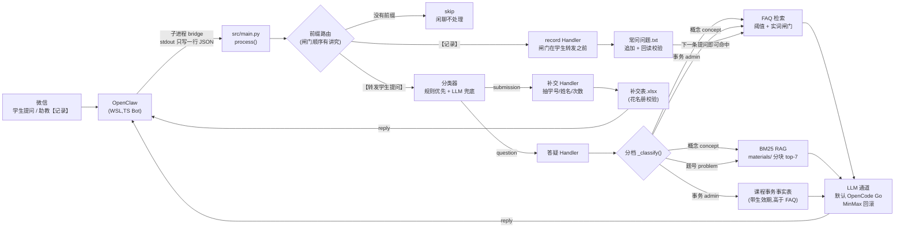
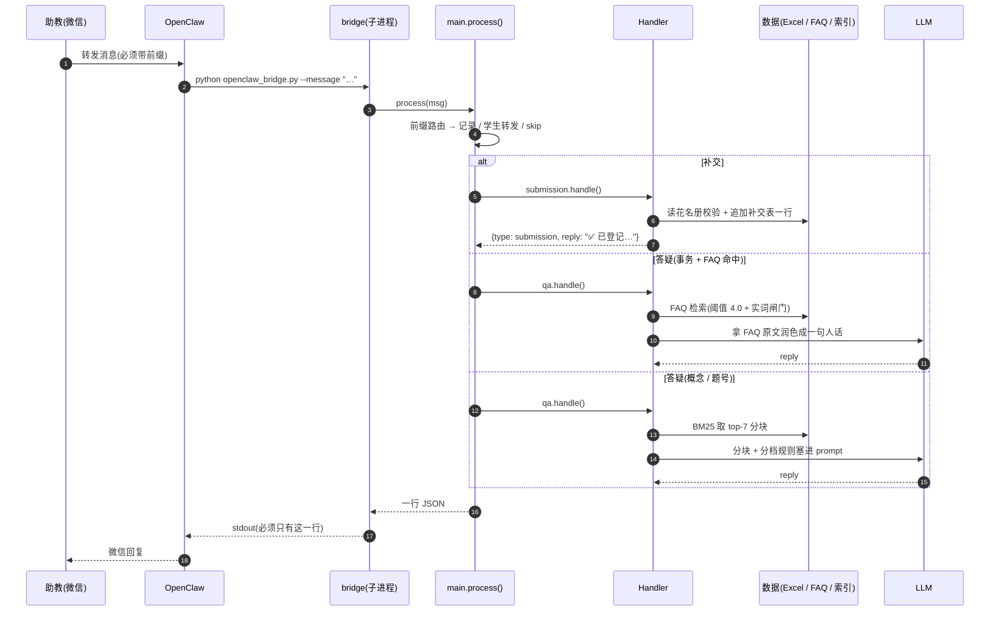

# 系统设计文档

> 对应需求文档 `requirements.md`,描述**怎么实现**。

> ⚠️ **时效性(2026-09-20 校订)**
> 这份是 **2026-04 的初版设计**,框架、模块划分、错误处理策略现在依然成立;
> 但 §3 里的**伪代码和配置值是当时的形状**,和现在的代码有出入 ——
> 已经**逐处改成本文的实际值**(路径、阈值、模型、答疑流程),凡是改动过的地方都标了
> `【当前】`。
> **"现在系统到底怎么跑"请看 [`knowledge_base.md`](knowledge_base.md)**(资料构成、
> 两条召回通路、重建步骤、已知限制);本文只讲"怎么实现、为什么这么分层"。
> 两者冲突时,**以代码和 `knowledge_base.md` 为准**。

## 1. 总体架构



> 同一张图的 **ASCII 版**留在下面 —— 终端里、`git diff` 里、以及不渲染 mermaid 的地方看这份。

```
┌───────────┐  微信转发   ┌──────────────┐
│ 助教(我) │ ─────────▶ │   OpenClaw   │
└───────────┘           │ (WSL Ubuntu) │
      ▲                 └──────┬───────┘
      │ 微信回复                │ 子进程调用 / HTTP
      │                        ▼
      │                 ┌──────────────────┐
      └─────────────────┤   ta-assistant   │
                        │   (本项目)        │
                        └──┬──────────────┬┘
                           │              │
           ┌───────────────┘              └──────────────┐
           ▼                                             ▼
   ┌───────────────┐                           ┌────────────────┐
   │  消息分类器    │                           │  LLM 通道      │
   │ (Classifier) │                           │ (默认 OpenCode  │
   └───┬───────┬───┘                           │  Go;MinMax 兜底)│
       │       │                               └────────────────┘
       ▼       ▼     ▼                                  ▲
  补交 Handler  答疑 Handler  记录 Handler ─ FAQ/RAG 检索─┘
       │       │         │                            ▲
       ▼       ▼         ▼                            │
   Excel 读写  知识库索引  常问问题.txt(追加写)─ FAQ 检索
       │       │         │
       ▼       ▼         ▼
   补交表     materials/   下一条提问即可命中
             (数电 + 电路基础两门课)
```

> **`【记录】` 是唯一一条"助教→系统"的写通路**(学生在微信里看不到它):
> 助教直接发 `【记录】问题:… 标准答案:…`,系统把这一条**追加**进 `常问问题.txt`,
> 下一条提问就能检索到(`FAQRetriever` 每次现读文件、没有常驻缓存,**不用重建索引**)。
> 放在上图里是因为它**绕开了分类器**:`main.process()` 里它是**学生转发闸门之前**的一个独立分支,
> 顺序不能反(见 §3.11)。设计细节和四条拒收规则见 `knowledge_base.md` §5.5。

## 2. 调用时序

先看整体时序(三条通路并排),再逐场景看**带真实日志值的调用链**:



### 2.1 补交场景

```
助教:转发"张三 20230001 昨天数电作业没交"
  │
  └──▶ OpenClaw 调 openclaw_bridge.py --message "..."
         │
         └──▶ main.process(msg)
                ├─ classifier.classify(msg) → "submission"
                ├─ submission.handle(msg)
                │    ├─ 正则抽 学号=20230001, 姓名=张三
                │    ├─ 读花名册 → 校验学号 存在 ✓(名单从 花名册/ 读,按表头文字定位,见 §3.1)
                │    ├─ 写补交表(追加一行)
                │    └─ 写日志
                └─ 返回 {type:"submission", reply:"✅ 已登记:张三(20230001)第 X 次补交"}
```

### 2.2 答疑场景

**【当前】答疑先分档,再决定走哪条通路**(`_classify()`),因为"补交/截止/成绩"这类
**事务题**可以照 FAQ 原文答,而"什么是叠加原理"这类**概念题**必须展开讲 ——
用同一条通路会互相伤害。详见 `knowledge_base.md` 第 1、5、6 节。

```
助教:转发"proteus 在哪下载?"
  │
  └──▶ main.process(msg)
         ├─ classifier.classify(msg) → "question"
         ├─ qa.handle(msg)
         │    ├─ _classify(msg) → "admin"(课程事务)
         │    ├─ FAQ 检索 → 命中"Proteus 下载"那条,score=7.2,
         │    │             且**共享至少一个实词**(实词闸门,见 §3.4)
         │    ├─ 事务题 + FAQ 命中 → **不查资料,把 FAQ 交给大模型润色成一句人话**
         │    └─ 写日志(记 qa_kind)
         └─ 返回 {type:"question", reply:"Proteus 需要自己找激活版..."}
```

> ⚠️ **【勘误 2026-09-20】这条快路"快"在"不查资料",不是"不调大模型"。**
> 本文(以及 `requirements.md` F-4、`knowledge_base.md` §1 的流程图、`wechat_end_to_end.md`)
> 原来都写成"**直接发 FAQ 答案,不调大模型**" —— **是错的**,代码里这一段从来没有 `return`。
> 照错的写去"修",会修出一个**事务答复直接裸奔、连润色都没有**的快路,方向正相反。
>
> 所以量了一遍再定:28 条能自命中的事务题 FAQ 逐条走真实通路,比对 FAQ 原文和答复里的数字 ——
> **FAQ 里有、答复里丢了的:0 条**;答复里多出来的 18 条,逐条看上下文全是
> 同义换算(零→0、「一周」→「七天」)、中文数字当字用(「一下」)、或模型自己补的常识(「A4 纸」)。
> 即**不丢信息,但会增补**。完整分类见 `knowledge_base.md` §5.4。
> **结论:保留调用,只把文档和注释改对。** 复核:`scripts/eval_admin_fidelity.py`(会真调 API,不进单测)。

### 2.3 RAG 场景(概念题)

```
助教:转发"什么是叠加原理?"
  │
  └──▶ qa.handle(msg)
        ├─ _classify(msg) → "concept"(学科概念;没命中任何关键词时也默认走这里)
        ├─ FAQ 检索 → 命中的话**当补充材料一并喂进去**,不短路
        ├─ RAG 检索(BM25)→ 教材第 4 章 / 第 10 章 + 讲义 + 作业题片段
        ├─ 拼 prompt: {context: 片段文本, question, 要求: 按档位作答}
        │     ① 概念 → 先看检索到的教材/讲义(教材 > 讲义 > 通用知识),
        │              用通用知识讲时必须自报"供参考";尽量结合作业题
        ├─ 调 LLM
        └─ 返回答复(末尾附"参考:教材-第4章-电路定理.md"等)
```

**带题号的提问走第三档**:`1.36 怎么做` 先被 `_PROBLEM_REF` 认出题号,
**只查资料、FAQ 连补充都不加**(问 1.36 时 FAQ 里那条"作业怎么提交"纯属噪声),
而且要求模型**只讲资料里那道题、不许自己解**(版次不同题号会串)。

## 3. 模块设计

### 3.1 `src/config.py`
集中所有配置,支持 `.env` 覆盖。

```python
# 伪代码要点
# 【当前】默认 root 是 ~/ykt_questions(跨平台),不再是 /mnt/c/... 下的中文目录。
# 那个 /mnt/c/.../雨课堂问题 是**旧部署**的位置,现在**没有任何代码在读它** ——
# 运行时用哪一份,判据是"补交表在谁那儿"(详见 knowledge_base.md 第 2 节)。
WINDOWS_ROOT = Path(os.getenv("WINDOWS_ROOT", Path("~/ykt_questions").expanduser()))
# 【2026-09-20 修】原先是 WINDOWS_ROOT/"数电资料"/成绩记分册_….xlsx,而**那个目录
# 根本不存在** —— 于是 load_roster() 一直返回 {},"学号/姓名校验"从未生效过。
# 现在单独一个 花名册/ 目录,理由不止"好看":名单**不是教学资料**,原先混在
# materials/ 里的那份记分册被 build_index.py 当成课程资料解析进了 RAG 索引。
# 名字固定,换学期把新导出的名单覆盖成这个文件名即可。始末见 knowledge_base.md §8 第 12 条。
ROSTER_DIR = WINDOWS_ROOT / "花名册"
GRADEBOOK_PATH = ROSTER_DIR / "电路基础理论课_学生名单.xlsx"   # 本学期:雨课堂导出,169 人
# ⚠️ 定位方式是**按表头文字找**(config.ROSTER_ID_HEADERS / ROSTER_NAME_HEADERS),
# 不再写死"第 5 行 / B 列 / C 列"。写死的坐标只对一种版式成立,版式一换就
# **安静地读成空名单** —— 那正是这个 bug 藏了几个月的形状。见 §3.3 与 §5。
# 打开方式也必须 read_only=False:那份记分册里写着 `<dimension ref="A1"/>`(错的范围声明),
# openpyxl 的只读模式只信它、也不校验,会把整份工作簿读成 1 行 1 列。
SUBMISSION_TABLE_PATH = WINDOWS_ROOT / "数字电路与逻辑设计实验（一）补交表.xlsx"
FAQ_PATH = WINDOWS_ROOT / "常问问题.txt"
MATERIALS_DIR = WINDOWS_ROOT / "materials"        # 【当前】原先是 "数电资料"

PROJECT_ROOT = Path(__file__).parent.parent
INDEX_DIR = PROJECT_ROOT / "data" / "index"
LOGS_DIR = PROJECT_ROOT / "data" / "logs"

# 【当前】默认通道是 OpenCode Go(OpenAI 兼容);MinMax 降级成**兜底/回滚通道**,
# 只在 LLM_API_KEY 为空时生效。业务代码只认 LLM_*,不认供应商。
LLM_API_KEY = os.getenv("LLM_API_KEY", "")
LLM_MODEL = os.getenv("LLM_MODEL", "deepseek-v4.1-flash")
LLM_ENDPOINT = os.getenv("LLM_ENDPOINT", "https://opencode.ai/zen/go/v1/chat/completions")
LLM_SESSION_HEADER = os.getenv("LLM_SESSION_HEADER", "x-opencode-session")  # 缺了会 400
MINMAX_API_KEY = os.getenv("MINMAX_API_KEY", "")          # 旧通道,回滚用
MINMAX_MODEL = os.getenv("MINMAX_MODEL", "abab6.5s-chat")

FAQ_HIT_THRESHOLD = 4.0
RAG_TOP_K = 7        # 【当前】原先是 5,见下方 §3.4 的说明
CHUNK_SIZE = 400
CHUNK_OVERLAP = 50
```

> **为什么把大模型单独抽成 `LLM_*` 一层:** 业务代码(答疑 / 分类)只关心
> "给一段 prompt、拿回一段文本",不该关心是哪家 API。各家差异(URL、鉴权头、
> 响应结构)全部收在 `src/llm/` 里,于是**换供应商 = 改 `.env`,不动任何业务代码**。
> OpenCode Go 强制要求 `x-opencode-session` 请求头,缺了直接 400 MissingSessionID
> (2026-09-17 实测),所以它也在配置里。

### 3.2 `src/handlers/classifier.py`

```
def classify(msg: str) -> Literal["submission", "question", "unknown"]:
    # 1) 规则:含"补交/漏交/没交/忘了交" 且 含 8位学号 → submission
    # 2) 规则:含 "?/?/怎么/为什么/在哪/吗/可以" → question
    # 3) 两者都不满足 → LLM 兜底(prompt: 分类为 submission/question/other, 只输出 JSON)
```

### 3.3 `src/handlers/submission.py`

```
def handle(msg: str) -> dict:
    student_id = extract_student_id(msg)      # re.search(r"\b\d{8}\b", msg)
    name = extract_name(msg) or lookup_name_by_id(student_id)
    hw_no = extract_homework_number(msg)      # 可能为 None
    roster = load_roster()                    # 【当前】scan_roster() 按表头文字定位后读出
    status = validate(student_id, name, roster)
    append_submission_row(SUBMISSION_TABLE_PATH, {
        "登记时间": datetime.now().strftime("%Y-%m-%d %H:%M"),
        "学号": student_id,
        "姓名": name,
        "作业次数": hw_no,
        "原始消息": msg,
        "校验状态": status,
    })
    return {"type": "submission", "reply": format_reply(...)}
```

### 3.4 `src/handlers/qa.py`

```
def handle(msg: str) -> dict:
    kind = _classify(msg)            # 【当前】concept / admin / problem

    # 1) FAQ 先搜(打分用原分词,但**过一道实词闸门**)
    faq_hits = faq_retriever.search(msg, top_k=3)     # 闸门在 retriever 里

    if kind == "admin" and faq_hits and faq_hits[0].score >= FAQ_HIT_THRESHOLD:
        # 2) 只有**事务题**允许"FAQ 短路资料通路"(唯一的快路);
        #    仍然要调大模型润色 —— 这条曾有文档写成"不调大模型",见 §2.2 的勘误
        context, source = format_faq(faq_hits), "FAQ"
    else:
        # 3) 知识库 RAG;概念题若 FAQ 也命中,则**当补充材料**一起喂
        rag_hits = rag_retriever.search(msg, top_k=RAG_TOP_K)
        context = format_rag(rag_hits)
        source = [h["source"] for h in rag_hits]
    reply = llm.chat(_SYSTEM_PROMPT, user_prompt_with_context)
    return {"type": "question", "reply": reply + f"\n(参考:{source})"}
```

**三处和初版设计不一样,都是踩出来的:**

| 初版的写法 | 问题 | 现在 |
|---|---|---|
| FAQ 命中就短路(不分档) | 概念题被"作业怎么提交"那条 FAQ 截胡,学生拿到一份截止时间 | **只有 `admin` 档短路**;概念题把 FAQ 命中当补充材料 |
| `faq_hits[0].score >= 阈值` 就算命中 | 中文疑问句里 `是/什么/的` 几乎每句都有,实测「什么是竞争冒险」以 **4.83 分假命中**「电路基础作业的截止时间是什么时候?」 | 再加一道**实词闸门**:命中的 FAQ 必须与提问**共享至少一个实词**,否则不算命中 |
| PDF 只有资料就全查资料 | 库里只有作业答案时,概念题全被"资料里没有"挡死 | **分档**:① 概念放开讲(教材 > 讲义 > 通用知识)② 事务死守资料 ③ 题号只认那道题 |

> **为什么闸门不改打分:** 停用词从**打分**里删掉,真实命中会一起掉下来 ——
> 实测「这周电路基础有作业吗」5.11 → **1.88**、「Proteus 在哪下载」5.48 → **3.03**,
> 因为 4.0 这个阈值本来就是按原分词标定的。**动分词等于偷偷动阈值。**
> 所以停用词只当**闸门**用,不参与打分。停用词表见 `src/rag/retriever.py` 的
> `_FAQ_STOPWORDS`,回归测试 `test/test_faq.py`。

### 3.5 `src/rag/indexer.py`

职责:一次性扫描 `materials/` 目录,分块,建 BM25 索引,存盘。

```
def build_index():
    chunks = []   # List[{"text": ..., "source": ..., "section": ...}]
    for f in walk(MATERIALS_DIR):
        if f.name.startswith(("00_", "_")):   # 【当前】目录/清单类文件不进索引
            continue
        text = parse_document(f)
        for c in split_into_chunks(text, CHUNK_SIZE, CHUNK_OVERLAP):
            # 【当前】把文档开头的 `检索:` 锚点行**复制进每一块** ——
            # 否则只有第 0 块带锚点,含解答正文的第 2 块得 0 分,检索召不回解答。
            c = _anchor_of(text) + c
            chunks.append({"text": c, "source": f.name, "section": ...})
    tokenized = [jieba.lcut(c["text"]) for c in chunks]
    bm25 = BM25Okapi(tokenized)
    apply_lucene_idf(bm25)        # 【当前】换掉库的 IDF 兜底,见 §3.6
    pickle.dump({"bm25": bm25, "chunks": chunks}, INDEX_DIR / "bm25_index.pkl")
```

### 3.6 `src/rag/retriever.py`

```
class BM25Retriever:
    @classmethod
    def load(cls, path): ...          # 【当前】装载时也调一次 apply_lucene_idf
    def search(self, query, top_k=7):
        tokens = jieba.lcut(query)
        scores = self.bm25.get_scores(tokens)
        return top_k_with_metadata(scores, self.chunks, top_k)   # 只要 score > 0 的
```

**【当前】`apply_lucene_idf()`:为什么非改不可。**
`rank_bm25.BM25Okapi` 算的是 `idf = log(N - df + 0.5) - log(df + 0.5)`,
出现在**半数以上分块**里的词会算成**负数**,而它对负数的处理是**统一兜底**成
`epsilon × average_idf`。实测本库 `的`(df 2959/3165)、`是`(2453)、`原理`(2401)
**全部等于 1.6994** —— 同一个正数,只比真关键词 `叠加`(4.40)小 2.6 倍。
于是**虚词变成了正证据**:问「什么是叠加原理」,`什么`+`是`+`原理` 给每一章白送 7.3 分,
把无关章节顶到了第 4 章前面。

改用 Lucene 的 `log(1 + (N-df+0.5)/(df+0.5))`(恒正、单调递减、不兜底):
`原理` 1.70 → **0.28**,`叠加` 4.40 → 4.41(几乎不动)。

⚠️ **只用于资料检索,不许用到 `FAQRetriever`** —— FAQ 的 4.0 阈值就是按旧 IDF 标定的,
换公式等于偷偷改阈值(实测真命中会掉到阈值以下)。那边靠实词闸门解决同一个问题。
细节与实测数字见 `knowledge_base.md` §3.6,回归测试 `test/test_idf.py`。

### 3.7 `src/llm/`(大模型通道)

**【当前】** 拆成两层:`src/llm/__init__.py` 是**对外的统一入口**(业务代码只 import 它),
`src/llm/minmax.py` 里装着各家供应商的实现。默认走 OpenCode Go(OpenAI 兼容),
`LLM_API_KEY` 留空时自动退回旧的 MinMax —— 这条退路是**回滚用**的。

```
# src/llm/__init__.py —— 业务代码只认这个
def chat(system: str, user: str, temperature=0.3) -> str: ...

# 底层(以 OpenCode Go 为例)
payload = {"model": LLM_MODEL, "messages": [
    {"role": "system", "content": system},
    {"role": "user", "content": user}
]}
headers = {
    "Authorization": f"Bearer {LLM_API_KEY}",
    "x-opencode-session": <稳定的唯一串>,   # 缺了这个直接 400
    "User-Agent": <浏览器 UA>,              # 有些网关会拦 requests 默认 UA
}
# POST https://opencode.ai/zen/go/v1/chat/completions
# 带超时(LLM_TIMEOUT=20)、重试(LLM_MAX_RETRIES=3)、写 data/logs/llm.log
```

> **两个请求头都是实测出来的,不是抄的**:不带 `x-opencode-session` 返回
> 400 MissingSessionID(2026-09-17 实测:不带头 400,带上头 200);
> UA 伪装是因为部分网关会拦掉 `python-requests` 的默认 UA。
> 回归测试 `test/test_llm_client.py`(离线跑,不发真实请求)。

### 3.8 `src/utils/doc_parser.py`

```
def parse_document(path: Path) -> str:
    ext = path.suffix.lower()
    if ext == ".pdf": return _parse_pdf(path)       # pdfplumber
    elif ext == ".docx": return _parse_docx(path)   # python-docx
    elif ext == ".doc": return _parse_doc(path)     # 先 libreoffice 转 docx
    elif ext == ".xlsx": return _parse_xlsx(path)   # openpyxl,拼 sheet/row/col
    elif ext == ".txt": return path.read_text("utf-8")
    else: return ""
```

### 3.9 `src/utils/excel_ops.py`

```
def ensure_submission_table(path: Path):
    if not path.exists():
        create_with_header(path, ["登记时间","学号","姓名","作业次数","原始消息","校验状态"])

def append_row(path: Path, row_dict: dict):
    wb = openpyxl.load_workbook(path)
    ws = wb.active
    ws.append([row_dict.get(k, "") for k in HEADERS])
    wb.save(path)

def load_roster() -> dict[str, str]:
    # 返回 {学号: 姓名}
```

### 3.10 `src/main.py`

提供两种入口:

- **CLI**:`python -m src.main --message "..."` → 打印 JSON
- **HTTP**(可选):`uvicorn src.main:app --port 8765` → OpenClaw POST `/process`

```python
def process(message: str) -> dict:
    # 【当前】闸门顺序是**承重**的:【记录】必须在学生转发闸门之前判。
    # 反过来的话,助教那条【记录】没有学生转发前缀,会被判成"非学生消息"丢掉 ——
    # 功能看着在、其实够不着。
    is_record, record_body = record.strip_prefix(message)
    log_event("process_input", ..., is_record=is_record)
    if is_record:
        return _safe(lambda: record.handle(record_body), "record")
    matched, msg = _strip_forward_prefix(message)
    ...
```

### 3.11 `src/handlers/record.py`(助教的 `【记录】` 入口)

一条**助教→系统**的写通路:把「学生这么问 / 该这么答」直接写进 `常问问题.txt`。
它存在的原因是**在此之前 FAQ 只能手改 txt**(没版本库、没校验、写错了没人知道)。

```
handle(msg) →
    strip_prefix        剥掉【记录】,容忍前导空白
    parse_record        认「问题/问/Q」+「标准答案/答案/答/A」,两种冒号宽度
    ↓ 四道检查,**任何一道不过就一个字都不写**,并说清原因
    ├─ 个人信息 学号(8 位以上连续数字)/ 花名册里的姓名 → 拒
    ├─ 长度     问题 ≤200 字、答案 ≤1000 字
    ├─ 文件在不在  FAQ 文件不存在 → 拒(**绝不自动创建**:会分裂成两份知识库)
    └─ 重复     与现有条目归一化后相同的 → 拒
    ↓
    _atomic_append      写 .tmp 再 os.replace,保留原换行风格与 BOM
    ↓
    回读校验            重新解析一遍,新条目不在里面 → **按原字节回滚**
    ↓
    近乎重复提示        top-1 相似度超阈值 → 写进去但回执里提醒
    ↓
    {"type": "record", "reply": "✅ 已记录,FAQ 现在能被检索到 38 条"}
```

四条设计约束(都是"错了很难查"的那类):

| 约束 | 为什么 |
|---|---|
| **拿不准就不写** | 两条粘在一起、答案里有行首 `A:` —— 猜错的代价是**一条内容错位的 FAQ 被安静地写进去**,学生问 A 拿到 B 的答案,谁都不会发现 |
| **拒收时一个字都不写** | 所有拒收路径都有断言"文件字节未变";宁可让助教重发一次 |
| **写前读、写后回读** | `_parse_faq` 是行首 `Q:`/`A:` 驱动的,写进去的东西未必读得出来;回读不过就回滚 |
| **不自动建文件** | 路径配错时"自动创建"会造出一份空 FAQ 并从此**安静地**分流,比报错糟得多 |

> **拒收回执里不复述正文**:提到学号就只说"问题里有学号(共 11 位)",不把号码打回去 ——
> 拒收本身就是因为它不该被留痕,再原样回显等于白拒。日志同理(只记 `reason=`,不记正文)。
> **已知未做**:`process_input` 那条日志仍会记下原始输入,所以**被拒的记录正文还是会进日志**;
> 以及并发写入有竞态(助教不会并发,暂不处理,同 `requirements.md` R-4)。
>
> 测试 `test/test_record.py`(49 例)。**它不写进真实 `常问问题.txt`**:
> `conftest.py` 的 `isolated_faq` 是 autouse 的,默认把 FAQ 路径指向一个**不存在**的临时文件。
> 另外那份测试语料**必须按生产规模搭**(40 条)—— BM25 的 IDF 随语料条数变化,
> 三条目的小样本里自命中只有 1.02 分(阈值 4.0),会让"记完能不能立刻检索到"这条测试假红。
> 实测真文件(37 条):自命中最低 10.75、中位 25.44。

## 4. 数据流示例

### 输入
```
学生A同学通过雨课堂补交了第一次作业,学号20230001,姓名张三
```

### 分类器输出
```json
{"type": "submission"}
```

### 补交 Handler 抽取
```python
{"student_id": "20230001", "name": "张三", "hw_no": "第 1 次", 
 "status": "OK", "raw": "...",  "time": "2026-04-19 14:32"}
```

### 补交表新增一行
| 登记时间 | 学号 | 姓名 | 作业次数 | 原始消息 | 校验状态 |
|---|---|---|---|---|---|
| 2026-04-19 14:32 | 20230001 | 张三 | 第 1 次 | 学生A... | OK |

### 返回
```json
{"type":"submission","reply":"✅ 已登记:张三(20230001)第 1 次补交,校验状态 OK"}
```

## 5. 错误处理策略

| 错误 | 处理 |
|---|---|
| 花名册文件不存在 | 告警日志 + 不阻断,学号校验跳过,"校验状态"标记"名单缺失"。**降级本身是对的**(补交登记不该因为名单读不出来就失败),但它有个代价付过一次:**这条分支太"温和",于是坏了好几个月没人发现** —— 见 §3.1 的说明和 `knowledge_base.md` §8 第 12 条。所以 2026-09-20 补了 `scripts/check_roster.py`(退出码 0/1),把"名单现在是好的"也变成一条**能被主动问的问题** |
| 补交表写入失败 | 重试 3 次,仍失败 → 返回错误消息,记日志 |
| LLM API 超时(默认通道 OpenCode Go,兜底 MinMax) | 退化为"把 FAQ/RAG 原文直接回复",避免完全不可用 |
| 索引文件不存在 | 提示跑 `scripts/build_index.py`,该次请求退化为"抱歉,知识库未就绪" |
| 消息分类失败 | 默认当 `question` 处理 |

## 6. 目录与路径约定

- **【当前】数据(`~/ykt_questions/`)和代码(`~/ta-assistant/`)分开**:
  代码在项目内,数据在 `WINDOWS_ROOT` 下,由 `config.py` 一处派生。
  `WINDOWS_ROOT` 可用 `.env` 覆盖,默认 `~/ykt_questions`(跨平台),
  **不再依赖 `/mnt/c/...` 那种中文 Windows 路径** —— 那套是旧部署,现在没有代码在读它。
- 所有项目内路径用 `PROJECT_ROOT = Path(__file__).resolve().parent.parent` 派生
- 日志文件按月分片:`data/logs/2026-09.log`
- **哪些东西不进版本库**(见 `.gitignore`):`data/logs/`、`data/index/`、`.env`。
  但 **`data/eval/` 是故意要提交的** —— 检索评测基线是"随代码走的黄金文件"。

## 7. 依赖清单(`requirements.txt`)

```
openpyxl>=3.1
pdfplumber>=0.10
python-docx>=1.1
python-pptx>=0.6.23   # 【当前】讲义/错误集锦是 pptx,要点藏在组合形状里
rank-bm25>=0.2.2
jieba>=0.42
requests>=2.31
python-dotenv>=1.0
fastapi>=0.110        # 可选,HTTP 模式
uvicorn>=0.29         # 可选
pytest>=8.0           # 测试
markdown>=3.5         # 【当前】scripts/md2html.py 生成文档的 HTML 版
```

> **OCR 的依赖不在这个文件里。** RapidOCR + ONNX Runtime 只服务"扫描版教材 OCR"
> 这一件事,装在**独立的 `/home/jj/ocr-venv`**,装进项目 venv 会让部署变重、
> 还和 `pip install -r requirements.txt` 打架(见 `knowledge_base.md` §7)。

## 8. 测试策略

**【当前】离线全量 338 个测试,5 秒左右跑完**(`pytest test/ -q`)。
**默认不发真实 API 请求** —— `test/conftest.py` 把网络调用兜住了,所以没网、
没配 key 也能跑。

分七类:

| 类别 | 例子 | 守什么 |
|---|---|---|
| **规则表驱动** | `test_query_kind.py`(29 条问法)、`test_problem_ref.py`(22 条)、`test_split_cn_problems.py` | 分档 / 题号识别 / 切题边界。**加新问法往表里加一行就行** |
| **契约** | `test_bridge_stdout_clean.py`、`test_llm_client.py`、`test_main.py` | stdout 必须是纯 JSON(OpenClaw 靠它解析);请求头/重试 |
| **语料与索引** | `test_import_textbook.py`、`test_indexer_context.py`、`test_chunker.py`、`test_doc_parser_pptx.py` | 教材章表不变量、页码标记、锚点复制、pptx 组合形状 |
| **检索质量** | `test_retrieval_recall.py`、`test_idf.py`、`test_eval_baseline.py` | **学生真会问的 17 条提问能不能召回到对的资料**;IDF 算得对不对;评测基线自身还在不在 |
| **写通路的隔离与安全** | `test_record.py`(49 例)、`test_log_isolation.py`、`test_submission_table_isolation.py`、`test_mine_faq_candidates.py` | `【记录】`的解析/拒收/原子写/回滚;**测试不许写进任何一份真实数据文件** |
| **读入口的版式韧性** | `test_roster.py`(11 例) | 花名册**换版式**还读不读得出来;读不出来时**说不说得出原因**(`scan_roster` 的 reason) |
| **文档渲染** | `test_md2html.py`(13 例) | mermaid 转图后**不留 `MERMAIDBLOCK` 占位符**、表格/图题/提示块构件齐全 —— 它坏了不会让系统答错话,但会静默产出"看起来正常、其实图没出来"的 HTML |

> **隔离是这一类的重点。** `【记录】`会**追加**进一份手写、无版本库的
> `常问问题.txt`,一次跑歪就是真数据受损。所以 `conftest.py` 的
> `isolated_faq` / `isolated_logs` / `isolated_course_facts` / `isolated_submission_table`
> 全是 **autouse** 的,默认把 `config.FAQ_PATH` 指向一个**不存在**的临时路径 ——
> "FAQ 文件不存在"因此成了测试里的**默认分支**,而"文件不存在时绝不自动创建"
> 这条规则也就天天在被跑。
>
> **这条线是按"会被写的东西"逐个数出来的,不是一次设计好的。** 每一次都是踩完才补:
> 先是 `data/logs/`(§9.7),然后发现 **补交表从来没人守** —— 同样形状的事故在那里
> 又长了一遍,而且长了 **398 行**(§8 第 13 条)。所以 `test_log_isolation.py` 之外
> 又加了 `test_submission_table_isolation.py`:它比的是**真实文件的字节快照**,
> 并且同时证明"补交登记本身照常落盘"——否则靠功能整个坏掉也能通过。
> **同一个 bug 会在你没检查的每一种资源上各长一遍。**

> **最后一类是这个项目最该被看重的一类。** 前三类测的是"索引里有没有那块内容",
> 最后一类测的是**"学生问出来,能不能召回到"** —— 两者中间隔着 BM25 的打分与排序,
> 而 2026-09-20 抓到的问题恰恰就在那一层(见 §3.6)。
> **只看"索引里有没有"的测试永远发现不了那种错。**
>
> 调参(改 `CHUNK_SIZE`、改锚点、加语料)时要看的不是"过/不过",而是**分数和名次的移动** ——
> 用 `python scripts/eval_retrieval.py`(可 `--save-baseline` / `--compare`,
> 有回归则退出码 1),它和 `test_retrieval_recall.py` **共用同一张用例表**。
> 一条用例"还能过、但第 3 名从 12.1 掉到 4.3"是**退化信号**,单测是看不见的。

- **人肉验收**:按 `requirements.md` §6 的清单过一遍
- **端到端抽查**:改完提示词后按 `knowledge_base.md` §7 的 ⑧ 步跑几个真实提问
  (那一步慢、要调 API、得人眼看,但能抓到评测表覆盖不到的东西:措辞、档位、格式)

## 9. 上线 checklist

- [ ] WSL 里能运行 `python -m src.main --message "test"` 不报错
- [ ] **数据目录 `WINDOWS_ROOT`(默认 `~/ykt_questions`)下的花名册、补交表、
      `常问问题.txt`、`materials/` 都能读到**
- [ ] **`python scripts/check_roster.py` 退出码 0,而且报出的人数是对的**
      (换学期/换导出之后必跑一次 —— 名单读不出来时补交**照样登记成功**,
      只是校验状态永远写「名单缺失」,不看这条就发现不了,见 §3.1)
- [ ] `scripts/build_index.py` 成功生成 `data/index/bm25_index.pkl`
- [ ] **`.env` 里的 `LLM_API_KEY` 配好**(留空会退回 MinMax 旧通道),
      调一次 `llm.chat("你好", "你是谁")` 能返回内容
- [ ] **`pytest test/ -q` 全绿**(离线,约 5 秒,当前 338 例)
- [ ] **`python scripts/eval_retrieval.py --compare` 退出码 0**(检索没有退化)
- [ ] OpenClaw 配置好调用脚本,端到端跑通一次补交、一次 FAQ、一次 RAG
- [ ] **`【记录】` 通路验一次**(发一条**会被拒收**的,例如带个假学号 ——
      拒收也证明它路由到了后端,而且**不会**往手写的 FAQ 里写坏数据)
