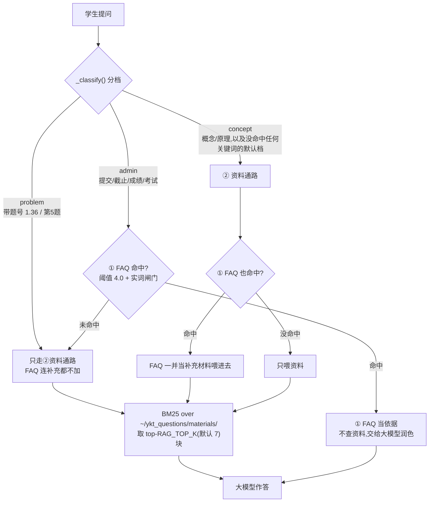
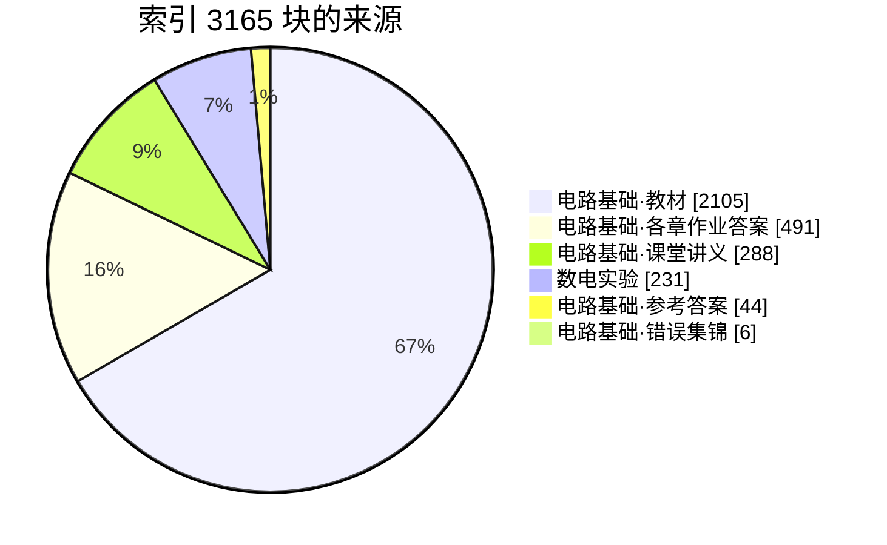

# 知识库说明(FAQ + 资料库)

> 建立:2026-09-20 · 起因:新增「电路基础」(张曰理老师)理论课的作业答案与群聊问答
> 最近一轮:**第九轮** —— 文档长出"网页层"(HTML 里有架构图/流程图/时序图/饼图,
> 不是 markdown 的翻版),外加一次全仓一致性审计。改动清单见 §9.9。
> (上一轮 = 第八轮:花名册终于读得出来,顺带撞出"补交表被单测写了 398 行",§9.8)

本文说明 ta-assistant 的知识库**有哪些内容、从哪来、怎么重建、边界在哪**。
日常运维只需要看**第 2 节、第 7 节(含 §7.1 三条"不碰索引"的操作)**。

**要加一条 FAQ**,别手改 txt —— 微信里发 `【记录】问题:… 标准答案:…`,见 §5.5。
**要改截止时间/提交方式这类事务口径**,编辑 `~/ykt_questions/课程事务.txt`,见 §6.6。
**换学期要换花名册**,覆盖 `~/ykt_questions/花名册/电路基础理论课_学生名单.xlsx` 这个
文件名即可,然后跑一次 `python scripts/check_roster.py` 确认人数对不对,见 §8 第 12 条。

**改动检索相关的东西之前,请先读 §3.6。** 那里记着一个反直觉的坑:
`rank_bm25` 会把"半数以上文档都含"的词的 IDF 兜底成**同一个正数**,
于是 `的/是/原理` 这类虚词变成"正证据"、把无关章节顶到正确章节前面。
现在的修法是 `apply_lucene_idf()`,而且**不许用到 FAQ 通路**(那会偷偷改掉 4.0 阈值)。

---

## 1. 两条召回通路

ta-assistant 的答疑是**两路串联**,不是一路:



> 下面是同一张图的 **ASCII 版** —— 终端里、`git diff` 里、以及不渲染 mermaid 的地方看这份。

```
学生提问
   │
   ├─ 先分档:_classify() → problem / admin / concept       ← 2026-09-20 晚新增
   │    │
   │    ├─ problem(带题号:1.36 / 第5题 / 题10.46)
   │    │     → 只查②资料通路,FAQ 连补充都不加
   │    │        (问 1.36 时 FAQ 里那条"作业怎么提交"纯属噪声)
   │    │
   │    ├─ admin(课程事务:提交/截止/成绩/考试/考勤/雨课堂…)
   │    │     ├─ ① FAQ 命中 → **不查资料,FAQ 当依据交给大模型润色**
   │    │     └─ 未命中 → ② 资料通路
   │    │
   │    └─ concept(学科概念/原理,以及**没命中任何关键词的默认档**)
   │          → ② 资料通路 + ① FAQ 命中则**当补充材料一并喂进去**
   │            (概念讲解要能展开,短路会把"讲得更透"一起掐掉)
   │
   └─ ② 资料通路:RAG,BM25 over ~/ykt_questions/materials/ 下的分块
         取 top-RAG_TOP_K(默认 7)块塞进 prompt,由大模型作答
```

**FAQ 命中就短路,不会再走资料通路** —— 所以 FAQ 里写一条不准确的答案,
代价比资料里写错还大,它没有任何"再检查一次"的机会。
(注意"短路"指的是**不走资料通路**,不是"不调大模型" ——
这句话以前被读歪过,见 §5.4 的勘误。)
**"带题号就先去查资料"这条规则,是为了不让 FAQ 短路掉具体题目**(§5.2.1);
**"只有事务题才走 FAQ 快路"这条,是为了不让 FAQ 短路掉概念讲解**(§6)。

**为什么 FAQ 要卡阈值 + 实词闸门**:见第 5 节,那里记了一次真实的误召回。

---

## 2. 知识库落在哪(以及为什么不是 `.env` 里配的那个)

| 东西 | 路径 |
|---|---|
| 业务数据根目录 | `/home/jj/ykt_questions/`(WSL 里,即 `~/ykt_questions`) |
| FAQ | `~/ykt_questions/常问问题.txt` |
| 资料目录 | `~/ykt_questions/materials/` |
| **花名册**(不是资料,见 §8 第 12 条) | `~/ykt_questions/花名册/` |
| 补交表 | `~/ykt_questions/数字电路与逻辑设计实验（一）补交表.xlsx` |
| 索引文件 | `~/ta-assistant/data/index/bm25_index.pkl`(gitignore,不版本化) |

`src/config.py` 的 `WINDOWS_ROOT` **默认就是 `~/ykt_questions`**,`.env` 里**没有**覆盖它 —— 
也就是说,当前跑的就是默认值,不用改任何配置。

⚠️ 但要注意**历史上还有一份旧知识库**在
`C:\Users\52880\Downloads\ykt_questions\`(WSL 路径 `/mnt/c/Users/52880/Downloads/ykt_questions/`):

- 它里面有数电的 `materials/`(7 个文件)和一份旧 `常问问题.txt`;
- **它不再是运行时读取的那份**。2026-09-17 那次实测时,后端在 `~/ykt_questions/` 下
  新建了补交表(`补交表.xlsx`,工作表名 `补交记录`,9 行),说明运行时用的就是 `~/ykt_questions`;
- 2026-09-20 本次更新,已把旧库里的数电资料**拷贝**进 `~/ykt_questions/materials/`,
  两份合流,所以现在运行时那一份是完整的。

`docs/design.md` / `docs/deployment.md` 里写的 `WINDOWS_ROOT=/mnt/c/Users/.../Downloads/ykt_questions`
是**旧部署方式的遗留说明**,与现在的实际运行状态不一致;真要改回 Windows 侧,得先把
`~/ykt_questions/补交表.xlsx` 里的补交记录合并过去,不然会丢记录。

---

## 3. 资料库里现在有什么

重建后的索引:**114 个文件 / 3165 个分块**。
电路基础里**教材占 2105 块(全库 67%)** —— 是 2026-09-20 晚 OCR 进来的,见 §3.5。

> 比上一版少 **1 个文件、1 块**:那份成绩记分册原先躺在 `materials/` 里,被
> `build_index.py` 当成教学资料解析进了索引(名单不是资料)。已移到 `花名册/`,
> 见 §8 第 12、13 条。移动前后跑了 `eval_retrieval.py --compare`:17 条用例全中、
> 0 条回归,§3.6 那张 df 表**逐个数复量过,一个都没动**(那块里没有那些词)。

分块构成(从实际索引里数的,不是估的;`pickle` 里 `path` 按目录归类):

| 来源 | 块数 | 文件数 |
|---|---|---|
| 数电实验(§3.1) | 231 | 6 |
| 电路基础 · **教材**(§3.5) | **2105** | 21 |
| 电路基础 · 各章作业答案(含中文详细解析) | 491 | 68 |
| 电路基础 · 课堂讲义 | 288 | 11 |
| 电路基础 · 参考答案(docx) | 44 | 7 |
| 电路基础 · 错误集锦 | 6 | 1 |
| **合计** | **3165** | **114** |

同一份数据画成图(教材一块就占三分之二 —— 这是"概念题为什么答得像教材"的直接原因):



> 教材一块的 21 个文件里,最大的是 `教材-第14章-频率响应.md`(159 块),
> 最小的是 `教材-译者序-符号与国标差异.md`(5 块)和附录(48 块)。
> (比上一版少 1 块 = 2026-09-20 语料审计丢掉的那张扫描仪元信息页,见 §3.5.1。)

### 3.1 数电实验(原有,本次只是搬进来)

原来那份索引里的 7 个文件,分块 232 个:

| 文件 | 分块 |
|---|---|
| 实验讲义2024.pdf | 188 |
| 实验仪器与教学软件的使用_202503.pdf | 16 |
| 数电模电电分复习.docx | 11 |
| 面试--数电.docx | 7 |
| 数电.docx | 6 |
| 实验报告模板(2026).pdf | 3 |

> **原来这里还有一行「成绩记分册 1 块」,现在没有了。** 那份 xlsx 是**名单**,
> 不该当教学资料 —— 已挪到 `~/ykt_questions/花名册/`(§8 第 12 条)。
> 顺带记一笔:它进索引时其实**只贡献了标题那一格**(140 个学生一个都没进去),
> 不是因为有人拦它,而是因为 `doc_parser` 用了 `read_only=True`,而那份工作簿的
> `<dimension ref="A1"/>` 撒了谎 —— **是被同一个 bug 意外挡住的**,不是设计。

### 3.2 电路基础

由 `scripts/import_circuit_theory.py` + `scripts/enhance_circuit_basic.py` 从
`C:\Users\52880\Downloads\202509电路理论基础\`(张老师课件 + 中文版作业答案)与
`C:\Users\52880\Downloads\电路基础课后作业答案\`(英文版 Soln)一起生成,
再加上 `scripts/import_textbook.py` 装配的**扫描版教材**(见 §3.5),
进索引共 **2935 个分块 / 108 个文件**(构成见 §3 的表)。六个来源:

| 来源 | 产出 | 说明 |
|---|---|---|
| `Z第N章 作业题目及答案.pdf`(9 份,中文版作业用书) | `materials/电路基础/<章节目录>/<题号>.md` | **权威版**,56 题 |
| 65 个 `SolnNNNNN.pdf`(英文版 Soln) | 同上(**同题号覆盖**)或独立成篇 | 中文版没布置的 12 题保持独立 |
| `第N章-xxx.pdf`(11 份课堂讲义) | `materials/电路基础/讲义/第N章-<章名>.md` | 课堂提纲,**概念题的权威依据之一** |
| `电路基础-中文版-原书第6版（扫描版）.pdf`(711 页) | `materials/电路基础/教材/教材-第N章-<章名>.md`(19 章 + 附录 + 译者序) | OCR 出来的教材正文,**概念与公式最细的依据**;见 §3.5 |
| `电路理论基础---错误集锦*.pptx` | `materials/电路基础/错误集锦.md` | 教材勘误,含"此题不用做" |
| `2-4 / 5-7 参考答案R.docx` | `materials/电路基础/参考答案/...` | 张老师的中文参考答案 |
| 全部资料清单 | `materials/电路基础/00_资料总目录.md` | 给人看的,**不进索引**(见 §3.4.1) |
| 生成清单(可追溯) | `materials/电路基础/_manifest.json`、`_manifest_theory.json`、`_manifest_textbook.json` | 不进索引 |

覆盖章节(作业答案):1、2、3、4、6、7、8、9、10、11、13、14、19 章。
教材则是**全书 19 章**都有。

**关键设计一:每份语料都带一段中文标题头。** 原因是英文版原答案是**英文**的
(Alexander & Sadiku 6th ed. 习题解答),而学生提问是**中文** —— jieba 切中文和切英文
是两套词,英文正文里没有「第十章」「作业」「答案」这些词,直接索引的话中文提问
召不回对应片段。所以生成时把中文锚点显式写了进去:

```
【电路基础 第10章 习题 10.46 参考答案(中文版)】任课老师:张曰理
来源:Z第10第10章 作业答案).pdf(中文版《电路基础》(原书第 6 版)配套作业用书,**参数与结论以本版为准**)
检索:电路基础 作业 答案 习题 解答 参考 中文版 第10章 CH10 10.46 题10.46 详细解析 讲解 ...

【中文详细解析】
...
【原文(核对用,未经改动)】
10.46 ...
【英文版对照(仅参考)】
⚠️ 这是**国际版**教材的解答,**个别题目的参数/单位与中文版不同**(例如公里与英里)。
**数值、单位、结论一律以中文版为准**;本段只用于对照两版差异。
```

**关键设计二:中文版与英文版按"输出路径"合并,中文版是正文。**
助教明确要求:国际版与中文版**个别题目的参数不同**(公里被换成英里),
所以**课后题答案以中文版为准**。做法是让中文版写到和英文版**同一个文件路径**
(`materials/电路基础/<章节目录>/<题号>.md`,例:`1第一章/1.36.md`)——
路径本身就是合并键,不需要额外维护映射表。于是:

- 中英都有的 53 题 → 一个文件,中文版是正文与结论,**英文原文降级**成文末的
  「英文版对照(仅参考)」块,并写明数值以中文版为准;
- 中文版独有 3 题(11.12、14.0、6.62)→ 只有中文;
- 英文版独有 12 题(第 13、19 章全部,以及 11.2、6.65)→ **原样保留**,不动。

**冲突处理是"结构性的",不靠提示词自觉。** 因为同一个文件里中文在前、英文在注明
"仅参考"的块里,大模型读到两套数字时,优先级写在文件结构里(而且提示词里也钉了一遍,
见 §6)。若反过来靠提示词说"注意别用错版本",迟早会漏。

**题号以正文自述为准,不用文件名。** 文件名那串数字**不可靠**:
`Soln11012.pdf` 对应的正文是 `Solution 11.2`、`Soln13007.pdf` 是 `Solution 13.7`。
脚本先读正文前 120 字符里的 `Solution X.Y`,读不到才退回文件名,并在不一致时打警告。

**中文版切题踩过的四个坑**(都在 `test/test_split_cn_problems.py` 里钉住了):

1. **题号正则结尾不能用 `\b`**。Python 的 `\w` 把中文也算进去,`2.74下图所示电路`
   里 `4` 和 `下` 都是 `\w`,用 `\b` 判词尾会**整题漏掉**(实测漏掉 2.74)。
   改成"后面不能跟数字"。
2. **行首的纯数值不是题号**。`10.5 V`、`0.25` 这类也会落在行首,靠"题号后十几个字里
   必须有中文"滤掉。
3. **按文件名声明过滤章号**。第 10 章的文件里会冒出行首的 `3.92`、第 11 章里冒 `13.7`
   (都是引用别题)。用 `Z第10第10章...` 里读出的"这份文件只该有第 10 章"一过滤就干净了。
4. **同一题号出现多次取正文最长的那段**。第 14 章开头有一行"作业题 14.0 … 14.4 …"的清单,
   pdfplumber 换行后清单项也落在行首,先匹配到的是清单而不是正文;取最长的就自然选中正文。

**第 6 章整章写 `6-11` 而不是 `6.11`**,所以切题时统一归一成点号,
否则中文版的 6-11 就没法和英文版的 `6.11.md` 合并。

### 3.3 中文详细解析(2026-09-20 加的 LLM 增强)

**原解析太简略,检索到了也答不了疑。** 1.36 题原文全文就两行:

```
(a) I = 20/0.25 = 80 amps.
(b) days = (20/0.002)/24 = 416.7 days.
```

学生看不懂 `0.25` 是哪来的(15 分钟 = 0.25 小时)。所以逐题调大模型,
把英文原解答**翻译并展开**成中文详细解析,写回同一个语料文件:

```
【电路基础 第1章 习题 1.36 参考答案】任课老师:张曰理     ← 标题头(检索锚点)
来源:Soln01036.pdf(...)
检索:电路基础 作业 答案 ... 1.36 题1.36 详细解析 讲解 思路 步骤 方法 怎么做 ...

【中文详细解析】                                        ← 大模型生成,学生看这个
【题目要求】/【已知条件】/【解题思路】/【详细步骤】/【最终答案】

【原文(核对用,未经改动)】                              ← 原文一字不动地附在后面
Solution 1.36 ...
```

生成器:`scripts/enhance_circuit_basic.py`(抽出逻辑复用 `import_circuit_basic` /
`import_circuit_theory`,不重复实现)。**75 题全部增强成功**,耗时 5 分 51 秒,并发 5。

**三类源共用一套缓存,新增源不重复花钱。** 缓存键是
`sha1(PROMPT_VERSION, kind, 原文)`,`kind` 就是命名空间:

| kind | 源 | 本次 |
|---|---|---|
| `cn-v1` | 中文版作业用书(**权威版**) | **56 题新生成** |
| `pdf` | 英文版 Soln(中文版没布置的题) | 12 题命中缓存,不重跑 |
| `docx` | 张老师中文参考答案 docx | 7 题命中缓存,不重跑 |

于是加中文版这件事只花了 56 次调用 —— 只有英文版的题(第 13、19 章等)沿用原解析,
它们本来也不该被中文版覆盖。反过来说:有中文版的 53 题**必须重新生成**,
因为旧解析是照**英文版**原文写的,数字可能正是错的那一版。改中文版提示词时,
把 kind 从 `cn-v1` 换成 `cn-v2` 就能让这部分精确失效。

三条纪律(改脚本前先读):

1. **不许改数值**。提示词明确要求保留所有数字/单位/结论,原文没写的推导不许补。
2. **原文必须原样附在文件末尾**。大模型出错时,原文是唯一的事实来源,
   助教可以逐行核对。这是"不许删原文"的原因。
3. **提示词版本化**。改了提示词就 bump `PROMPT_VERSION`(或换 kind,如 `cn-v1`→`cn-v2`)。

**文件路径与格式只有一个来源。** `import_circuit_theory.py` 定义 `Spec`(写去哪、
标题头、正文、文末附加块)和 `render()`;增强脚本**不自己拼文件内容**,而是调
`render(spec, 中文解析)`。这样重写文件时**不可能漏掉英文对照块** —— 它压根不自己拼。
`_collect_jobs` 里也据此跳过被中文版覆盖的英文题号,否则两个 job 会写同一个文件、
谁后写谁赢。

**中文版原文的两种 PDF 失真,提示词里明确交代了**(只在解释里还原,**不许动数值**):

- **上下标被甩到下一行**:正文写 `R 、R 、R`,下一行是 `1 2 3`,实为 R₁、R₂、R₃;
- **公式符号丢失**:如 4.15 原文 `p = i2R = (1.875)23 = 10.55w`,实为 `p = i²R = (1.875)²×3`。

实测 4.15 的中文解析**主动报出了原文的一处不一致**:"原文此处 13/2 与上一行 13/3 不一致,
且按 13/2 代入得不到 3/8,疑为抽取失真或笔误;按上一行 13/3 理解…与原文结论一致,
请对照作业册"。这种"照实说不确定"比编一个通顺解释有价值得多。

**数字保留审计(每次增强后都要跑)**:
`./.venv/bin/python scripts/audit_enhanced_numbers.py --context`。
把原文里所有"有意义的数字"(≥3 位或带小数点)抠出来,逐个查是否出现在中文解析里。
本次结果 **75 份中 69 份数字全部保留**,剩 6 份逐条人工看过,**没有一处是大模型改错**:

| 类型 | 例子 |
|---|---|
| 别题的题号(图注 `For Probs. 19.18 and 19.37`) | `11.12` `19.37` `10.60` |
| PDF 丢了上标 → `10⁹` 变 `109` | `109`(`8.883x109`) `103` |
| PDF 把分数/乘号拍平 | `7030`(=70∥30) `205`(=20∥5) `22.5`(=`ω²2.5`) |
| 纯精度差异(不是错误) | 原文 `13.51342 – j48.9189` → 解析写 `13.513 - j48.919` |
| MATLAB 输出表格被概括 | 13.11 的 `1.0e+003 * 0.2000 + 1.2000i` |

> 审计脚本自己也修过一处**盲区**:中文版题的原文后面跟着「英文版对照」块,而两版
> 数字本就可能不同 —— 原来把英文那段也算进"原文",于是"中文解析里没有英文版独有的数"
> 全被报成缺失,把真正该看的几行淹没了(57 份"可疑" → 修好后 6 份)。
> 现在按 `【英文版对照(仅参考)】` 截断,只审**中文原文**。
> 同理,`讲义/` 与 `错误集锦.md` 本来就不该有解析,已从审计范围里排除。

最后一条特意核过:13.11 的中文解析写 `I1 = 0.1390 − j0.7242 A`、`I_x = 0.4619∠−80.26°`,
与原文 `I = 0.1390 - 0.7242i`、`461.9cos(600t–80.26˚) mA` **一致** ——
说明是**读出来的**,不是模型自己算的。

> 能力边界:题图是图片,大模型看不到。提示词要求它在该处注明
> "(此处依赖题图,请对照作业册或原始 PDF)",**禁止凭空描述电路长什么样**。
> 实测 9.67、13.11 等题都正确写了这句。想让它能讲图,得先做 OCR/视觉方案(见 §8)。

### 3.4 检索:锚点必须复制进**每一块**,不能只放第一块

这是增强之后暴露出来的、比"内容简略"更隐蔽的问题(2026-09-20)。

学生问「电路基础第一章作业的1.36怎么做」,修好 FAQ 截胡后资料通路终于被调用了,
可模型回答的却是"**资料里只有题目,没有收录解题步骤**"。查分块得分,真相是:

| `1.36.md` 的分块 | 得分 |
|---|---|
| 第 0 块(锚点行 + 题目要求) | **20.77** ← 只有它带着 `检索:` 锚点行 |
| 第 1 块(已知条件) | 2.27 |
| 第 2 块(**详细步骤**) | **0.00** |
| 第 3 块(最终答案) | 5.90 |
| 第 4 块(英文原文) | 0.00 |

于是 top-5 被**别的文件的第 0 块**占满(它们都含「电路基础/作业/答案/第N章」,
各得约 12.5 分),模型只拿到"题目要求"。**检索没召回解答,再详细的内容也没用。**

**修法**:`src/rag/indexer.py` 里把文档开头的 `检索:` 锚点行**复制进每一块**。
副作用是好的 —— 锚点里的通用词(电路基础/作业/答案/习题)因此在所有块里都出现,
IDF 自动趋近 0,真正有区分度的**题号**反而更突出。修完的得分:

```
1.36  问:top-5 = 19.49 / 17.20(目录) / 16.14 / 15.49 / 15.17   ← 4 块都是 1.36.md
10.46 问:top-5 全部来自 10.46.md
```

同一次还调了 `RAG_TOP_K`:**5 → 7**。一份电路基础语料的分块数中位数是 5、最长 11,
只取 5 块会把同一条解答的后面几块切掉(实测问 10.46 时模型只拿到前两问的推导,
如实回答"第三项资料未给详细步骤")。取 7 能覆盖 93% 的题目文件(68/73)。

`_anchor_of()` **只认文档开头 400 字符内的 `检索:` 行**,避免误抓正文深处偶然的同名文字;
数电的原始 PDF 没有锚点行,行为完全不变。

> ⚠️ **这个"好的副作用"有个上限,教材进库后被撞到了。** 同一套机制在**作业答案**上有效
> (通用词被摊平、题号突出),但教材的锚点里除了通用词还有一串**通用词尾巴**
> (`定义 概念 原理 定理 公式 推导 讲解 详解 怎么理解 为什么`)——
> 它们被复制进每一个教材分块,等于给全部 19 章同时发了一张"什么都能答"的通行证。
> 真正的代价不在尾巴本身,而在当时 `原理` 这类词的 IDF 被兜底成一个**正数**(1.70):
> 见 §3.6。**结论:锚点复制这个机制没错,但"往锚点里多塞词"不是免费的。**

### 3.4.1 目录/清单类文件**不进索引**(2026-09-20 晚)

加完讲义后复测,发现**每个问题的第一名都是 `00_资料总目录.md`**:

| 提问 | `00_资料总目录.md` 得分 | 本该命中的文件 |
|---|---|---|
| 什么是叠加原理 | **13.6**(第 1 名) | 第4章-电路定理.md 第 11 名 |
| 作业里的叠加定理怎么理解 | **15.0**(第 1 名) | 第4章-电路定理.md 第 18 名 |
| 教材上哪里有印错的地方 | **16.2**(第 1 名) | 错误集锦.md 第 9 名 |

原因是结构性的:目录里**列着每个题号和章节名**,于是任何带题号或章节词的提问
它都能拿高分 —— 而它的正文只是一份清单,对回答毫无营养,还占掉 7 个名额里的 1 个。
**修法**:`_iter_files()` 里跳过 `00_` 开头(人工目录)和 `_` 开头(生成清单)的文件。
它们是给人看的,不是给人问的。改完 1064 → 1061 块,第一名全部还给真正的资料。

### 3.4.2 锚点里要写上**学生的说法**,不能只写书面语

同一批复测里暴露的第二种失败:问「教材上**哪里有印错**的地方」,错误集锦排第 9、
大模型答"我这边没有拿到那份清单的内容";把问法换成「教材哪里**印错了**」,同一份资料
排第 **2**。一模一样的意图,一个答得上一个答不上 —— 因为锚点里写的是
`印刷 错误 勘误`,而学生说的是 `印错`。

**修法**:错误集锦的检索行补上口语句式(`印错 印错了 写错 错字 哪里有错 哪里印错
教材错误 书上错了`)。改完同一问的得分:

```
错误集锦.md  26.24 / 25.05 / 23.47 / 23.28 / 21.49 / 21.08   ← 前 6 名全是它
```

同理给讲义锚点补了 `作业 习题` 两个词:学生问「**作业里的**叠加定理怎么理解」时,
讲义原本一个词都对不上这两个字,只能靠"定理"勉强挤进前 20;补完后
「什么是叠加原理」那一问里第4章-电路定理.md 从第 11 名升到第 8 名。

> 教训:锚点是**手写的同义词表**,它的价值全在"覆盖学生真实的问法"。
> 每遇到一次"资料明明在库里却答不出",先看分块得分,再看锚点缺了哪个词。

**2026-09-20 晚补的第五条证据(教材上线的副产品)。** 学生问「虚短和虚断是什么意思」,
而**教材正文里根本没有"虚短""虚断"这两个词** —— 全 19 章 grep 下来只在
`教材-第5章-运算放大器.md` 里各出现 1 次,而且都在**我注入的锚点行**上,正文一个都没有。
教材(译本)的说法是"开环增益无穷大""输入电阻无穷大"(第 166、171、736 行)。

也就是说:`CONCEPTS[5]` 里写 `虚短虚断`,是**唯一**让第 5 章能对这个问题召回的机制。
去掉它,这一问就只能靠大模型的通用知识答。

顺带确认了这个机制**不会**假装成功:召回的第 5 章分块里并没有解释这两个词,
所以大模型照实说了「下面这版讲法是通用教材知识,供参考;教材第5章(从P134起)专门讲
运算放大器,可以对照着看」—— 该收的声明收了,该给的页码给了。
**锚点负责"召得回",不负责"块里真有答案";后者由提示词第①档的声明规则兜住。**

### 3.5 扫描版中文教材(OCR 进库,2026-09-20 晚)

`电路基础-中文版-原书第6版（扫描版）.pdf`(711 页 / 266 MB)一直是唯一一个
"资料就在手里但进不了库"的东西。**它是纯扫描件**:每页一张 1904×2944 的图
(`Pdg2Pic` + `FreePic2Pdf` 生成),`get_text()` 全文只有 115 个字符(还是元数据里的书名)。
`pdfplumber` 一个字都抽不出来,所以 §4 一直把它记成"排除项"。

现在它进来了:**21 个文件 / 2105 个分块**,索引从 1061 涨到 3166 块(教材占 66%)。

| 产出 | 内容 |
|---|---|
| `教材-第N章-<章名>.md`(19 份) | 全书正文,每章一个文件 |
| `教材-附录-奇数编号习题答案(P670-P695).md` | 书后附录,**只有最终答案没有过程** |
| `教材-译者序-符号与国标差异.md` | 导线交叉处**有没有黑点**的含义与国标相反,学生照国标读图会读错 |

**引擎:RapidOCR(ONNX),不是因为效果好,是因为别的走不通。**
服务器 `sudo` 要密码 → `apt install tesseract-ocr` 直接没戏;RapidOCR 是纯 pip 依赖、
自带中英文模型、CPU 就能跑,中文识别明显好过 tesseract-chi_sim。
711 页 12 进程跑 **47.9 分钟**(约 3.2 秒/页),结果 743,562 字符。

**DPI 用 300,是量出来的不是拍的。** 实测 200 DPI 相比 300 DPI:
正文行**一行不少**,只是少数公式碎片会丢(`β=`、`M`、`-j20`、`WM`),
而耗时只省 15%(55s vs 65s/页)。省这点时间换公式碎片不划算,所以留 300。

**三个必须记住的设计点:**

1. **书前 16 页(封面/版权/出版者的话/译者序/前言/作者简介/**目录**)不进正文。**
   目录页尤其:它列着全部章名和页码 —— 正是 §3.4.1 说的那种"谁提问它都高分"的清单。
   封面、版权页、作者简介同理。
2. **`印刷页 = PDF 页 − 16`。** 这个偏移错了,答案里引用的"教材 P188"就会指到别的题上去
   (错误集锦写的就是**书上页码**)。偏移是**三个独立来源交叉验证**出来的 —— 书前页的罗马
   数字(PDF 12→XI、16→XV)、正文书眉(PDF 19/20/21 印着 3/4/5)、目录里写的章节起始页 ——
   而且 `import_textbook.py` 会**逐页用书眉自查**,不一致的页在结尾报出来。
   全 711 页跑下来**零不一致**(`_manifest_textbook.json` 里 `bad_page_headers` 是空数组)。
3. **每页开头插 `[教材 P{印刷页}]` 标记。** 这是教材比讲义强的地方:讲义是 PPT 导出,
   **没有页码**;教材有页码,大模型才能答"教材 P188 这道题印错了",学生翻书能直接对上。

**文件名必须带 `教材-` 前缀,这不是洁癖。** `讲义/` 里的文件名格式**一模一样**
(`第1章-基本概念.md`、`第4章-电路定理.md`…与教材章名逐字相同),而索引里的 `source`
字段**只存文件名不含目录** —— 不加前缀,学生看到「参考:第4章-电路定理.md」就分不出
那是课堂 PPT 还是教材正文。`test/test_import_textbook.py` 里有一条测试专门钉住这个不重名。

**踩到的两个坑(都已修,并留了测试):**

- **译者序取错了页。** 原本写 `TRANSLATOR_NOTE_PDFS = (4, 5)`,但 PDF 4 是
  **「出版者的话」**(讲这套丛书的历史,与电路无关),PDF 5 才是「译者序」。
  产出物开头是"出版者的话"却在标题里自称"符号与国标差异" ——
  一个**自称讲 A 实际是 B** 的文件比没有文件更糟,大模型会拿它去答符号问题。改成 `(5,)`。
- **书前页算出了负页码。** 书前 16 页用**罗马数字**页码,套 `pdf − 16` 得到 `[教材 P-12]`,
  学生按它翻书永远翻不到。修法:书前页一律不加页码标记,并抽成 `_translator_note()`
  单独可测(`test_translator_note_never_gets_a_negative_page_marker`)。

**概念词进锚点是手写的,不是从正文自动抽的。** `--report-sections` 试过自动抽节标题,
噪声大到不能用 —— 正文里公式行、图注也长成 `3.4 xxx` 的样子,抽出来有
`1.6 X10- = 25 000(V) 4` 这种;而且**真的节会漏**(1.8 解题方法、3.6、3.9 都没抽到)。
所以 `CONCEPTS` 是按书的目录**人工核对**写死的,并有一条测试禁止把
「本章小结」「复习题」「PSpice」这类**结构性标题**混进去(它们没有检索价值)。

**OCR 出来的公式是乱的,这一点必须让学生知道。** 正文识别得很准,但公式、上下标、矩阵
常有乱码(如 `C = εA/d` 变成 `C= EA d`)。所以提示词里加了一条:**引用教材时说清页码,
看到明显不成句的公式就照实说"这里 OCR 得不清楚,请对照教材 P某页",不要猜一个看起来
通顺的公式**。附录那种"只有答案没有过程"的也同理,锚点里已经把这件事写明了。

#### 3.5.1 教材语料审计(2026-09-20 深夜,教材上线后立刻做的)

教材一进来就占了索引 66%,所以它不是"多加了一份资料",而是**重新定义了整个检索环境**。
于是先做了一轮审计:**先量现状,再决定改什么**,没有凭感觉动。三件事,两改一不改。

**① 扫描仪元信息页 —— 删掉。** OCR 结果里有 1 页全是 `SS号`、`页数`、`扫描日期`
这类扫描软件写进去的字段。它跟目录页、`00_*.md` 是同一类东西:**一段谁提问都能命中的清单**,
而且它落在某一章的正文里,会以"教材第 N 章"的身份被引用出去。整页丢弃,索引少 1 块
(2106 → 2105,也就是 §3 表里那个差 1)。

**② `Ω` 被 OCR 认成 `Q` —— 按上下文改回来,1932 处。** 这是本轮**最值得修**的一条:
  电阻单位写错等于把题改了。修法是**只认上下文,不做全库替换** ——
  正则 `(\d(?:[kKmMμnGgTt])?)Q(?![0-9A-Za-z值点参因品])` 要求
  "数字(可带 k/M/m 等倍率前缀)+ Q + 后面不是字母/数字/汉字",
  这样 `5Q`→`5Ω`、`2.2kQ`→`2.2kΩ`,而 `Q` 点(三极管/逻辑里的 Q)、`Q值`、`品质因数Q`
  一个都不会被误伤(负向断言里那几个汉字就是为它们留的)。
  含 `Ω` 的分块从 999 涨到 **1125**。改动处数记在 `_manifest_textbook.json` 的
  `ohm_symbol_fixes` 里,可追溯。

**③ 页码标记只覆盖了 35.8% —— 修到 99.7%,这条最影响可用性。**
  `[教材 P{印刷页}]` 是教材相对讲义**唯一**的优势(讲义是 PPT 导出,没有页码)。
  第一版只在这一页"看起来像是新的一页开始"时才插标记(靠书眉),结果 2106 块里
  只有 754 块带页码 —— 学生看到"教材 P188 有讲"却翻不到,等于这个优势没兑现。
  改成**逐页传递**:标记跟着 `cur_page` 走,每一块都继承它所在页的页码。
  覆盖率 754/2106(**35.8%**)→ **2099/2105(99.7%)**。

  剩下 6 块没页码,全部有明确原因,**不是漏**:

  | 例外 | 块数 | 为什么合理 |
  |---|---|---|
  | `教材-译者序-符号与国标差异.md` | 5 | 书前页用**罗马数字**页码,套 `pdf − 16` 会得到负数,按 §3.5 的坑一律不加(留有测试) |
  | 附录的标题块 | 1 | 那一块只有附录标题本身,还没进正文,原书也没给页码 |

> **一个已知的外观瑕疵**:附录文件名仍叫 `教材-附录-奇数编号习题答案(P670-P695).md`,
> 而 P695 那页(就是上面删掉的扫描仪页)已经不在库里了。**故意不改名** ——
> 文件名进了索引 `source` 字段、进了基线 JSON、也被学生的历史对话引用,
> 为了对齐一个页码去重命名,换来的是一致的假象而不是一致。记在这里,不修。

### 3.6 BM25 的 IDF 兜底:虚词被当成"正证据"(2026-09-20 深夜)

**症状。** 用户验收过的提问「什么是叠加原理」,第 4 名才是 `教材-第4章-电路定理.md`
(13.47 分),而 `教材-第5章-运算放大器.md`(13.53 分)、`教材-第17章-傅里叶级数.md`
挤在它前面。**"运算放大器"和"叠加原理"没有任何关系** —— 这不是"排序不太好",是错的。

**根因是库的兜底,不是语料。** `rank_bm25.BM25Okapi` 算
`idf = log(N - df + 0.5) - log(df + 0.5)`:词出现在**半数以上**分块里时这个值是**负的**,
而它把负数**统一兜底**成 `epsilon × average_idf`(epsilon = 0.25)。实测本库:

| 词 | df(共 3165 块) | 旧 IDF | 换 Lucene 后 |
|---|---|---|---|
| `的` | 2959 | 1.6994 | 0.09 |
| `怎么` | 2595 | 1.6994 | — |
| `是` | 2453 | 1.6994 | — |
| `原理` | 2401 | **1.6994** | **0.28** |
| `叠加`(真关键词) | 38 | 4.40 | 4.41 |
| `叠加定理` | 225 | 2.57 | 2.64 |

关键在于:**`原理` 和 `的` 的权重一模一样,而且是个正数,只比真关键词 `叠加` 小 2.6 倍。**
于是「什么是叠加原理」里的 `什么`+`是`+`原理` 给**每一章白送 7.3 分**
(实测第 5 章那块 13.53 分里 7.3 分来自这三个词)。
**"什么词都匹配"变成了正证据**,这才是"无关章节挤进 top-7"的机制。

而 §3.5 提到的**锚点通用词尾巴**(`定义 概念 原理 定理 公式 推导 讲解 详解 怎么理解 为什么`)
把这个效应**放大**了:那串词被复制进**每一个**教材分块,等于给全部 19 章
同时发了一张"什么都能答"的通行证。教材一进库,这个尾巴的代价才第一次变明显。

**修法:换成 Lucene 的 IDF 写法** `log(1 + (N - df + 0.5) / (df + 0.5))` ——
单调递减、**恒为正、不兜底**。见 `src/rag/retriever.py:apply_lucene_idf`。
效果是"稀有词不被削、常见词被压平",正是 IDF 该干的事。

**为什么不清零。** 清零(把常见词直接踢出打分)会让"问句只由虚词组成"时全库 0 分、
一条都召不回 —— 比噪声更糟。Lucene 版留了很小一点权重,排序意义不变而噪声基本消失。

**为什么不在 `load()` 里"顺手也修一下 FAQ"。** `FAQRetriever` 的 4.0 阈值**就是按旧 IDF
标定的**,换公式等于**偷偷改阈值**:实测「这周电路基础有作业吗」5.11 → 1.88、
「Proteus 在哪下载」5.48 → 3.03,真命中会掉到阈值以下、FAQ 通路直接哑掉。
FAQ 那边解决同一个问题靠的是"实词闸门"(`_FAQ_STOPWORDS`),不是改打分。
`test/test_idf.py::test_faq_retriever_keeps_the_original_idf` 专门钉住这条边界。

**装载时也会修一遍。** 老索引 pickle 里存的是旧 IDF。`BM25Retriever.load()` 里也调
`apply_lucene_idf`,所以**不重建索引也能去掉虚词噪声**;重建是为了让磁盘上的那份也干净。
(这条有个副作用值得记:拿"修复前的索引"做突变测试**测不出差别** —— 装载时被修好了。
第一次跑突变测试就因为这个假绿,后来改成"旧索引 **+** 注释掉装载时的调用"才复现出失败。)

**效果(实测,不是估的)。** 17 条用例命中 **17/17**、MRR **0.956** 前后不变,
ch4/ch5 的名次反转被纠正。但要如实说清楚:严格表上的"无关教材章"总数只从 **8 条降到 7 条**,
没有归零。剩下的跨章命中**是真正的词形匹配**,不是打分的锅:

- 第 17 章讲傅里叶级数时用的"叠加"是**谐波叠加**,词同一个、意思不同;
- 第 10 章(正弦稳态)里有**交流电路里的戴维南等效/叠加应用**,算相关章,已写进 `allow_ch`;
- 第 5 章那块是正文顺带提到 —— 词形匹配解决不了,记作已知残留。

表里后来又从 7 条降到 4 条,那是**逐条核对 `allow_ch`**(把"确实相关的章"正名)的结果,
**不是打分变好了**。这个区别必须分清,否则下次会以为"再调调 IDF 还能降"。

---

## 4. 有这几类文件被**故意排除**了(不是遗漏)

`import_circuit_basic.py` 里用 `KNOWN_SKIP` 逐个写明原因,每次运行都会打印。依据都是实测:

| 文件 | 为什么不要 |
|---|---|
| ~~`电路基础-中文版-原书第6版(扫描版).pdf`(266 MB,711 页)~~ | ~~**纯扫描件,没有文本层**~~ → **2026-09-20 晚已 OCR 进库**,见 §3.5 |
| `Fundamentals of Electric Circuits (4th Ed.) Solution Manual*.pdf`(两份,各 1972 页) | **版次不符**。作业用的是**第 6 版**(单题解答页脚是 `Copyright © 2017`),这两份是**第 4 版**,题号会串。实测在 4th 手册里**搜不到** `Solution 10.46`。照它答会答错题 |
| 英文教材正文(993 页/1.7M 字符) | 英文正文对中文提问几乎无召回,1.7M 字符还会把 BM25 结果稀释掉。**不是不能加,是要加就得先给它配中文小节标题**(见第 8 节待办)。中文版教材 OCR 进库后,这一项的必要性进一步下降了 |
| `微信图片_20251011164912_70_519.jpg` | `src/utils/doc_parser.py` **不支持图片**,无 OCR |
| `00_*.md` / `_*.md` | 人工目录与生成清单,**不进索引**(理由见 §3.4.1)。注意"排除"发生在索引阶段而不是导入阶段 —— 文件仍然生成,人还能翻 |

> 教训:一个"看起来全是资料"的目录,直接整个 rglob 进索引是危险的。
> 版次不同的答案手册比没有答案更糟 —— 它会自信地给出错题的解答。
>
> 另一条教训(扫描版教材那条):**"排除"这个结论要写清依据,也要定期回头看。**
> 当初记的是"没有文本层,要索引必须先 OCR" —— 依据没错,但"先 OCR"这个前提
> 后来被当成了"做不到"。真正卡住的从来不是可行性,是**没去量 OCR 的成本**(实测 48 分钟)。

---

## 5. FAQ 文件:格式、阈值,和一次真实的误召回

### 5.1 格式

`~/ykt_questions/常问问题.txt`,条目间空行分隔;解析器是
`src/rag/retriever.py` 的 `_parse_faq()`:

```
Q:
<问题,可以多行>
A:
<答案,可以多行>

Q:
...
```

文件开头可以写注释(解析器遇到 `Q:` 之前的内容会跳过)。
**不要**在答案里出现行首的 `Q:`。当前 **37 条**:数电 7 条 + 电路基础 30 条。

### 5.2 阈值与"实词闸门"

`FAQ_HIT_THRESHOLD = 4.0`。2026-09-20 加了第二道闸门,原因是实测踩到的假召回:

加入电路基础 FAQ 后,`什么是竞争冒险`(数电概念题)以 **4.83 分**命中了
`电路基础作业的截止时间是什么时候?` —— 因为中文疑问句里 `是`、`什么`、`的`
几乎每句都有,BM25 就被这些虚词凑够了分。FAQ 命中会**短路掉资料通路**,
于是学生会拿到一份"作业截止时间"去回答"什么是竞争冒险"。

**第一次修法是错的,记在这里免得再走一遍**:把停用词从**打分**里删掉。
结果虚假命中没了,但真实命中一起掉到阈值以下 ——
`这周电路基础有作业吗` 5.11 → **1.88**、`Proteus 在哪下载` 5.48 → **3.03**。
因为 4.0 这个阈值本来就是按原分词标定的,动分词等于偷偷动了阈值。

**现在的做法**:停用词只当**闸门**,不参与打分。
打分照旧(原 jieba 分词,阈值含义不变),但要求命中的那条 FAQ
**至少共享一个实词**;一个都不共享就当作没命中,退回落 RAG。
实测:真命中分数**一分没变**,假命中归零。

```python
scores = self.bm25.get_scores(list(jieba.cut(query)))   # 打分:原分词
q_content = _faq_content_tokens(query)                  # 闸门:只留实词
if not (self.content_tokens[i] & q_content):            # 无实词交集 → 不算命中
    continue
```

停用词表在 `src/rag/retriever.py` 的 `_FAQ_STOPWORDS`,加了 `这/那/这题/那题` 这类
指代词(它们没有话题信息,但 `那题` 曾让 `10.46 那题怎么做` 误命中 1.23 那条 FAQ)。

> **这道闸门原来有两条"测试",但它们永远不会红** —— 2026-09-20 深夜才发现。
> 原因很隐蔽:测试只用**一条** FAQ 语料,而 `rank_bm25` 对 df > N/2 的词的 IDF 兜底是
> `epsilon × average_idf`;单条语料下 `average_idf` 是**负的**,兜底值也为负,
> 分数会被 `scores[i] > 0` 先滤掉 —— **要复现的病根本没机会出现**。
> 现在的做法是两段式:`test/test_faq.py` 里搭一份**合成的多篇语料**把病造出来,
> 再拿**真实的 `常问问题.txt`** 钉住那个被记录下来的假命中。
> 并且做了**突变测试**:把闸门删掉,两条测试必须红 —— 红了才算真测试(§9.6)。

### 5.2.1 实词闸门**拦不住**的那种截胡:带题号就先去查资料

闸门只挡"纯虚词凑分"。但下面这种情况它挡不住,因为两边**共享的确实是实词**:

```
学生问:电路基础第一章作业的1.36怎么做？        ← 2026-09-20 用户实测报的这个
FAQ 命中:电路基础理论的作业怎么提交？要交给学委吗？   得分 5.61(阈值 4.0)
```

`电路/基础/作业/怎么` 四个实词两边都有,于是 FAQ 命中 → **短路掉资料通路** →
学生拿到"作业在雨课堂提交",外加一句"这个我不确定"。
而 **1.36 的解答就在知识库里**(检索得分 19.49)。

根因是 FAQ 通路的前提「FAQ 命中就不必查资料」在**具体题目**上不成立:
「电路基础+作业+怎么做」这几个词,既属于"怎么交作业",也属于"这题怎么做"。

**规则改成:提问里带题号 → 认定问的是具体题目 → 先查资料,FAQ 只兜底。**
判定正则 `_PROBLEM_REF` 在 `src/handlers/qa.py`,能认出 `1.36` / `第5题` / `题10.46`。

必须**既准又稳**,两类误判都有代价,所以专门有回归测试 `test/test_problem_ref.py`:

| 判成"问题目"(该查资料) | 判成"普通问题"(该走 FAQ) |
|---|---|
| `1.36 怎么做` `第5题的参考答案` `第一章 1.23 的答案` | `作业怎么提交` `这周有作业吗` `雨课堂怎么加入` |
| `10.46 那题怎么做` `题10.46怎么解` | `第1次作业没交`(**"第N次"不是题号**) |
| `1.23 最后是算电还是电费` | `2026-09-20 的作业`(日期不能当成题号) |

最后两条是重点:`第1次作业没交` 若被误判成"问题目",补交登记就会被推去查资料;
`2026-09-20` 若被误判,任何带日期的提问都会绕开 FAQ。

> 副作用(是好的):`1.23最后是算电还是电费` 以前命中那条窄 FAQ,只回答电费那一点;
> 现在走资料,学生拿到的是**完整解答**。这正是 §8 旧限制 #4 的解法。

**同一天晚些时候又往前走了一步**:FAQ 快路(命中就不查资料)现在**只留给事务题**,
概念题即使命中 FAQ 也照常查资料,把 FAQ 当补充材料一起喂进去。
原因是概念题要能展开讲解,短路会把"讲得更透"一起掐掉。见 §6。
分档判据 `_classify()` 收在 `src/handlers/qa.py`,回归测试 `test/test_query_kind.py`。

### 5.3 脱敏规则(重要,新增条目前先读这段)

本次从两份微信群聊记录里提取问答,**公开规则**是:

- ✅ **可以出现**:`张曰理`(任课老师姓名)、`mcdl`(助教网名)
- ❌ **必须脱敏**:其他所有同学的姓名与网名

具体处理:

| 情况 | 处理 |
|---|---|
| 群里的学生真实姓名(19 个) | 一律不写进 FAQ;确实需要指代时用「某同学」 |
| 群里的学生网名/昵称(约 26 个) | 同上,一律不写 |
| 2 班未加雨课堂的**名单**那一条 | 整条**丢掉**(它是点名用的,不是问答) |
| 学生自我介绍 + 点名舍友的那一段 | 整段丢掉(纯身份信息) |
| 助教真实姓名(群昵称里带) | 用 `mcdl` 代替 —— 白名单只放行了网名 |
| 旧数电 FAQ 里出现的「某同学姓名 + 学号」 | 改为「某同学」(已脱敏) |
| 旧数电 FAQ 里的另一位助教姓名、另一位老师的姓名 | 改为「另一位助教」「任课老师」 |

⚠️ **连"举例说明脱敏了什么"也不要写出真名**。本文档初稿在这里列了被删掉的具体姓名,
等于换个地方又公开了一遍 —— 已在 2026-09-20 改掉。要记录就得记成上面这样的类别描述。

顺带修掉了仓库里的一处同类问题:`deploy/openclaw/…/SKILL.md` 的"手工自检"示例
原本用的是一组**真实姓名 + 学号**,已换成 `测试同学 20259999999`。

> 注:`~/ta-assistant/data/logs/2026-04.log` 和 `.claude/settings.local.json` 里也有这组
> 真实姓名学号,但它们在 `.gitignore` 里(不进版本库),且日志本身就是业务记录的用途,未改动。

> ⚠️ **黑名单扫一遍 ≠ 干净(2026-09-20 实测)。** 那天做全库脱敏扫描,结果报"0 命中"——
> 但那是**假的安全感**:名单本身**漏了一位同学**,是顺着 `.claude/settings.local.json` 里
> 一条历史批准记录才发现黑名单不全的。**denylist 只能证明"已知的这些没有",证明不了"没有"。**
> 补全之后重扫,tracked 文件里的真实姓名/学号确实是 0 —— 而**真正让它成立的是另外两条**:
> ① 名单/记分册/补交表**本体绝不进版本库**(查过,工作树里一个都没有);
> ② 允许出现 PII 的只有**被 gitignore 的文件**(`data/logs/`、`.claude/settings.local.json`)。
> 所以以后做这类检查,**先确认"名单类文件有没有混进会被提交的目录",再看黑名单**。
> 扫描时也只打印**位置**、不打印命中内容 —— 姓名学号本身不该被复述到任何地方。

### 5.4 勘误:"FAQ 快路"快在**不查资料**,不是"不调大模型"

**一句话**:事务题命中 FAQ 时,系统**跳过资料通路、仍然调大模型润色**。

这条本来不值得单开一节,但**四份文档同时写错了**,而且错得**方向相反** ——
照错的写去"修",会修出一个事务答复直接裸奔的快路:

| 文档 | 原来写的 |
|---|---|
| 本文 §1 的流程图 | `FAQ 命中 → 直接发答案,不调大模型(唯一的快路)` |
| `design.md` §2.2 / §3.4 | `事务题 + FAQ 命中 → 直接发 FAQ 答案,不调大模型` |
| `requirements.md` F-4 | `直接发 FAQ 答案、不调大模型` |
| `wechat_end_to_end.md` | `FAQ 快路(命中就不调大模型)` |

**代码里从来没有这个 `return`** —— `qa.py` 那一段只是把 `context` 换成 FAQ,
往下走照样 `llm.chat(...)`。注释和文档说的是一回事,代码是另一回事,而且**没人会发现**:
两种行为在回执上长得一模一样。

**那到底该补 `return` 还是该改注释?量过再定的:**

拿 **28 条**能自命中的事务类 FAQ 逐条走真实通路,比对"FAQ 原文里的数字"和"模型答复里的数字"
(`scripts/eval_admin_fidelity.py`,**会真调 API**):

| | 结果 |
|---|---|
| FAQ 里有、答复里**丢了**的数字 | **0 条** ← 这才是"失真",它是 0 |
| 答复里**多出**的数字 | **18 条**(逐条看过上下文,见下) |

**"丢 = 0" 是关键**:28 条里没有一条把 FAQ 的事实弄丢,所以**保留润色的决定成立**。

> ⚠️ **但结论不能写成"数字原样不动" —— 我第一版就是这么写的,是错的。**
> 那 18 条里,数字**确实会被改写**。分三类:
>
> | 类 | 例子 | 性质 |
> |---|---|---|
> | ① 同义换算 / 写法归正 | 零→`0`、「一周」→「七天」、「十」→`10` | 语义没变,只换了写法 |
> | ② 中文数字当普通字用 | 「一下」「一起」「对不上」 | **误报**,本来就不是数字(比对脚本的固有噪声) |
> | ③ **模型自己补的** | 「打印到 **A4** 纸」、举例「`10.46` 怎么做」 | **不在助教审过的口径里** |
>
> 准确的说法是:**润色不丢信息(28/28),但会增补** —— 而增补的东西不受口径控制。
> 第 ③ 类就是下面那条观察项的一般形式。

**所以保留调用,只把注释和这四份文档改对。**

⚠️ **但那不等于"润色可以随便加东西"。** 2026-09-20 晚在 OpenClaw 侧做自检时看到过一例:
问「Proteus 在哪下载?」(FAQ 里有这条),答复里**多带了一个微信公众号文章的链接** ——
那是模型从自己的知识里补的,FAQ 原文没有。链接本身未必有害,但它**不在助教审过的口径里**。
这是"润色"和"自由发挥"的边界,现在只靠提示词约束(事务类不许用自己知识补充一个字),
**没有机制去挡**。记在这里,留作观察项。

**这条不进单测**,因为它验的是**模型的输出**,不是代码逻辑 ——
单测里那个"模型"是桩,桩不会改写数字。要复核就手动跑上面那个脚本。

### 5.5 助教自己在微信里加 FAQ:`【记录】`

**在这之前,加一条 FAQ 只有一条路:开编辑器手改 `常问问题.txt`。**
那份文件没有版本库兜底、没有格式校验、写错一个行首 `A:` 就会把条目截成两半,
而且**改完没有任何反馈**。`【记录】`就是给这件事补的入口。

```
【记录】问题:仿真软件 Proteus 在哪下载?
标准答案:课程群文件里有个压缩包,解压后按说明装。
```

回执 `✅ 已记录,FAQ 现在能被检索到 38 条`,或者 `❌ 没记: <为什么>`。

**四条设计约束,针对的都是"错了很难查"的那类错:**

| 约束 | 为什么 |
|---|---|
| **拒收时一个字节都不写** | 每条拒收路径的测试都断言"文件内容未变"。"写一半"比"没写"糟得多 |
| **拿不准就拒,让助教重发** | 两条粘在一起、答案里有行首 `A:` —— 猜错的代价是**一条内容错位的 FAQ 被安静地写进去**:学生问 A 拿到 B 的答案,谁都不会发现 |
| **写前读、写后回读校验,不过就按原字节回滚** | `_parse_faq` 是行首 `Q:`/`A:` 驱动的,写进去的东西**未必读得出来**;不校验等于把"写成功"当成"写对了" |
| **FAQ 文件不存在就拒,绝不自动创建** | 路径配错时"自动创建"会造出一份空 FAQ 并从此**安静地分流**,比报错难查得多 |

拒收的四类:**含个人信息**(8 位以上连续数字 / 花名册里的姓名)、**太长**(问题 >200 字、答案 >1000 字)、
**格式拿不准**、**与现有条目重复**(近乎重复则写进去但在回执里提醒)。

> **回执里不复述正文**:提到学号只会说"问题里有学号(共 11 位)",不把号码打回去;
> 日志同理,只记 `reason=`。拒收的理由就是"它不该被留痕",再回显一遍等于白拒。
> **已知未做**:`process_input` 那条日志仍会记原始输入,所以**被拒的记录正文仍会进日志**;
> 并发写有竞态(助教不会并发,同 `requirements.md` R-4)。

**"立刻生效"不是"大概会生效",是测过的。** `FAQRetriever` 每次调用都重新读文件,
没有常驻缓存,所以记完**不用重建索引**;`test_record.py` 里有一条测试就是
"记一条 → 用真 `FAQRetriever` 查 → 必须 top-1 且过阈值"。

> ⚠️ **写这条测试踩到一个坑,值得记下来:测试语料必须按生产规模搭。**
> 最初用 3 条 FAQ 的小语料,自命中只有 **1.02 分**(阈值 4.0),测试**假红**。
> 原因不是功能坏了,是 **BM25 的 IDF 随语料条数 N 变化** —— 语料太小,分数整体就低。
> 实测真文件(37 条):自命中**最低 10.75、中位 25.44**,全部过阈值。
> 所以 fixture 改成 40 条,并且把量出来的数字写进测试文件里 ——
> **免得以后有人靠"调低阈值"把这个假红修掉**(那会把真命中一起放进来)。
> 一条**假红**比没有测试更糟:它会诱人去改对的东西。

**实现与部署:**

| 位置 | 内容 |
|---|---|
| `src/handlers/record.py` | 解析 / 四道检查 / 原子追加 / 回读回滚。`handle()` 返回 `{"type": "record", …}` |
| `src/main.py` | 闸门在**学生转发闸门之前**;顺序反了会被判成"非学生消息"丢掉,而且**看起来一切正常** |
| `src/config.py` | `RECORD_PREFIX`,刻意**不放进** `STUDENT_FORWARD_PREFIXES` |
| `test/test_record.py` | 49 例。`conftest.py` 的 `isolated_faq` 是 autouse 的,默认指向一个**不存在**的临时文件 —— 所以"文件不存在就拒"这条规则**每次跑测试都在被执行** |
| `deploy/openclaw/…/SKILL.md`、`AGENTS.md` | 加了第五种返回值 `record`;约定 `✅`=记上了、`❌`=没记上,**禁止**在 `❌` 时回"已经记下了" |
| `scripts/install_openclaw_skill.sh` | 带版本标记(`ta-assistant-route: v2`)—— **改接入件内容必须 bump 它**;装到别人的 `AGENTS.md` 上时只追加、不肯改既有的段落 |

**验真用的是突变测试**:22 个变异抓住 21 个,漏掉的那个经核对是**等价变异**
(标记词正则都是 `^` 锚定的,`^\s*答案\s*[:：]` 不可能匹配 `标准答案:`,分支顺序颠倒不改变行为)。
顺带纠正了我在源码里写错的一句注释 —— 原来写"顺序有讲究",是变异测试试出来那句话不成立。

### 5.6 从日志里挖"下一条 FAQ 该写什么"

`scripts/mine_faq_candidates.py`(2026-09-20 新增)。读 `data/logs/*.log` 里的 `qa_kind` 事件,
把**学生真问过、但 FAQ 没接住**的问法挖出来:`faq_hit=False` 且被反复问的 →
**该补 FAQ 条目**(它的主产出);`top_score` 很低的 → 该补语料。
它只读日志、只打印,不写任何东西。

**一条量出来的教训(决定了它的算法):** 干净日志里 474 条问句,去掉空白标点后
**只有 25 种不同写法**,而其中一条问法的**同一种写法被问了 158 次**。
所以这份日志的主要信息是"同一句话被反复问",**不是**"同一件事有很多种说法"——
于是**数的是"被问过多少次",不是"有几种写法"**。
(先前数的是写法数,那条被问 158 次的问题因为"只有 1 种写法"被 `--min-count 2`
判成"只问过一次"**整条丢掉** —— 最该补的那条恰恰是唯一被丢的。)

> **这个脚本有个前提,踩过一次:** 生产日志被**测试**写脏过
> (`process_input` 事件 + `raw` 字段),于是挖出来的"高频问题"全是测试用例 ——
> 实测 543 条问句里 **521 条(95.9%)** 的原文恰好等于 `test/` 里的字符串字面量。
> 现在 `test_log_isolation.py`(autouse)守着这件事;污染过的那段日志**没有删,是改名归档**:
> `data/logs/2026-09.log.tests-polluted-20260920` ——
> 新名字不匹配挖矿脚本的 `[0-9]{4}-[0-9]{2}.log`,自动不再被读,而**字节一个没少**,
> 回滚就是 `mv` 回来一句。**跑挖矿前先看一眼日志里有没有 `raw_repr` 的测试残留。**

---

## 6. 大模型侧的三档规则(资料里没有时怎么办)

`src/handlers/qa.py` 的 `_SYSTEM_PROMPT`。这里记的是**为什么这么写**,改提示词前先读。

### 6.1 走过的一段弯路

第一版提示词是"**只依据资料作答,资料里没有就回答『这个我不确定,建议问任课老师』**"。
写它的原因是实测问`什么是叠加定理`时,模型在资料里没有的情况下**凭自己的知识讲了一整段**,
而本项目的定位是答疑以资料为准。

这条规则治好了"瞎讲",但**做过头了**:当时知识库里只有**作业答案**、没有教材正文
(课堂讲义是 §9.4 那一轮才加进来的),
于是所有概念题(什么是叠加原理、为什么功率因数要补偿)都被一刀切成"我不确定,建议问任课老师"。
学生问概念得到的是一堵墙 —— 这正是助教 2026-09-20 反馈要改的。

### 6.2 现在的三档

把"资料里没有"拆成三种情况,提示词里逐条写明:

| 档 | 例子 | 资料里没有时 |
|---|---|---|
| ① **学科概念/原理** | 什么是叠加原理、为什么功率因数要补偿 | **先看资料里有没有教材(中文版第 6 版)或课堂讲义** —— 有就以它为准讲(不必加声明);两者都没有才用自己的通用教材知识讲,且必须先说一句「以下讲解是通用教材知识,供参考」 |
| ② **课程事务** | 怎么交作业、截止时间、补交规则、评分、考试安排、名单、成绩 | **一个字都不许猜**,只回答"这个我不确定,建议问任课老师"。写错截止日期比不回答严重得多 |
| ③ **具体题号** | 1.36 怎么做 | 只认资料里那道题的解答。资料里没有就明说没找到,**不许自己解** —— 教材版次不同题号会串(见 §4),自己解可能给出别的题的答案 |

**① 档里的教材与讲义谁优先(2026-09-20 晚定,教材进库后改的):**
两者都有时 —— **以教材的细节为准,用讲义的口径来组织**。
教材(§3.5)有推导、有页码、覆盖全书 19 章,但它是**译本**;
讲义是张老师课堂上的讲法,但**只是 PPT 提纲、往往只有结论没有推导**。
所以不是"二选一",是"用老师熟悉的口径,讲书上更细的内容"。

外加一条【尽量结合作业】:**讲概念时,如果资料里有相关作业题,就写出题号拿它当例子**,
讲清楚"这个概念在作业里怎么用"。同时明确禁止它编造题目内容、禁止说
"作业里第几题考了这个"(它看不到作业册,不知道里面有什么)。

**还有一条【中文版优先】**(2026-09-20 晚加):一道题里同时有
`【…参考答案(中文版)】` 和 `【英文版对照(仅参考)】` 时,
**数字、单位、最终结论一律用中文版那段的**,英文版那段只用来对照两版差异,
**不许拿它的数字去回答**。这是把 §3.2 的文件结构约定在提示词里再钉一遍 ——
两处都写,是因为"用错版本"正是助教点名的那类错误。

**教材进库后又加了一条【引用教材时要给页码】**(见 §3.5)。两个要点:

1. **引用教材讲解时要说清页码**(「教材第188页讲了这一点」)。
   教材段落里带着 `[教材 P188]` 这种**书上印刷页码**标记,指着它**下面**那段内容。
   教材比讲义强就强在这里 —— 讲义是 PPT 导出,**没有页码**,学生翻不到。
2. **OCR 出来的公式不要硬解。** 教材是扫描件 OCR 的,公式/上下标/矩阵常有乱码,
   指示模型"看到明显不成句的公式就照实说『这里 OCR 得不清楚,请对照教材 P某页』,
   **不要猜一个看起来通顺的公式**"。
   这一条比第一条重要:**猜出来的公式看起来是对的,学生不会去核对。**

### 6.3 为什么②③必须单独钉住

因为**幻觉的代价不对等**。概念讲得浅一点、用词不完全是老师的说法,学生自己看书也能纠正;
但**编一个截止日期、编一道题的解答**,学生会照着做 —— 后者就像 §4 里那份 4th 版答案手册,
"自信地给出错题的解答"。所以放开①的前提,是把②③写死。

### 6.4 实测(2026-09-20)

| 提问 | 效果 |
|---|---|
| `什么是叠加原理` | 讲了定义 → 四步用法 → 四个易错点(受控源要保留 / 功率不能叠加 / 只适用线性电路 / 参考方向),末尾**自动挂上讲义**:"张老师的讲义在第10章正弦稳态分析里专门讲了这一点(10.4 叠加原理)" |
| `作业里的叠加定理怎么理解` | 概念讲解 + 用库里的 **4.15** 举例(设 i = i₁+i₂+i₃ 分别是 20V 源、2A 源、16V 源单独作用),并提醒对照作业册自己画单源电路 |
| `1.36 怎么做` | 只用 `1.36.md` 一份资料,答的是**中文版**的数字(20A∙h、12V、80A、416.7),并把 `0.25` 的来历讲清(15 分钟 = 0.25 小时) |
| `教材上哪里有印错的地方` | 逐章列出勘误(P9 应为 115 V、P166 新版书漏了 2 μF、**P188 这题本身有错不用做**…)。修锚点之前这一问是答"我这边没有拿到那份清单"的 |
| `什么是竞争冒险?` | 数电资料里**有**相关内容 → 直接用资料答,而且**没有**加"通用教材知识"那句前缀(资料里有就不该加) |
| `13.11 那题怎么做`(英文版独有) | 正常按 `13.11.md` 答(ω=600、j480/j360/j720、−j138.89 Ω),说明中文版没布置这题也不影响 |
| `电路基础期末考试考什么范围` | 事务题:先明说"我这边没有正式通知,请以张老师说明为准",再把复习资料里的要点**标注清楚**列出来当参考,结尾再强调"不等于考试范围" |
| `期中考试什么时候` | 事务题:资料里没有 → 明说没有考试安排信息、建议问老师,**没有编日期** |
| `电路基础第12章 12.99 怎么做` | 库里没有 → "这道题我没有找到对应的参考答案,建议问任课老师",并解释教材版次不同题号会串、所以不替你推 |

**核实过引用没有编。** 上面 `什么是叠加原理` 那句挂靠是真是假,直接去讲义里查了:
`讲义/第10章-正弦稳态分析.md` 第 142 行确实有 `10.4 叠加原理`,第 145 行还写着
"若电路中有几个不同工作频率的电源,则叠加原理…"。
`4.15` 那段提到的 20-V / 2-A / 16-V 三个电源、3Ω 电阻、i = 1.875 A、p = 10.55 W
也全都能在 `4第四章/4.15.md` 原文里找到。**引用是读出来的,不是编的** ——
这两条每次改完提示词都值得再抽查一遍。

### 6.4.1 教材进库后的复测(2026-09-20 晚,同一批提问)

教材从"资料里没有"变成"资料里最细的那份",① 档的口径随之改了(§6.2),
所以同一批问题又跑了一遍:

| 提问 | 教材进库前 | 教材进库后 |
|---|---|---|
| `什么是叠加原理` | 讲义一句 + 通用知识 | **教材第4章(线性性质/齐次性/叠加性)+ 第10章(不同频率要分开)**,并指出**功率不能叠加**;末尾自动挂上讲义 10.4 |
| `虚短和虚断是什么意思` | — | 诚实声明"以下是通用教材知识,供参考",**同时给出教材页码**:"教材第5章(从P134起)专门讲运算放大器" —— 因为召回的块里确实没有解释这两个词(见 §3.4.2) |
| `1.36 怎么做` | 正确(只用 `1.36.md`) | **未变**,依然只用 `1.36.md`,数字与结论不变 |
| `教材上哪里有印错的地方` | 错误集锦逐条列出 | **未变**,错误集锦仍在最前 |

**同样核实了引用没编。** `什么是叠加原理` 那份答复里提到「例5-5、例10-5」,
看着像编的 —— 实测 grep 教材正文:`例5-5` 在 `教材-第5章-运算放大器.md` 出现 2 次、
`例10-5` 在 `教材-第10章-正弦稳态分析.md` 出现 2 次,**都在**(书的例题编号确实有
`例4.10` 和 `例5-5` 两种写法)。**"看起来像幻觉"不等于幻觉,但必须每次都去查一遍。**

### 6.5 还有一条:不要用 Markdown

回复是**原样发到微信**的,微信不渲染 `**` `#` `-`。改之前模型输出了 `**叠加定理**`,
学生看到的是一堆星号。这条从第一版保留到现在。

> ⚠️ **没有联网**。`src/llm/minmax.py` 是个纯粹的 chat completion 客户端,
> 没有 tool calling、也没接搜索 API。所以 ① 档的讲解全部来自模型**自己的知识**,
> 不是实时检索的结果。要真联网得先加一个搜索步骤(见 §8 待办)。

### 6.6 ② 档多了一层"会过期的口径":课程事务事实表

**问题不在"答不出来",在"答得太自信"。** FAQ 对事务类的覆盖率本来就高,
但**FAQ 条目不会过期** —— 截止时间、提交方式、补交规则这类事每学期都变,
而写下的那条答案会继续被命中、而且说得很自信。提示词第②条(事务类一个字都不许猜)防的是
"说错",可它防不住"照着去年的截止日期说得斩钉截铁"。

所以给 ② 档加了一份**会过期的权威版本**:`~/ykt_questions/课程事务.txt`
(`config.COURSE_FACTS_PATH`),助教手工维护,每条带生效/失效日期。

```
生效: 2026-09-01
失效: 2027-01-31
事实: 本课程作业补交需在截止后 7 天内联系助教登记
来源: 张曰理老师 2026-09-01 课间通知
```

| 设计点 | 为什么 |
|---|---|
| **它高于 FAQ 与课程资料**,冲突时以它为准 | 它就是为"改了口径"存在的;不高于旧条目就白加了 |
| **日期算不清的块整块跳过 + 告警** | 宁可这条规则不生效(退回原来的"资料里没有"),也不能拿一条**自己都算不清还算不算数**的规则去回答事务问题 |
| **只在事务档注入,且排在 FAQ 前面** | 不等"FAQ 没命中"才注入:命中时才是风险所在。而"以它为准"这条规则**需要有顺序上的支撑**,否则是一句空话 |
| 生效/失效**两端都含当天** | 平时看不出来,学期末最后一天就会有人踩 —— 所以钉成"含",并且有测试盯着 |
| 表要**保持小**(几十条以内) | 事务类提问每次都会把它整块塞进 prompt,越长越贵、也越容易让模型扯到不相关的事 |
| 文件**不存在 → 空列表,静默休眠** | 这个项目里"数据文件还没放上去"是常态,不能因此让答疑整条挂掉 |

解析器 `src/utils/course_facts.py`,测试 `test/test_course_facts.py`(14 例);
单测里有 autouse 的 `isolated_course_facts`,免得受助教本机那份影响。

> ⚠️ **如实说:这个文件现在还不存在**(2026-09-20 实测 `~/ykt_questions/课程事务.txt` 没有,
> `load_facts()` 返回 0 条)—— **功能建好了但一次都没在真实数据上跑过**,
> 当前线上行为与加它之前完全一致。要启用得助教先写那份表(格式见上,几十条以内),
> **不需要重建索引**(每次调用现读)。这也意味着它那 14 条测试是目前唯一的保护。

> **这个功能的理由不靠数字,但要记一笔数字的教训。** 立项时记的是
> "265 条 `qa_kind` 事件里事务题 124 条、**112 条(90.3%)命中 FAQ**"。
> 写 `mine_faq_candidates.py` 时才发现**那份日志 96% 是单测自己写进去的** ——
> 这组数不可信。同一份日志里能认出来的真学生提问只有 **22 条**(真·事务题 13 条、命中 11 条)。
> **方向没变**(覆盖率越高,旧答案继续被命中的面越大),但百分数不写了 ——
> 22 条样本给不出可信的百分比。
> 真正该做的是等干净日志攒够量再量,而且**该由挖矿脚本来量**(§5.6)。

---

## 7. 资料更新后怎么重建(日常运维)

**先把七步的顺序记成图,再看下面可直接复制的命令**(②③ 的顺序不能反,④ 平时不用做):

```mermaid
flowchart LR
  A["① --dry-run<br/>先看要动什么<br/>不调 API、不写盘"] --> B["② import_circuit_theory<br/>落盘原始语料"]
  B --> C["③ enhance_circuit_basic<br/>补【中文详细解析】<br/>幂等,走缓存"]
  C --> D["④ OCR → import_textbook<br/>仅教材换了才需要"]
  D --> E["⑤ build_index<br/>重建 BM25 索引<br/>(FAQ 不用重建)"]
  E --> F["⑥ audit_enhanced_numbers<br/>大模型有没有改数字"]
  F --> G["⑦ eval_retrieval --compare<br/>17 条用例,退化则退出码 1"]
  G --> H["⑧ 抽查几问<br/>端到端、要人眼看"]

  B -.->|"顺序反了会被跳过,不会覆盖"| C
  D -.->|"跳过这一大步"| E
```



```bash
cd ~/ta-assistant

# ① 先看要动哪些文件、要花多少次大模型调用(不调 API、不写盘)
./.venv/bin/python scripts/import_circuit_theory.py --dry-run
./.venv/bin/python scripts/enhance_circuit_basic.py --dry-run

# ② 落盘:讲义 + 错误集锦 + 中文版作业答案的原始语料
#    (默认跳过已带【中文详细解析】的文件,不会把解析冲掉)
./.venv/bin/python scripts/import_circuit_theory.py

# ③ 生成/更新中文详细解析(幂等;已增强过的题走缓存,不会重复调 API)
./.venv/bin/python scripts/enhance_circuit_basic.py --workers 5
#    只重做某一题:  --only 1.36      忽略缓存全部重做:  --no-cache
#    不碰中文版源:  --no-theory

# ④ 教材(扫描版):OCR → 装配。**只在教材 PDF 换了或 OCR 参数改了时才需要重跑**,
#    平时这一步不用做 —— 语料已经躺在 materials/电路基础/教材/ 里了。
#    OCR 按页缓存(独立 venv,见下),断了重跑只补没做的页:
/home/jj/ocr-venv/bin/python scripts/ocr_textbook.py --workers 12
./.venv/bin/python scripts/import_textbook.py --dry-run   # 先看章边界/书眉页码自查
./.venv/bin/python scripts/import_textbook.py             # 落盘

# ⑤ 重建 BM25 索引(FAQ 不用重建,它是每次启动现建的)
cp data/index/bm25_index.pkl data/index/bm25_index.pkl.bak.$(date +%Y%m%d-%H%M%S)
./.venv/bin/python scripts/build_index.py

# ⑥ 跑一遍数字保留审计(见 §3.3),确认大模型没改数值
./.venv/bin/python scripts/audit_enhanced_numbers.py --context

# ⑦ **检索质量评测**(见 §3.6、§9.4):17 条学生真会问的提问,看名次和分数
./.venv/bin/python scripts/eval_retrieval.py             # 打表格
./.venv/bin/python scripts/eval_retrieval.py --compare    # 与基线比,有条目变差则退出码 1
#    改语料/改锚点/改 CHUNK_SIZE **前后各跑一次**,这一步比 ⑧ 的抽查更早发现问题:
#    它会告诉你"第 3 名从 12.1 掉到 4.3" —— 还能过,但已经在退化了。

# ⑧ 抽查几问(注意前缀,不带前缀会被当成非学生消息直接跳过)
./.venv/bin/python scripts/openclaw_bridge.py --message '【转发学生提问】1.36 怎么做'
./.venv/bin/python scripts/openclaw_bridge.py --message '【转发学生提问】什么是叠加原理'
./.venv/bin/python scripts/openclaw_bridge.py --message '【转发学生提问】教材上哪里有印错的地方'
./.venv/bin/python scripts/openclaw_bridge.py --message '【转发学生提问】虚短和虚断是什么意思'
```

**② 和 ③ 的顺序不能颠倒。** import 写的是**没有解析的原始语料**,enhance 才把它升级成
"详细解析 + 原文 + 英文对照"。万一顺序反了(先 enhance 后 import),import 默认会跳过
带解析的文件,所以也不会出事 —— 这个保护是刻意留的,不要改成"总是覆盖"。

**④ 用的是一个单独的 venv(`/home/jj/ocr-venv`)。** RapidOCR + ONNX Runtime 只服务 OCR
这一件事,装进项目 `.venv` 会让部署变重、还和 `pip install -r requirements.txt` 打架。
所以 OCR 那条命令用**绝对路径的 ocr-venv**,后两条用项目自己的 `.venv/bin/python`。

改完提示词时,别忘了**第 ⑥ 步一次都不能省**:大模型唯一真正危险的地方就是悄悄改一个数
(见 §3.3),而那是最不容易被人一眼看出来的错误。

**第 ⑦ 步和第 ⑧ 步管的不是一回事,别用 ⑧ 代替 ⑦。** ⑦ 是**量化的**,看的是
"哪条用例的名次/分数动了",能在还没坏到答错之前就报警;⑧ 是**端到端的**,
看的是"学生真的发这句话,回出来的东西对不对"——它慢、要调 API、还得人眼看,
但能抓到评测表覆盖不到的东西(提示词措辞、档位选择、格式)。
**⑦ 过不了就别跑 ⑧**,先修检索。

**第 ⑧ 步的四个抽查问题各自守着一类回归**,不要随便换掉:

| 问题 | 守住什么 |
|---|---|
| `1.36 怎么做` | 带题号的提问**没被教材挤掉**(教材占索引 66%,这是最容易被稀释的一类) |
| `什么是叠加原理` | ① 档概念题能拿到**教材/讲义**的讲法,而不是通用知识 |
| `教材上哪里有印错的地方` | 错误集锦仍在最前,且页码能对上 |
| `虚短和虚断是什么意思` | 锚点里的**学生口语词**还在起作用(教材正文没有这两个词,见 §3.4.2) |

几点说明:

- **不要单独跑 `import_circuit_basic.py`** —— 它只产出"原始语料",没有中文详细解析,
  会把 `enhance_circuit_basic.py` 的成果覆盖回未增强版。它现在的定位是
  "抽取逻辑的实现 + 被 enhance 复用",不是日常入口。
- 增强脚本**断点续跑**:缓存写在 `materials/电路基础/_enhance_cache.json`,
  中途失败/中断后重跑只会补没做完的题。哪一题失败了它会在结尾明确列出来。
- **`_enhance_cache.json` 和 `_manifest.json` 不会被索引**(`doc_parser` 不认 `.json`)。
- 改了提示词要 **bump `PROMPT_VERSION`**,否则旧结果会被当成最新的继续复用。
  **只改了中文版那套提示词(`_USER_CN`)时,更精确的做法是换 `kind`(`cn-v1`→`cn-v2`)** ——
  只失效中文版那 56 题,英文版独有的题继续吃缓存(§3.3)。
- FAQ 改完**不需要重建索引**(`FAQRetriever.from_default()` 每次调用都重新读文件)。
  加条目**优先用微信里的 `【记录】`**(§5.5),别再手改 txt —— 手改没有校验,写错一个
  行首 `A:` 就把条目截成两半,而且没有反馈。

### 7.1 三条"不碰索引"的日常操作

日常最常做的三件事**都不用重建索引**,因为它们都是每次调用现读文件:

| 想做什么 | 怎么做 | 为什么不用重建 |
|---|---|---|
| 加 / 改一条 FAQ | 微信发 `【记录】问题:… 标准答案:…`(§5.5) | `FAQRetriever` 无常驻缓存,现读现建 |
| 改课程事务口径(截止/提交/补交) | 直接编辑 `~/ykt_questions/课程事务.txt`(§6.6) | `load_facts()` 每次现读;带生效期的块自动过期 |
| 看"下一条该补什么" | `python scripts/mine_faq_candidates.py`(§5.6) | 只读日志,不写任何东西 |
| **确认花名册读得出来** | `python scripts/check_roster.py`(§8 第 12 条) | 只读名单,和索引无关 |

**只有改 `materials/` 里的语料(或锚点)才需要重建索引** ——
锚点复制是 `build_index.py` 阶段做的(§3.4),不重建不生效。

> 改语料**前后各跑一次** `python scripts/eval_retrieval.py --compare`(§3.6、§9.6):
> 它比单测更早发现问题 —— 单测只回答"过/不过",它能报出"第 3 名从 12.1 掉到 4.3"。

---

### 7.2 文档怎么重新生成(改了 md 之后)

`docs/*.html` 是**生成物**,不要手改:

```bash
cd ~/ta-assistant
.venv/bin/python scripts/md2html.py --all docs/ --hub
```

改内容一律改 `.md`,再跑这一条。渲染层做了什么("不是翻版"体现在哪)见 §9.9。
mermaid 图**写在 md 里**(GitHub 原生渲染),所以同一个 ` ```mermaid ` 块
在 GitHub 和本地 HTML 里都是图,不用维护两份。

## 8. 已知限制与待办

1. **题图看不到**。电路题的图是图片,大模型只能读文字。提示词要求它注明
   "(此处依赖题图,请对照作业册或原始 PDF)"而不是瞎编,但**它讲不了图**。
   想解决要上 OCR/视觉模型(见第 7 条)。
2. **概念题现在是"教材 > 讲义 > 通用知识"三级,但下面两级仍有各自的短板**。
   教材(§3.5)是**最细**的依据,讲义是**本课程的讲法**。定下的口径是
   *两者都有时以教材的细节为准、用讲义的口径来组织*(§6.2)。
   但要知道两件事:
   - **讲义只是 PPT 转出来的文字**(11 章,第 1、2、3、4、6、7、8、9、10、11、14 章),
     是提纲不是教材,上面往往只有结论、没有推导;
   - **教材的公式有 OCR 乱码**(见第 5 条),而且它**只在 19 章正文里**,
     没覆盖到的提问仍要落回通用知识 —— 那时大模型会先声明"以下是通用教材知识,供参考"。
3. **没有联网**。① 档的概念讲解来自模型**自己的知识**,不是实时搜索结果
   (`src/llm/minmax.py` 是纯 chat completion,没有 tool calling)。
   要联网得先加一个搜索步骤,并且想清楚"搜索结果和课程资料冲突时听谁的"。
4. **`参考:` 那一行仍有噪声,教材上线后变得更长了 —— 但成因已经查清、大部分已修**。
   RAG 取 top-7,只要分数 >0 就列进 `参考:`,于是答 1.36 时会带上
   `数电模电电分复习.docx`(它含"电路理论/第一章作业"等词)。
   问`什么是叠加原理` 时末尾挂过 `教材-第17章-傅里叶级数.md`、`教材-第5章-运算放大器.md`,
   原来的解释是"章节锚点长得很像,通用词摊平后分数接近"——**这个解释只对了一半**:
   真正起作用的是 `rank_bm25` 的**负 IDF 兜底**,锚点只是放大器,见 §3.6。
   换成 Lucene IDF 之后虚词的权重从 1.70 降到 0.28,ch4/ch5 的名次反转已纠正。
   **剩下的跨章命中是真正的词形匹配**(第 17 章的"叠加"指谐波叠加、第 10 章确有叠加的
   交流应用),不是打分的锅 —— 详见 §3.6 末尾。**要归零得靠"按课程分开索引"或换向量检索**,
   不在本次范围。**答案本身是对的**,只是末尾多列了名字。

   > 这一条的量已经**被钉住了**:`scripts/eval_retrieval.py` 的每条用例都有
   > `max_foreign`(当前实测值),涨了才红。所以"不再变差"是有闸门的,
   > 而"变得更好"要靠 §8 第 10 条那类工作。
5. **教材的公式是 OCR 出来的,会乱码**。正文识别得很准,但公式/上下标/矩阵常有错
   (如 `C = εA/d` 识别成 `C= EA d`)。应对办法是**提示词层的**:要求引用时说清页码、
   看到不成句的公式就照实说"OCR 得不清楚,请对照教材 P某页",**不要猜一个看起来通顺的
   公式**。想根治要给公式单独做后处理或换带公式识别的引擎,不在本次范围。
   另外附录那份(`教材-附录-奇数编号习题答案`)**只有最终答案、没有解题过程**,
   锚点里已经把这件事写明了,但学生仍可能误以为它和作业答案文件等价。
   **`Ω` → `Q` 这一类符号错误已经用上下文规则批量修回 1932 处**(§3.5.1),
   但那只覆盖了"数字 + 单位"这一种形态,别的符号错误仍在。
6. **英文教材正文、4th 版答案手册仍未索引**,原因见第 4 节。
7. **图片类资料一律没进库**(doc_parser 不支持 OCR)。题图仍是这个库里最大的洞:
   电路题不看图基本做不了,而现在只能让大模型注明"(此处依赖题图,请对照作业册)"。
   教材 OCR 走通之后这条路**技术上已经通了**(同一个 RapidOCR 就能识图),
   缺的是把题图从 PDF 里切出来、按题号挂到对应题上的工程,以及"识出来的图注怎么用"
   这个设计问题。见 §9.5 待办。
8. **中文版作业答案的排版靠正则切**,遇到"一整章排版不一致"的新 PDF 可能要重调。
   当前已经踩到并处理了四个坑(见 §3.2),但这些规则是**对着现有的 12 份 PDF 调出来的**,
   换一批 PDF 就得重新验证 —— `test/test_split_cn_problems.py` 里钉住了现有边界,
   加新 PDF 时先跑它。
9. **教材的章边界是手写的表**(`CHAPTERS`),章首页判断错了会把正文切到隔壁章去,
   而且**不报错**。目前靠两条防线:书眉页码逐页自查(§3.5 第 2 点)和
   `test/test_import_textbook.py` 里"章与章首尾相接"的测试。换书(比如第 7 版)时
   那张表必须重新核对,不能照抄。
10. **检索仍是"词形匹配",不懂同义词。** 学生说"叠加原理"、书里写"叠加定理",
    靠的是锚点里**手写进两个说法**;说"虚短虚断"、书里写"开环增益无穷大",
    靠的也是锚点手写(§3.4.2)。**没被写进锚点的同义说法就召不回**。
    这条路的天花板已经能看见了 —— 下一步要么按同义词表扩锚点,要么上向量检索。
    这也是第 4 条那些跨章残留的根:BM25 只知道词一样不一样,不知道意思。
11. **评测表只有 17 条,且是"我这一天的语料"上量出来的。** `max_foreign`
    写的是**当前实测值**,它保证"不许变差",**不保证"现在没问题"**;
    换语料、换书、换 `CHUNK_SIZE` 之后,那些数字要**重新量一遍**再当基线,
    不能直接 `--save-baseline` 把新的现状盖上去当规范(那就成了"把 bug 固化成标准")。
    真正该做的是**持续往里加用例**(尤其是学生真问过的、答得不好的),
    表越大越能挡住退化;但加用例必须**先跑一遍看实际命中什么**再写期望。
    另外,**基线本身也要有人守**:它得待在**随代码走的目录**里
    (`data/eval/`,故意不进 `.gitignore`)。只在 WSL 一侧存在的文件,
    下次 Windows → WSL 的 `rsync --delete` 会把它删掉 —— 而"基线没了"必须是一个
    **失败**(`--compare` 退出码 1 + `test/test_eval_baseline.py` 变红),不能是静默放过。
    这条是 2026-09-20 深夜**自己踩出来的**,详见 §9.6 第四步。

12. **花名册读不出来 —— 学号/姓名校验从未真正生效过**(2026-09-20 发现,**同日已修**)。
    两层原因,都实测过:
    - `config.GRADEBOOK_PATH` 指向 `<WINDOWS_ROOT>/数电资料/…xlsx`,**该目录不存在**;
    - 就算路径改对,那份 xlsx 里写的是 **`<dimension ref="A1"/>` —— 一个错的范围声明**
      (它明明有 146 行 17 列)。而 `openpyxl(..., read_only=True)` **只信这个标签、
      也不校验它对不对**,于是把整份工作簿读成 **1 行 × 1 列**:不抛异常、不告警,
      只是安静地一行人都读不出来。
      实测 `read_only=False` → 146 行 × 17 列,能读出 **140 人**(学号全 8 位)。
      > 注意"标签写错"和"标签没有"是**两种不同的坏法**,openpyxl 的反应也不同:
      > 写错 → 报 `max_row=1`(看起来像读到了 1 行);整条没有 → 报 `None`。
      > 两种都会让学生读不出来,但只有前者**伪装成正常**。`test/test_roster.py` 两种都钉了。

    **后果(在生产数据上量的):补交表 379 行,其中 378 个数据行的「校验状态」全是「名单缺失」。**
    (这批数据的另一重身份见第 13 条。)也就是说 `requirements.md` F-3 承诺的学号/姓名校验、
    验收清单里"学号不在花名册 → 标记"那一条,**从来没有被验证过**。副作用:`【记录】`的
    姓名 PII 闸门也因此是关着的 —— 它会主动在回执里说明"⚠ 花名册没读到,这次只查了学号、
    没查姓名",**而发现这个缺陷的入口正是那句提示**。

    **修法(2026-09-20,三处一起改):**

    | 改哪儿 | 改成什么 | 为什么 |
    |---|---|---|
    | 路径 | 独立出 `~/ykt_questions/花名册/` | 名单**不是教学资料**;原先和语料混在 `materials/` 里,被解析进了索引(见 §3.1) |
    | 定位方式 | **按表头文字自动定位**(`ROSTER_ID_HEADERS` / `ROSTER_NAME_HEADERS`) | 原来写死"表头第 5 行、数据第 7 行、学号 B 列、姓名 C 列",那只对**一种版式**成立;花名册每学期都换,版式一变就**安静地读成空名单** —— 正是这个 bug 藏了几个月的形状 |
    | 读取模式 | `read_only=False` | 见上;花名册只有一两百行,内存代价可忽略 |
    | 单元格值 | 数值学号归一化(去掉 `2530123456.0` 那种 `.0`) | 学号是数字时 openpyxl 读成 int/float,不归一化就永远对不上 |

    **换源**:本学期的名单换成助教给的雨课堂导出(电路基础理论课,
    `花名册/电路基础理论课_学生名单.xlsx`,**169 人,学号全 8 位**)。
    换源后自动定位找到的是「表头第 2 行、学号第 1 列、姓名第 2 列」——
    **和旧记分册的(第 5 行 / B 列 / C 列)完全不同**,正好证明"写死坐标"这条路走不通。
    旧记分册一并从 `materials/` 挪进 `花名册/`,两种版式都还能读(140 人)。

    **补上"正向自检"**:`scripts/check_roster.py`,退出码 0/1,打印表头行、列号、
    人数、学号位数分布。这条是针对**根因**的 —— 上面两个 bug 的共同形状是
    **"返回空字典而不是报错"**,所以"名单现在是好的"必须能被一条命令证明出来。

    > 教训:**"不阻断、只打个标记"的降级分支,如果永远不会有人去看那个标记,就等于没有告警。**
    > 这条分支设计得很"温和"(见 `design.md` §5),于是它坏了好几个月,日志里写得明明白白,
    > **没有一个环节会因此变红**。这和 §9.6 第四步那个"缺基线却退出 0"是同一类错误 ——
    > **凡是"检查没做成"的分支,都要能和失败挂钩。**
    >
    > 这次真正把它翻出来的,是**核对另一件事**(名单表长什么样)时顺手看到
    > "398 行全是「名单缺失」"。**已知缺陷清单本身不会自己变短,得有人去撞它。**

13. **补交表被单测写进了 398 行假数据**(2026-09-20 发现,**同日已归档 + 已堵**)。

    **发现方式**:修第 12 条时要核对"哪份名单对得上",于是去看补交表里的学号 ——
    结果 **398 个数据行只有 1 个学号、1 个姓名、4 种原文**。
    再拿那 4 种原文去 `test/` 里搜:**逐字都在**。时间戳也对得上,集中在反复跑全量测试的那几天。

    ```
    表头: 登记时间 学号 姓名 作业次数 原始消息 校验状态      数据行: 398
    学号取值数: 1          姓名取值数: 1
    原始消息去重数: 4   (×101 / ×99 / ×99 / ×99)
    → 四种原文原样出现在 test/ 里: True True True True
    → 校验状态分布: {'名单缺失': 398}
    ```

    **一条学生发的都没有。** 来源是 `test_main.py` 的补交用例和
    `test_bridge_stdout_clean.py` 的第三个用例(`王小明 20230001 漏交第1次作业`),
    每跑一次全量测试就往里追加几行,攒了 398 行。

    这和 §9.7 那条**日志污染是同一次事故的第二次发作**,但性质更差:
    - 日志只是"读起来失真";**补交表是要交给助教登记的正式记录**,混着 398 行假数据,
      真的补交根本认不出来;
    - 它**盖住了第 12 条那个真故障** —— 398 行校验状态全是「名单缺失」,
      和"花名册从来没读出来过"长得一模一样,于是那个 bug 被这堆噪声掩护了很久。

    **处理(三步,都不删数据):**
    | 做什么 | 怎么做 |
    |---|---|
    | 归档脏表 | 改名 `…补交表.xlsx.tests-polluted-20260920`,**字节不动**(15039 B),回滚 = `mv` 回去 |
    | 堵住写通路 | `conftest.isolated_submission_table`(autouse)把花名册与补交表都指到临时目录;**子进程那条路**靠新增的 `SUBMISSION_TABLE` 环境变量(同 `TA_LOGS_DIR` 的理由) |
    | 守住它 | `test/test_submission_table_isolation.py`:比 xlsx 的**字节快照**,并且证明"补交登记本身照常落盘"(否则靠功能坏掉也能过) |

    归档后**不再重建**空表 —— 下一次真实补交登记时 `ensure_submission_table()` 会自己建。

    > 教训:**"测试不许写生产数据"这条线,要按"会被写的东西"逐个数,不能只在踩过的那一处堵。**
    > 日志那次堵完只覆盖了 `data/logs/`;这个项目的生产数据还有 FAQ、事务表、补交表、花名册,
    > 其中**补交表是唯一没有人守的那个**。**同一个 bug 会在你没检查的每一种资源上各长一遍。**

已解决(留在这里是为了别把老问题当新问题再查一遍):

- ~~**带题号的提问被 FAQ 截胡**~~ → 2026-09-20 修,见 §5.2.1。
- ~~**检索召不回解答正文**~~(锚点只在第一块、`RAG_TOP_K` 太小)→ 2026-09-20 修,见 §3.4。
- ~~**原解析英文且太简略**~~ → 2026-09-20 加 LLM 中文详细解析,见 §3.3。
- ~~**概念题一律回"这个我不确定,建议问任课老师"**~~ → 2026-09-20 晚改成分档,
  概念题放开用通用知识讲并结合作业题,见 §6。
- ~~**`00_作业答案目录.md` 会排在具体答案前面**(任何带题号/章名的提问它都拿 13~17 分,
  稳居第一,把真资料挤到第 9~18 名)→ 2026-09-20 晚:`00_*` / `_*` 一律不进索引,
  目录改由脚本生成给人看,见 §3.4.1。
- ~~**作业答案用的是英文版参数,和中文版作业册不一致**~~ → 助教反馈后,
  中英同题合并且以中文版为准,见 §3.2 / §9.4。
- ~~**扫描版中文教材没有文字层、进不了库**~~ → 2026-09-20 晚 OCR 后进库(21 文件 / 2105 块),
  见 §3.5 / §9.5。
- ~~**概念题只能靠通用知识讲**~~(讲义是 PPT、没有教材正文)→ 教材进库后
  ① 档改成 **教材 > 讲义 > 通用知识**,见 §6.2 / §9.5。
- ~~**虚词被当成"正证据",把无关章节顶到正确章节前面**~~(`什么是叠加原理` 里
  `什么/是/原理` 给每一章白送 7.3 分,第 5 章压过第 4 章)→ 2026-09-20 深夜换 Lucene IDF,
  见 §3.6 / §9.6。
- ~~**`Ω` 被 OCR 认成 `Q`**(电阻单位写错等于改题,1932 处)→ 2026-09-20 深夜按上下文修回,
  见 §3.5.1。
- ~~**教材只有 35.8% 的分块带页码**,学生按"教材 P188"翻不到 → 2026-09-20 深夜
  改成逐页传递,99.7%,见 §3.5.1。
- ~~**两条 FAQ 闸门测试是假绿的**(单条语料 + 负 IDF,病根本复现不出来)→
  2026-09-20 深夜改成"合成语料 + 真实文件"两段式,并用突变测试证明它真的会红,见 §9.6。
- ~~**改检索只能靠人肉抽查**~~(改完不知道有没有变差)→ 2026-09-20 深夜建了 17 条用例的
  评测脚本 + 共用同一张表的 pytest 闸门 + 基线 JSON,见 §3.6 / §9.6。

---

## 9. 改动清单(2026-09-20)

### 9.1 第一轮:搭建知识库

| 文件 | 改动 |
|---|---|
| `scripts/import_circuit_basic.py` | **新增**。把作业答案转成带中文锚点的语料 |
| `scripts/build_index.py` | 文案从"数电资料"改成通用;打印实际用的 `MATERIALS_DIR` |
| `src/handlers/qa.py` | `_SYSTEM_PROMPT`:覆盖两门课 / 只依据资料 / 不要 Markdown |
| `src/rag/retriever.py` | FAQ 加"实词闸门"(`_FAQ_STOPWORDS` + `_faq_content_tokens`) |
| `deploy/openclaw/…/SKILL.md` | 描述改成两门课;自检示例去掉真实姓名学号 |
| `~/ykt_questions/常问问题.txt` | **新建**(37 条,已脱敏) |
| `~/ykt_questions/materials/` | 数电 7 个文件搬入 + 电路基础 72 个语料文件 |

### 9.2 第二轮:修"1.36 答不出来" + 加中文详细解析

| 文件 | 改动 |
|---|---|
| `scripts/enhance_circuit_basic.py` | **新增**。调大模型生成中文详细解析(§3.3) |
| `scripts/import_circuit_basic.py` | 版权样板改成 `strip_copyright()`:`Copyright ©` 和 `年份 McGraw-Hill` 两种写法都删,且**每页页脚都删**(原先只删文末一种) |
| `src/handlers/qa.py` | 加 `_PROBLEM_REF` / `_is_problem_query`:带题号先查资料(§5.2.1) |
| `src/rag/indexer.py` | 加 `_anchor_of()`:把 `检索:` 锚点复制进每一块(§3.4) |
| `src/config.py` | `RAG_TOP_K` 5 → 7(§3.4) |
| `test/test_problem_ref.py` | **新增**。题号识别的正/反例回归测试(21 例) |
| `~/ykt_questions/materials/电路基础/` | 72 个语料文件重写为"中文详细解析 + 原文" |

索引规模:384 块 → **638 块**(80 个文件)。备份在
`data/index/bm25_index.pkl.bak.20260920-015722`(增强前)与
`bm25_index.pkl.bak.20260920-013854`(搭库前)。

### 9.3 第三轮:概念题不该一律回"我不确定"

起因:助教反馈「什么是叠加原理」这类概念题只会回"建议问任课老师",
应当允许大模型用自己的知识讲清概念,**并结合库里的作业题**帮学生理解。

| 文件 | 改动 |
|---|---|
| `src/handlers/qa.py` | 加 `_classify()`(`_ADMIN_HARD` / `_CONCEPT_MARK` / `_ADMIN_SOFT`);FAQ 快路收窄到"仅事务题";概念题把 FAQ 命中当**补充材料**而不是短路;**重写 `_SYSTEM_PROMPT`** 成三档(概念放开 / 事务死守 / 题号只认资料)+【尽量结合作业】;分档结果写日志 `qa_kind` |
| `test/test_query_kind.py` | **新增**。分档回归测试(36 例),重点钉住"单字不能当关键词"(交流电/分压/时间常数)与"考试 vs 定理"的优先级 |
| `deploy/openclaw/…/SKILL.md` | 描述与"不要做的事"同步三档规则 |

**没有改索引、没有调 `PROMPT_VERSION`** —— 改的是答疑侧的通路与提示词,
跟语料生成无关,不用重建索引。

未改动:`.env`、补交表、OpenClaw 配置、`docs/` 以外的既有文档。

### 9.4 第四轮:中文版作业答案为准 + 讲义 + 错误集锦

起因:助教给了新目录 `202509电路理论基础`(张老师课件 + 中文版作业答案),
并指出**国际版与中文版个别题目参数不同(公里↔英里),课后题答案要以中文版为准**;
另外概念题当时"没有资料可依"(§9.3 的遗留),希望把**中文版第 6 版教材和错误集锦**也加进来。

| 文件 | 改动 |
|---|---|
| `scripts/import_circuit_theory.py` | **新增**。中文版作业答案切题(56 题)+ 课堂讲义(11 篇)+ 错误集锦(1 篇);定义 `Spec`/`render()`,中英同题**按输出路径合并**(§3.2);生成 `00_资料总目录.md` 并**删除**被取代的 `00_作业答案目录.md` |
| `scripts/enhance_circuit_basic.py` | 加 `Job.spec` 与 `--theory-src` / `--no-theory`;新增 `_USER_CN` 提示词(展开而非翻译 / 还原两种 PDF 失真 / 源文笔误要报不要改);`_collect_jobs` 跳过被中文版覆盖的英文题;文件内容改由 `theory.render()` 生成,自己不再拼 |
| `src/utils/doc_parser.py` | `_parse_pptx` 支持 **pptx 递归遍历组合形状 + 表格**(错误集锦的要点全在 group 里,原先只拿到页标题) |
| `src/handlers/qa.py` | `_SYSTEM_PROMPT` 加【中文版优先】段;① 档改成**先看检索到的讲义**、没有才用通用知识 |
| `src/rag/indexer.py` | `_iter_files` 跳过 `00_*` / `_*`(目录类文件不进索引,§3.4.1) |
| `scripts/audit_enhanced_numbers.py` | 审计在 `【英文版对照(仅参考)】` 处截断;排除 `讲义/` 与 `错误集锦.md` |
| `test/test_split_cn_problems.py` | **新增**。切题边界回归测试(13 例) |
| `test/test_doc_parser_pptx.py` | **新增**。pptx 递归/表格解析测试 |

规模变化:

| | 之前 | 现在 |
|---|---|---|
| 索引 | 80 文件 / 638 块 | **94 文件 / 1061 块** |
| 题目文件 | 72 | **75**(56 题来自中文版,其中 53 题与英文合并) |
| 讲义 | 0 | **11 篇**(第 1、2、3、4、6、7、8、9、10、11、14 章) |
| 错误集锦 | 0 | **1 篇** |
| 大模型调用 | — | **新增 56 次**(另有 19 题命中缓存) |

**没有 bump `PROMPT_VERSION`,而是换了 `kind`(`cn-v1`)。** 目的相同(让新提示词的结果
不被旧缓存顶掉)但更精确:换 kind 只失效**中文版**那 56 题,英文版独有的题继续吃缓存。
这也意味着**再改中文版提示词时要换到 `cn-v2`**,别只改 `PROMPT_VERSION` —— 那会把
英文题的缓存一起废掉,白花钱。

未改动:`.env`、补交表、OpenClaw 配置、`docs/` 以外的既有文档。
**`电路基础-中文版-原书第6版（扫描版）.pdf`(266 MB)没有索引** —— 它是**扫描件、
没有文字层**,`pdfplumber` 抽不出文本(见 §4 / §8 第 5 条)。

### 9.5 第五轮:扫描版中文教材 OCR 进库

起因:§9.4 剩下的最后一件事 —— "中文版第六版教材也加入并且索引"。
教材是**纯扫描件**(无文本层),所以这次是 OCR 工程,不是解析工程。

| 文件 | 改动 |
|---|---|
| `scripts/ocr_textbook.py` | **新增**。RapidOCR 逐页 OCR,**按页缓存可断点续跑**;多进程(默认 12);`OMP_NUM_THREADS=1` 靠多进程吃满 CPU |
| `scripts/import_textbook.py` | **新增**。装配成 19 章 + 附录 + 译者序;`CHAPTERS`/`CONCEPTS` 两张**人工核对**的表;`_page_ok` 逐页书眉自查偏移;每页插 `[教材 P{印刷页}]`;文件名带 `教材-` 前缀避免与 `讲义/` 撞名 |
| `src/handlers/qa.py` | ① 档改成 **教材 > 讲义 > 通用知识**;新增【引用教材时要给页码】段(含"OCR 乱码不要猜"的指示) |
| `docs/knowledge_base.md` | 新增 §3.5(教材整节)、§3.4.2 第五条证据(虚短虚断);§4 把教材移出排除表;§7 加 OCR 步骤与四个抽查问题的说明 |
| `test/test_import_textbook.py` | **新增**。25 例:章表不变量、页码偏移、去书眉、装配、文件名不撞名、译者序无负页码 |

规模变化:

| | 之前 | 现在 |
|---|---|---|
| 索引 | 94 文件 / 1061 块 | **115 文件 / 3166 块** |
| 教材 | 0 | **21 篇**(19 章 + 附录 + 译者序),2106 块 |
| OCR 耗时 | — | **47.9 分钟**(711 页 / 12 进程 / 约 3.2 秒每页),74.4 万字符 |
| 大模型调用 | — | **0**(OCR 不调 API) |

**关于"教材会不会把答案挤出去"这件事,是量出来的,不是猜的。**
教材占索引 66%,这个体量足以让 BM25 的分数分布整体变形,所以**入库前先建好索引跑一遍
基线、入库后再跑同一组提问**,对照如下(下表就是完整记录;基线索引留在
`data/index/bm25_index.pkl.bak.20260920-pretextbook`):

| 提问 | 改前 top-1 | 改后 top-1 | 结论 |
|---|---|---|---|
| `1.36 怎么做` | `1.36.md` 16.05 | `1.36.md` **19.57** | **无稀释**,分数反而升高 |
| `13.11 那题怎么做` | `13.11.md` 16.97 | `13.11.md` **20.20** | 同上 |
| `教材上哪里有印错的地方` | `错误集锦.md` 26.24 | `错误集锦.md` **27.51** | 同上 |
| `什么是竞争冒险?` | 数电文件 20.69 | 数电文件 **22.96** | 同上(数电的问法没被电路教材干扰) |
| `什么是叠加原理` | 讲义 9.82,第 2 名起是**数电噪声** | 讲义 **14.76**,第 2~7 名**全是教材** | **大幅改善** |
| `作业里的叠加定理怎么理解` | `2.82.md` 15.21 | `2.82.md` 15.52,教材进第 4、7 名 | 略改善(top-1 仍是无关题,改前也如此) |

**为什么带题号的提问反而涨分:** 教材把「电路基础 / 作业 / 答案」这类**通用词**的 IDF
压得更低,于是有区分度的**题号**(`1.36`、`13.11`)在整体分数里更突出。
这正是 §3.4 里记过的那个副作用,现在有了量级更大的证据。

**这一轮改动的取舍,和没做的事:**

- **DPI 用 300 不用 200。** 200 DPI 的正文**一行都不少**,丢的只是公式碎片,但**只省 15% 时间**
  (55s vs 65s/页)。省这点时间换公式碎片不划算 —— 而且教材的价值恰恰在公式和推导。
- **没有把 OCR 做进 `doc_parser`。** 它是**一次性**的语料生产步骤(教材 PDF 不会天天换),
  做成 `doc_parser` 的分支会让每次索引都白跑一遍 OCR。所以走"独立脚本 + 落盘成 .md"。
- **没有把题图一起解决。** OCR 引擎现成,但"把题图切出来按题号挂到对应题上"是另一件事
  (见 §8 第 7 条),不在本轮。

未改动:`.env`、补交表、OpenClaw 配置、`docs/` 以外的既有文档、作业答案与讲义语料(一字未动)。

### 9.6 第六轮:教材语料审计 + 修 BM25 的 IDF 兜底 + 建常驻评测

起因:助教自己试了一遍(「叠加原理」答出了教材 + 例题 + 通用知识),**明确说满意**,
同时让我自己找可改进的地方、并多写自动化测试让系统更可靠。
所以这一轮**不是从需求出发,是从"先量一遍"出发** —— 量出来两个真问题,加一套闸门。

**第一步:教材语料审计**(教材占索引 66%,它一进来整个检索环境就变了)。
三件事,两改一不改,详见 §3.5.1:

| 发现 | 怎么处理 | 依据 |
|---|---|---|
| 1 页扫描仪元信息(`SS号`/`页数`/`扫描日期`)混进正文 | **整页丢弃**(索引 2106 → 2105 块) | 与目录页同类:谁提问都能命中,且会以"教材第 N 章"的身份被引用出去 |
| `Ω` 被 OCR 成 `Q`,1932 处 | **按上下文修回**(要求"数字 + 可选倍率前缀 + Q + 后面不是字母/数字/汉字") | 电阻单位写错等于把题改了。全库替换会误伤 `Q` 点、`Q值`、`品质因数Q` |
| `[教材 P{页}]` 只覆盖 **754/2106 = 35.8%** | **改成逐页传递** → **2099/2105 = 99.7%** | 页码是教材相对讲义**唯一**的优势,不兑现等于白进库。剩余 6 块例外已逐条说明 |

**第二步:查出并修掉"虚词当正证据"。** 这是本轮真正的技术发现。
「什么是叠加原理」把 `教材-第5章-运算放大器.md`(13.53)排在了第 4 名(13.47)前面 ——
**两章毫无关系**。根因不在语料,在 `rank_bm25` 的 **负 IDF 兜底**:`的`(df 2959)、
`是`(2453)、`原理`(2401)全被兜底成同一个正数 **1.6994**,于是 `什么`+`是`+`原理`
给每一章白送 7.3 分。改用 Lucene 的 `log(1 + (N-df+0.5)/(df+0.5))`(恒正、不兜底),
`原理` 的权重 1.70 → **0.28**,真关键词 `叠加` 4.40 → 4.41(几乎不动)。详见 §3.6。

| 文件 | 改动 |
|---|---|
| `src/rag/retriever.py` | **新增 `apply_lucene_idf()`**;`BM25Retriever.load()` 装载时也调一次(老索引不用重建就去掉噪声)。**明确不碰 `FAQRetriever`** —— 它的 4.0 阈值是按旧 IDF 标定的 |
| `src/rag/indexer.py` | `build_index()` 建完 BM25 后调 `apply_lucene_idf` |
| `scripts/import_textbook.py` | 丢扫描仪页;`_OHM_OCR` 上下文规则修 `Ω`;`[教材 P页]` 逐页传递;统计进 manifest |
| `scripts/eval_retrieval.py` | **新增**。17 条用例的评测脚本,可 `--save-baseline` / `--compare`(有回归退出码 1) |
| `test/test_retrieval_recall.py` | **新增**。与评测脚本**共用同一张用例表**,每问一条回归闸门 |
| `test/test_idf.py` | **新增**。IDF 的病、修法、边界(含"不许用到 FAQ 上")共 8 例 |
| `test/test_faq.py` | 两条**假绿**的闸门测试改成真的(原先单条语料 + 负 IDF,病根本复现不出来) |
| `test/test_qa_flow.py` | `FakeRAG` 加 `truncate` 开关:`RAG_TOP_K` 是调过的,测试不该跟着它漂 |
| `test/test_eval_baseline.py` | **新增**。基线自身的不变量(在不在、形状对不对、用例表有没有漏存量过) |
| `data/eval/retrieval_baseline.json` | **新增**。基线(`data/logs/`、`data/index/` 被 gitignore,但 `data/eval/` 是**故意要提交**的 —— 它得随代码走,不能只活在 WSL 一侧) |

**第三步:把"不许变差"钉成闸门。** 这是本轮对"更可靠"最实质的贡献 ——
不是在这次修好,而是**以后每次改动都会被量一遍**:

- `scripts/eval_retrieval.py` 打出每条用例的 top-K 与分数,**能看到"第 3 名从 12.1 掉到 4.3"
  这种"还能过、但已在退化"的信号**;`--compare` 与基线逐条比名次/噪声/不该出现的资料。
- `test/test_retrieval_recall.py` 用同一张表当 pytest 闸门(索引不存在时**跳过**而不是失败)。
- 表里还有三条**自检**测试:提问不重复、每条用例必须有期望、期望的文件名**真的在索引里**
  (写错的期望会永远不命中,而人是不会发现的)。

**第四步:给"闸门的闸门"补上 —— 基线自己也得有人守。**
这一步是**撞出来的**:我把基线生成在 WSL 侧,而 Windows → WSL 的同步带 `--delete`
(`rsync -a --delete … /mnt/c/…/ /home/jj/ta-assistant/`)——
下一次同步就**把只存在于 WSL 的基线删了**,而 `--compare` 在基线不存在时**返回 0**。
于是"闸门悄悄失效",而且**一路绿灯**:人以为它在守着,其实什么也没守。
这跟 `_parse_faq` 的全角冒号、FAQ 那两条假绿测试是**同一类错误 —— 静默失败**,
所以这次按同一套办法处理(不靠"下次注意"):

| 补的东西 | 作用 |
|---|---|
| `compare_with()` 缺基线时**返回 1**(原来返回 0) | 让闸门失效**本身**就是一个失败 |
| `test/test_eval_baseline.py`(**新增**) | 基线必须在、能解析、字段形状对(`--compare` 靠 `foreign` 做 diff,缺了就静默比不出东西)、**用例表里的提问都进过基线**(加了用例没重存 = 那条没人守) |
| 基线留在 Windows 侧工作副本里 | `data/eval/` **不进 `.gitignore`**(`data/logs/`、`data/index/` 进) —— 它是**随代码走的黄金文件**,只在 WSL 一侧存在的东西下次同步就没了 |

顺带记一条**操作教训**:上面那个"退出码看起来是 0"我查了两轮才发现是**自己读 `$?` 的姿势错了**
(`wsl.exe bash -lc "… echo \$?"` 里的转义把退出码吃掉了),改成**写成脚本文件再跑**
(`bash /mnt/c/…/check_gate.sh`)才看到真相是 1。**复杂的多步验证不要硬塞进一行 `wsl.exe bash -lc`。**

**三个值得记下来的方法论教训:**

1. **"测试通过"可能是假的,要用突变测试证明它真的在测东西。** 那两条 FAQ 闸门测试原本
   永远绿:单条语料的 IDF 是负的,病根本复现不出来。改成"合成语料 + 真实文件"两段式,
   再**把闸门删掉看它红不红** —— 红了才算是真测试。删掉闸门时失败信息里打出的是
   `电路基础作业的截止时间是什么时候?`(4.83 分)——**一个问"竞争冒险"的学生会真的收到这个答案**,
   这才叫"这条测试在守什么"。
2. **突变测试第一次跑出了假绿,而假绿本身就是结论。** 拿"修复前的索引"做对照时,
   表里 17 条一条都没红 —— 因为 `load()` 里也调了 `apply_lucene_idf`,老索引一装载就被修好了。
   改成"旧索引 **+** 注释掉装载时的调用"才复现出失败。**副作用被发现了,而且它是好的那个方向。**
3. **"闸门失效"必须当成失败来报。** 缺基线却退出 0 的那次,是这一轮唯一一个
   "我差点当成没问题"的地方 —— 而它恰好发生在我刚写完"静默失败最危险"那段话之后。
   **凡是"检查没做成"的分支,都要和非 0 退出码/红测试挂钩**,不能只打一行提示。

**效果(实测,如实说):**

| | 结果 |
|---|---|
| 用例命中 | **17/17**(与改前相同) |
| MRR | **0.956**(与改前相同) |
| ch4/ch5 名次反转 | **已纠正**(第 4 章回到第 5 章前面) |
| 严格表上的"无关教材章" | 8 条 → **7 条**(**没有归零**) |
| 再降到 4 条 | 靠**逐条核对 `allow_ch`**(把确实相关的章正名),**不是打分变好了** |
| 离线测试 | **190 通过 / 约 2.9 秒** |

剩下的 7 条(其中 4 条是核对 `allow_ch` 之后的)**是真正的词形匹配**:第 17 章讲傅里叶级数时
用的"叠加"指**谐波叠加**(词同义不同)、第 10 章确有叠加/戴维南的交流应用。
**词形匹配解决不了这类问题,再调 IDF 也降不下去** —— 这条要写清楚,免得下次白费功夫。

**这一轮没有做的事(以及为什么):**

- **没有改教材锚点里的通用词尾巴。** 它确实放大了噪声,但**真正的权重在 IDF 兜底上** ——
  修了 IDF 之后那串词的权重从 1.70 掉到 0.28,尾巴的作用被中和了。
  再动一次锚点等于**同时改两个变量**,基线就没法解释了。**刻意不动。**
- **没有把 `RAG_TOP_K` 调小去"减少噪声"。** 噪声是靠分数压下去的,不是靠少取几条;
  调小会伤到"要召回多个来源"的那些提问。
- **没有重命名附录文件名**(虽然 `(P670-P695)` 已与内容不符),理由见 §3.5.1 末尾。
- **没有顺手把 IDF 修法用到 FAQ 上。** 看起来是同一个问题,实际会**偷偷改掉 4.0 阈值**。

未改动:`.env`、补交表、OpenClaw 配置、`docs/` 以外的既有文档、答疑提示词、
以及**作业答案 / 讲义 / 数电语料(一字未动)** —— 这一轮只动教材语料和检索打分。

### 9.7 第七轮:FAQ 从"手改 txt"变成"能记";顺带收掉三处**静默缺陷**

起因是助教提的三件事,合起来指向同一个洞 —— **FAQ 这份东西一直没有"维护"这条路**:

1. 加一条 FAQ 只能开编辑器手改 `常问问题.txt`,没有校验、没有版本库、没有反馈;
2. 日志里躺着"学生真问过的问法",但**没有任何一条路径**把它变成 FAQ 条目;
3. 截止时间这类事每学期都变,而 FAQ 条目**不会过期**,旧答案会继续被自信地命中。

| # | 做了什么 | 文件 | 详见 |
|---|---|---|---|
| 28 | **课程事务事实表**(带生效期,高于 FAQ,只在事务档注入) | `src/utils/course_facts.py`(**新增**)、`src/config.py`、`src/handlers/qa.py`、`test/test_course_facts.py`(**新增** 14 例) | §6.6 |
| 29 | **日志补检索字段**:`path` / `n_hits` / `top_score` / `sources` 合并进同一条 `qa_kind` 事件 | `src/handlers/qa.py`、`src/utils/logger.py` | §5.6 |
| 30 | **日志 → FAQ 候选**挖矿脚本 | `scripts/mine_faq_candidates.py`(**新增**)、`test/test_mine_faq_candidates.py`(**新增** 38 例) | §5.6 |
| 31 | **`【记录】` 入口**:助教在微信里直接写 FAQ | `src/handlers/record.py`(**新增**,356 行)、`src/main.py`(闸门在**学生转发闸门之前**)、`src/config.py`、`test/test_record.py`(**新增** 49 例)、`test/conftest.py`、`deploy/openclaw/…`(SKILL.md + AGENTS.md 到 **v2**)、`scripts/install_openclaw_skill.sh` | §5.5 |
| 33 | **测试污染生产日志**这件事故的收尾 | `test/test_log_isolation.py`(**新增** 4 例)、`test/conftest.py` 的 `isolated_logs`;污染日志改名归档 | §5.6 |
| — | **四份文档的同一处勘误** | `docs/design.md`、`docs/requirements.md`、`docs/wechat_end_to_end.md`、本文 §1 | §5.4 |
| — | **"润色失真"的量化脚本 + 它的噪声被钉住** | `scripts/eval_admin_fidelity.py`(**新增**,会真调 API)、`test/test_eval_admin_fidelity.py`(**新增** 6 例) | §5.4 |
| — | **新发现的缺陷(未修)** | 花名册读不出来 → 学号/姓名校验从未生效 | §8 第 12 条 |

**这一轮值得单独记下来的四件事:**

1. **"测试通过"又假了一次,而这次是"假红"。** `【记录】` 有条测试是"记完立刻能检索到",
   用 3 条 FAQ 的小语料跑,自命中只有 **1.02 分**(阈值 4.0)—— 看着像功能坏了。
   真相是 **BM25 的 IDF 随语料条数 N 变化**,小语料整体分低。
   实测真文件(37 条):自命中**最低 10.75、中位 25.44**,全部过阈值。
   所以照**生产规模**重建 fixture(40 条),并把量出来的数字写进测试文件 ——
   **免得以后有人靠"调低阈值"来修这个假红**(那会把真命中一起放进来)。
   **一条假红比没有测试更糟,它会诱人去改对的东西。**
2. **突变测试又抓出一个"我以为",而它同时纠正了源码里的一句话。**
   `【记录】` 的 22 个变异抓住 21 个;漏掉的那个经核对是**等价变异**
   (标记词正则都是 `^` 锚定的,分支顺序不影响行为)。而我之前在 `record.py` 里
   写过"这个顺序有讲究" —— **那句话是错的**,是变异测试试出来的。
3. **静默失败的老毛病换了个地方长出来(§8 第 12 条)。** 花名册读不出来 →
   校验降级成"只打个标记" → **没有任何环节会因此变红**,于是坏了好几个月。
   而且它的发现方式很偶然:是 `【记录】` 回执里那句"⚠ 花名册没读到"让人看见的。
   **降级分支如果不和失败挂钩,就等于没有告警** —— 和 §9.6 第四步同一条教训。
4. **数字要报告全: "不丢" ≠ "不变"。** 我第一版把 28 条实测写成"数字一条都没丢也没被改",
   复核时发现**后半句是错的** —— 丢了是 0 条(这半句成立),但**多出来的有 18 条**,
   而且数字确实会被换写法(零→0、「一周」→「七天」)。
   结论(保留润色)没变,但**理由必须写准**,否则下次有人会拿它去论证"润色完全无副作用"。

**效果(实测):**

| | 结果 |
|---|---|
| 离线测试 | **310 通过 / 约 4.2 秒**(上一轮 190) |
| 检索评测 | 17/17 命中,MRR 0.956,**0 条回归**(`--compare` 退出码 0) |
| 突变测试(`record.py`) | 22 个变异,抓住 21 个(1 个等价变异) |
| FAQ 文件 | **一字未动**(md5 `2bf236afcabe0300cc7093ba4445ee8e`,跑测试/评测前后一致) |
| OpenClaw 接入件 | SKILL.md 与 AGENTS.md 升到 **v2**,两条自检通过 |

未改动:`.env`、补交表、`~/ykt_questions/常问问题.txt`、`materials/` 里的语料、
答疑提示词(`_SYSTEM_PROMPT`)、OpenClaw 配置 —— 这一轮动的是**通路和入口**,不是语料。

### 9.8 第八轮:花名册修好,顺带撞出"补交表被单测写了 398 行"

上一轮把"花名册读不出来"记进了待办(§8 第 12 条),标着"等助教拍板"。
这一轮的起点就是助教给了**本学期的名单**(雨课堂导出)——
而要核对"哪份名单才是对的那份",就必须去看补交表里的学号,**然后撞上了第 13 条**。

| # | 做了什么 | 文件 | 详见 |
|---|---|---|---|
| 34 | **花名册修好**:独立目录 + 按表头自动定位 + `read_only=False` + 学号归一化 + **换成本学期名单** | `src/config.py`、`src/utils/excel_ops.py`(`scan_roster` **新增**)、`test/test_roster.py`(**新增** 11 例) | §8 第 12 条 |
| — | **正向自检**:`python scripts/check_roster.py`,退出码 0/1 | `scripts/check_roster.py`(**新增**) | §8 第 12 条 |
| 35 | **名单移出语料目录**(名单不是资料,原先被解析进 RAG 索引) | `~/ykt_questions/materials/` → `~/ykt_questions/花名册/`;索引重建 114 文件 / 3165 块 | §3.1 |
| — | **同一个 `read_only` 坑也堵了语料解析侧** | `src/utils/doc_parser.py::_parse_xlsx` | §3.1 |
| 36 | **补交表被单测写脏 398 行**:改名归档 + 隔离 fixture + 守卫测试 | `test/conftest.py`(`isolated_submission_table`)、`test/test_submission_table_isolation.py`(**新增** 4 例)、`src/config.py`(新增 `SUBMISSION_TABLE` 环境变量) | §8 第 13 条 |

**这一轮值得记下来的三件事:**

1. **"修好了"的证据不是测试变绿,是一条命令能报出人数。** 换源那一刻最能说明问题:
   自动定位在新名单上找到的是「表头第 2 行、学号第 1 列、姓名第 2 列」,
   而旧记分册是「第 5 行、B 列、C 列」—— **两种版式没有任何一个坐标相同**,
   写死坐标那条路根本走不通。所以补的不是"改对常量",是**改掉"靠常量定位"这件事**,
   再给一条 `check_roster.py` 把"现在读到几个人"变成随时可问的问题。
2. **同一个 bug 会在你没检查的每一种资源上各长一遍(§8 第 13 条)。**
   日志污染那次堵完,只覆盖了 `data/logs/`。这个项目的生产数据还有 FAQ、事务表、
   补交表、花名册,而**补交表是唯一没人守的那个** —— 于是它在同一个形状上长了 398 行出来。
3. **缺陷清单不会自己变短。** 第 12 条挂了一整天,没有任何机制会去复查它;
   真正把它翻出来的是**核对另一件事**时顺手看了一眼。
   `check_roster.py` 就是这次想到的对策:把"它现在是好的"也变成一个**能被问的问题**,
   而不是等着下一次撞上。

**效果(实测):**

| | 结果 |
|---|---|
| 离线测试 | **325 通过 / 约 4.7 秒**(上一轮 310,新增 15 例) |
| 检索评测 | 17/17 命中,MRR 0.956,**0 条回归**(`--compare` 退出码 0) |
| 索引 | **114 文件 / 3165 块**(少 1 = 记分册移出);`df` 表逐个数复量,一个都没动 |
| 花名册 | **169 人,学号全 8 位**;`check_roster.py` 退出码 0;旧记分册(140 人)也能读 |
| 补交表 | 脏表归档(15039 B 原样,回滚 = `mv`);跑完测试**没有**被重新写出来 |
| FAQ | **一字未动**(md5 `2bf236afcabe0300cc7093ba4445ee8e`) |

未改动:`.env`、`常问问题.txt`、答疑提示词、OpenClaw 配置、`materials/` 里除记分册外的语料。

### 9.9 第九轮:文档长出"网页层" + 全仓一致性审计

这一轮**没有动语料、没有动检索、没有动答疑提示词** —— 动的是"文档长什么样"和
"全仓的数字对不对得上"。起点是助教的两句话:一句是"课程名对不上是因为这学期我改带电路基础课了"
(所以补交表文件名里那个"数电实验"是**历史遗留,不用改**),另一句是:

> "docs 里面的 html 我本来想的是尽量多图片和表格或者架构图或者流程图框架,
> 而不是和 markdown 文件一模一样的内容。"

| # | 做了什么 | 文件 |
|---|---|---|
| 39 | `md2html.py` 从"markdown 翻版"改成**网页层**:mermaid 转真图、表格横向滚动+表头吸顶、图片转带题注的 `<figure>`、引用块按 ⚠️/✅/❌ 上色、侧边目录+滚动高亮、本页速览胶囊、回到顶部、阅读进度条 | `scripts/md2html.py`(重写) |
| 40 | **图写进 md,而不是只写进 HTML** | `docs/design.md` §1 架构图 + §2 时序图、`docs/knowledge_base.md` §1 分档决策 + §3 **饼图** + §7 更新流水线、`docs/deployment.md` §0 三方关系图、`docs/requirements.md` §3 功能模块图、`docs/wechat_end_to_end.md` §0 端到端时序图 |
| 41 | 新增**文档首页** `docs/index.html`(每篇一张卡片:小节数/表格行数/图数) | `scripts/md2html.py --hub` |
| 42 | 文档渲染的回归测试 **13 例** | `test/test_md2html.py`(**新增**) |

**关键取舍:mermaid 写在 markdown 里,不写在生成器里。**
GitHub **原生渲染** mermaid —— 同一个围栏,GitHub 上是图、本地 HTML 里也是图,
**一张图不用维护两份**。代价是 HTML 要联网从 CDN 取 mermaid(约 1 MB);
不联网时**退化成一张代码块**,源码另存一份在折叠区里,信息不丢。
(旧的那张 ASCII 架构图**保留在图下面** —— 终端里、`git diff` 里还得靠它。)

**全仓一致性审计(这一轮的另一半)**,查出来四处:

| 查出来的 | 处理 |
|---|---|
| `docs/design.md` 的 df 分母还是 `/3166`(索引已是 3165) | 改成 3165;df 值本身逐个数复量过,**一个没动** |
| `docs/knowledge_base.md` §9.5 写"3167 块" —— **这个数字从来没存在过** | 改成 3166(那一轮的真实值) |
| `docs/wechat_end_to_end.md` 的勘误里"全库 3166 块" | 改成 3165,并注明少的那 1 块是记分册移出 |
| `scripts/md2html.py` 的提示块生成的是 `<blockquote warn>` —— **少了 `class=`**,CSS 一条都匹配不上 | 由**新写的测试**当场抓住(`<blockquote class="warn">`) |

顺带核过、**结论是"本来就对"** 的:`README` 的脚本树 16 项与 `scripts/` 逐一对得上;
`src/` 里没有裸 `print`(唯一三处都显式 `file=sys.stderr`);全部 `.py` 可编译;
文档里的本地链接**全部存在**(没有断链);`.env`/`data/logs`/`data/index` 都在 `.gitignore` 里。

> **`src/rag/retriever.py` 那处 `search(query, top_k=5)` 的默认值留着没改。**
> 生产路径上 `qa.py` 显式传 `config.RAG_TOP_K`(=7),所以它是**死默认值**;
> 改它属于"顺手改代码",和这一轮(文档+审计)不是一件事,记在这里备查。

**效果(实测):**

| | 结果 |
|---|---|
| 离线测试 | **338 通过 / 约 4.6 秒**(上一轮 325,新增 13 例) |
| 检索评测 | 17/17 命中,MRR 0.956,**0 条回归**(`--compare` 退出码 0) |
| 索引 | **114 文件 / 3165 块**(未改动;这一轮没碰语料) |
| 文档 | `docs/` 下 **8 个 HTML**,共 **8 张 mermaid 图**(教材饼图 / 架构图 / 时序图);FAQ md5 仍为 `2bf236af…` |
| 代码 | 除 `md2html.py` 外**没有改动**;`.env`、答疑提示词、OpenClaw 配置未动 |

