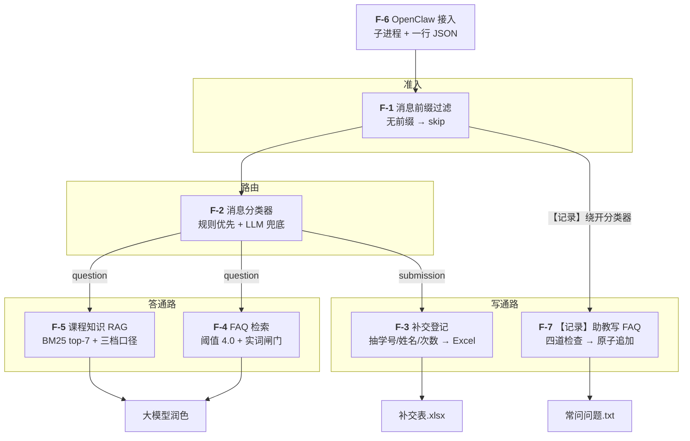

# 需求文档(PRD)

> 文档目标:把"懒人助教"模糊的期望写成可执行的需求,让 Claude Code / OpenClaw 能无歧义地实现。

> ⚠️ **时效性(2026-09-20 校订)**
> 这是 **2026-04 的初版需求**,用户故事(US-1~4)和功能需求(F-1~F-6)的骨架现在依然成立。
> **本文保留原样不改写** —— 它是"当时提了什么"的记录,抹掉就查不出后来为什么变成现在这样。
> 但**下面这张表里的东西已经和现状不同了**,读 §3~§5 之前先看它。
> **"现在系统到底怎么跑"请看 [`knowledge_base.md`](knowledge_base.md)。**

| 初版写的 | 现状 | 为什么变了 |
|---|---|---|
| 数据在 `C:\...\Downloads\雨课堂问题\` | **`~/ykt_questions/`**(WSL 原生目录) | 中文路径 + 跨文件系统 IO 慢;`config.WINDOWS_ROOT` 默认已改 |
| 资料目录叫 `数电资料/` | **`materials/`** | 里面现在装着**两门课**,再叫"数电资料"是错的 |
| §5 "❌ 不做多课程支持(只服务数电实验课)" | **已服务两门课**:数电实验 + 电路基础(理论课) | 助教实际带了两门;同一份索引,靠分档和锚点区分(见 `knowledge_base.md` §1) |
| F-4 只写了"最高分 > 阈值 4.0 即命中" | **再加一道实词闸门** | 实测「什么是竞争冒险」以 4.83 分**假命中**「电路基础作业的截止时间是什么时候?」—— 中文疑问句里 `是/什么/的` 几乎每句都有 |
| F-4 "命中的 Q/A 交给 LLM 润色后回复" | **事务题只走 FAQ、不查资料,但仍然要润色;概念题把 FAQ 当补充材料** | 分档之后才知道该不该短路,详见 `knowledge_base.md` §1 / §5.4。⚠️ 本文曾把"不查资料"误写成"**不调大模型**",**已于 2026-09-20 勘误** —— 两处改法方向相反 |
| F-5 "资料里没有就说明" | **分三档**:概念题放开讲(须自报"供参考")/ 事务题死守资料 / 题号题只认那道题 | 一刀切会让概念题全被"资料里没有"挡死;而事务题和题号题又必须死守 |
| F-5 检索 top-5 | **top-7**(`RAG_TOP_K`) | 一份语料的中位分块数是 5、最长 11,取 5 会把同一条解答的后面几块切掉 |
| 数据源只有 PDF/DOCX/XLSX | 还有 **PPTX**(讲义/错误集锦)、**扫描版 PDF 需 OCR**、**Markdown 语料** | 见 `knowledge_base.md` §3 |
| 隐私:"学生信息不上传外部" | **不变,而且更严**:姓名/学号/网名进语料前一律脱敏 | 只有任课老师和助教网名可公开 |

## 1. 背景

- **用户**:中山大学信通院研究生,担任数字电路与逻辑设计实验课助教。
- **痛点**:每周要手工处理作业补交登记、回答学生重复提问。
- **现有能力**:Windows 11 + WSL Ubuntu;Claude Code 已装;OpenClaw 微信 Bot 已接入 MinMax 大模型 API。

## 2. 用户故事

### US-1:自动登记作业补交
> 作为助教,我把学生发来的补交消息转发给 OpenClaw,我希望系统自动识别出学生姓名、学号、补交的作业次数,并写入补交表 Excel,这样我就不用再手工登记。

### US-2:自动回答常见问题
> 作为助教,当学生问"Proteus 在哪下载""我没交作业怎么办"这类重复问题时,我希望 OpenClaw 能直接根据我整理的 FAQ 自动回复,我只需审一眼。

### US-3:自动回答数电知识问题
> 作为助教,当学生问数电课内容时(比如"什么是竞争冒险?"),我希望系统能从我整理的数电资料里找到相关片段,结合 LLM 生成答案,而不是让我翻资料。

### US-4:所有文件在一处
> 作为一个怕乱的人,我希望所有项目代码、文档、日志、索引都在 `C:\Users\YOUR_USERNAME\Downloads\ta-assistant\` 下,不要到处散落。

## 3. 功能需求



> 图里 **F-7 是从 F-1 直接分出去的**(不进分类器)—— 这是实现里的硬约束:
> `main.process()` 中它的闸门必须排在**学生转发闸门之前**,顺序反了会被判成
> "非学生消息"丢掉,而且**看起来一切正常**。见 `design.md` §3.11 / `deployment.md` §3。

### F-1 消息前缀过滤
- **输入**:原始转发消息字符串
- **规则**:只有以 `【转发学生提问】` 开头的消息才进入后续处理;否则直接返回 `{"type": "skip", "reply": "(非学生消息,未处理)"}`
- **原因**:OpenClaw 会收到各类消息(闲聊、转发、系统通知),加前缀区分"需要处理的学生消息"与其他消息
- **配置**:前缀常量在 `src/config.STUDENT_FORWARD_PREFIX`,可通过 `.env` 的 `FORWARD_PREFIX` 覆盖
- **【当前】例外**:`【记录】`(F-7)是**助教的元命令、不带学生转发前缀**,
  所以它必须在**这道闸门之前**判 —— 顺序反了会被当成"非学生消息"丢掉,
  而且**看起来一切正常**(回一句"未处理"就算完了)。实现见 `design.md` §3.10

### F-2 消息分类器
- **输入**:经前缀过滤后的微信文本(剥掉前缀后的内容,可能包含图片描述、学号、姓名、问题等)
- **输出**:消息类型 ∈ {`submission`(补交), `question`(提问), `unknown`(不确定,兜底)}
- **策略**:
  - 优先**关键词匹配**:出现"漏交""补交""没交""作业"且包含 8 位学号 → 判为 `submission`
  - 出现疑问词"?""?""怎么""为什么""在哪""可以吗""吗" → 判为 `question`
  - 两者都不满足或同时满足 → 调用 LLM 做兜底判断(返回 JSON)
- **容错**:分类错误时默认按 `question` 走,因为 Q&A 不会破坏数据

### F-3 补交登记模块
- **数据源**(**【当前】都在数据目录 `WINDOWS_ROOT` 下,默认 `~/ykt_questions/`**,
  路径由 `config.py` 拼,**不要在代码里裸写绝对路径**):
  - 学生花名册:**`<WINDOWS_ROOT>/花名册/电路基础理论课_学生名单.xlsx`**(只读,用于姓名/学号校验)
    —— ⚠️ **【勘误 2026-09-20,同日已修】** 原写作
    `<WINDOWS_ROOT>/数电资料/…成绩记分册_*.xlsx`,而**那个目录不存在**;
    就算改对路径,那份 xlsx 里写着 `<dimension ref="A1"/>`(错的范围声明),
    `openpyxl(read_only=True)` 会把它读成 1 行 1 列。
    **后果:学号/姓名校验从未真正生效过**(补交表 378 个数据行**全部**是「名单缺失」)。
    现已改掉三处:独立出 `花名册/` 目录、**按表头文字自动定位**(不再写死行列号)、
    `read_only=False`;并补了 `scripts/check_roster.py` 做正向自检。
    选**哪个文件**是助教定的(本学期名单 = 雨课堂导出,169 人);
    换学期覆盖同名文件即可,不用改代码。始末见 `knowledge_base.md` §8 第 12 条
  - ⚠️ **名单不是教学资料**,所以**不放在 `materials/` 里** —— 原先那份记分册躺在
    `materials/` 下,被 `build_index.py` 当成课程资料解析进了 RAG 索引。
    详见 `knowledge_base.md` §3.1
  - 补交记录表:`<WINDOWS_ROOT>/数字电路与逻辑设计实验（一）补交表.xlsx`(读写;**不存在则自动创建**,字段见下)
- **补交记录表字段**(如不存在自动创建):

  | 字段 | 示例 | 说明 |
  |---|---|---|
  | 登记时间 | 2026-04-19 14:32 | 系统当前时间 |
  | 学号 | 20230001 | 8 位数字,从消息中正则抽取 |
  | 姓名 | 张三 | 中文姓名,从消息或花名册反查 |
  | 作业次数 | 第 1 次 | 如消息提到"第 X 次" / "Chapter X" / "作业 X" |
  | 原始消息 | "老师您好 数电作业昨天没交上去" | 完整保留 |
  | 校验状态 | OK / 学号不在名单 / 姓名不匹配 | 交叉校验结果 |

- **抽取逻辑**:
  1. 正则 `\b\d{8}\b` 找学号
  2. 中文姓名:若消息明显含"姓名:XXX"或 2-4 字中文连续片段(排除课程名关键词)则提取;否则用学号反查花名册
  3. 作业次数:正则 `第\s*([一二三四五六七八九十\d]+)\s*[次章]` / `作业\s*(\d+)` / `chapter\s*(\d+)` / `实验\s*(\d+)`
  4. 校验:学号存在于花名册 ✓ / 姓名与花名册一致 ✓
- **幂等性**:同一学号同一作业次数在 24 小时内重复登记 → 追加一条但在"校验状态"标记"重复"

### F-4 FAQ 检索模块
- **数据源**:`<WINDOWS_ROOT>/常问问题.txt`(默认 `~/ykt_questions/常问问题.txt`)
- **格式约定**:文件里每条 FAQ 用 `Q:` / `A:` 分隔,空行分段(参考样例)
- **检索策略**:
  1. 解析 txt → 得到 `[(Q, A), ...]`
  2. 对 Q 做 BM25 打分(中文分词用 `jieba`)
  3. 取 top-3,若最高分 > 阈值(默认 4.0)、**且与提问共享至少一个实词**,则视为命中
- **输出**(**【当前】与初版不同**):只有**事务题**(提交/截止/成绩/考试)允许
  **跳过资料通路、只用 FAQ 当依据**;概念题即使 FAQ 命中,也**当补充材料**一并喂给大模型,不短路。
  未命中则进入 F-5。
  ⚠️ **勘误(2026-09-20)**:这里原写作"直接发 FAQ 答案、**不调大模型**",是错的 ——
  代码里这段没有 `return`,大模型照样会被调一次(28 条事务题 FAQ 比对过:
  **FAQ 原文里有、答复里丢了的数字 = 0 条**,所以润色不丢事实;答复会换写法、也会增补)。
  保留调用的理由、以及那 18 条"多出来"的分类,见 `knowledge_base.md` §5.4

### F-5 课程知识 RAG 模块
- **数据源**:`<WINDOWS_ROOT>/materials/` 下全部文档(**【当前】装着两门课**)
  - `*.pdf` → `pdfplumber` 提取文本(**纯扫描件抽不出来,需 OCR**,见 `knowledge_base.md` §3.5)
  - `*.docx` / `*.doc` → `python-docx`(doc 先转 docx 用 `libreoffice --convert-to docx`)
  - `*.xlsx` → `openpyxl`(把每个单元格拼成"sheet:行列:内容")
  - **【当前】`*.pptx`** → `python-pptx`,**必须递归组合形状 + 读表格**(讲义和错误集锦的要点全在 group 里)
  - **【当前】`*.md`** → 直接读(OCR/脚本生成的语料就是这个格式)
- **索引构建**(一次性,放在 `scripts/build_index.py`):
  1. 遍历数据源目录,解析所有文档(**`00_*` / `_*` 是给人看的目录清单,跳过不进索引**)
  2. 按段落切块(`CHUNK_SIZE=400`,重叠 50 字)
  3. **【当前】把文档开头的 `检索:` 锚点行复制进每一块** ——
     否则只有第 0 块带锚点,含解答正文的第 2 块得 0 分,检索召不回解答
  4. 用 BM25 建倒排索引,**再用 Lucene 公式重算一遍 IDF**(见 `knowledge_base.md` §3.6:
     库的默认实现对高频词会兜底成一个正数,等于把虚词当成了正证据)
  5. 序列化到 `data/index/bm25_index.pkl`,含每块元信息 `{source, text, ...}`
- **检索**:query → jieba 分词 → **BM25 top-7**(`RAG_TOP_K`)→ 拼成 context
- **生成**(**【当前】分档,不再一刀切**):把 `context + 学生问题` 喂给大模型,
  要求按档位作答 ——
  **① 概念题**先看检索到的教材/讲义(教材 > 讲义 > 通用知识),用通用知识讲时
  必须自报"供参考",并尽量结合作业题;
  **② 事务题**一个字都不许猜;
  **③ 题号题**只认资料里那道题,不许自己解。

### F-6 OpenClaw 接入
- **调用方式**:OpenClaw 收到我转发的消息后,执行:
  ```bash
  python3 /home/<user>/ta-assistant/scripts/openclaw_bridge.py --message "<转发内容>"
  ```
  或通过 HTTP 调用本地服务(`src/main.py` 启动 FastAPI,监听 127.0.0.1:8765)
- **返回**:JSON `{"type": "submission"|"question", "reply": "要发回微信的话"}`
- **OpenClaw 做**:把 `reply` 发回我的微信(最终由我决定是否转发给学生)

### F-7 `【记录】` 助教写 FAQ 的入口(**【当前】新增,2026-09-20**)

- **背景**:F-4 的 FAQ 是**手写的 txt**,加一条要开编辑器、手抄格式、还没有任何校验。
  本项是**唯一一条"助教 → 系统"的写通路**(学生消息里没有这个前缀)。
- **输入**:助教直接发给机器人(不经学生转发前缀)的
  `【记录】问题:<学生问的那句话>` + `标准答案:<以后该怎么答>`
  (标签认 `问题/问/Q` × `标准答案/答案/答/A`,全角半角冒号都认)
- **输出**:JSON `{"type": "record", "reply": "✅ …" | "❌ 没记: <原因>"}`
- **规则**(拒绝时**一个字节都不写**):
  1. **含个人信息就拒** —— 8 位以上连续数字(学号)、花名册里的姓名。回执**不复述**个人信息
  2. **太长就拒** —— 问题 >200 字 / 答案 >1000 字
  3. **拿不准就拒** —— 缺答案、两条粘在一起、答案里出现行首 `A:`(会截断条目),都请助教分次重发
  4. **FAQ 文件不存在就拒,绝不自动创建** —— 路径配错时自动建会**安静地**分裂出第二份知识库
  5. 与现有条目重复 → 拒;**近乎重复** → 写进去但回执里提醒
- **落盘**:追加写(`.tmp` + `os.replace`),保留原文件的换行风格与 BOM;**写完回读校验**,
  新条目解析不出来就按原字节回滚
- **生效**:**立即**。`FAQRetriever` 每次调用现读文件、没有常驻缓存,不用重建索引

## 4. 非功能需求

| 类别 | 要求 |
|---|---|
| 响应时间 | 单次调用 < 10 秒(含 LLM) |
| 稳定性 | 任一模块挂掉不影响其他(补交挂了还能答疑) |
| 可观测 | 所有操作追加到 `data/logs/YYYY-MM.log`(JSON Lines 格式) |
| 可维护 | 所有路径、阈值、提示词集中在 `src/config.py` 和 `.env` |
| 中文友好 | 输出、日志、文档全中文;jieba 分词;UTF-8 编码 |
| 隐私 | 学生信息不上传外部(除了必要的 LLM 调用),API Key 不写进代码 |
| **【当前】可回归** | 改语料/锚点/检索参数前后必须能**量化对比**,不能只靠人肉抽查 —— `pytest test/ -q`(离线)+ `scripts/eval_retrieval.py --compare`(有回归退出码 1) |

## 5. 非目标(明确不做)

- ❌ 不做图片 OCR(学生发截图时只提取文字消息)
  —— **【当前】这条只对"学生发的截图"成立**。**扫描版教材**那条路后来还是 OCR 了
  (纯扫描件没有文字层,不 OCR 就进不了库),用的是独立脚本 + 独立 venv,
  见 `knowledge_base.md` §3.5。**题图仍然没做**,那还是最大的洞。
- ❌ 不自动回复给学生(最终人工审阅后转发)
- ❌ 不改成绩、不打分
- ❌ 不做 Web 管理界面(命令行 + 日志足矣)
- ~~❌ 不做多课程支持(只服务数电实验课)~~ → **【当前】已服务两门课**
  (数电实验 + 电路基础)。这是**后来改的**,原因和代价见本文开头那张对照表。

## 6. 验收标准

- [ ] 转发"【转发学生提问】张三 20230001 作业昨天没交" → 补交表新增一行,姓名/学号/时间/原文填对
- [ ] 转发"【转发学生提问】proteus 在哪下载?" → 返回基于 FAQ 的答复
- [ ] 转发"【转发学生提问】什么是竞争冒险?" → 返回基于 `面试--数电.docx` 的答复,末尾标注资料来源
- [ ] 无前缀消息"你好啊今天天气不错" → 返回 `{"type": "skip"}`,不处理
- [ ] 学号不在花名册 → 补交表"校验状态"写"学号不在名单",不中止流程
      —— **【勘误】这项此前从未通过过**(花名册读不出来,见 F-3 的勘误,每条都落到"名单缺失")。
      花名册已于 2026-09-20 修好,`test/test_submission_table_isolation.py` 与
      `test/test_roster.py` 钉住了"名单能读出来"和"读不出来会降级但不报错"两件事 ——
      **但"人肉在微信里发一条真补交"这一步仍未做过**(现有补交表里的数据全是单测写的,
      已归档,见 `knowledge_base.md` §8 第 13 条),验收时要补一次
- [ ] **【当前】发 `【记录】问题:测试 20259999999 在哪交作业` → 回 `❌ 没记`**
      (刻意带一个假学号 —— 既验通路,又**不会**往手写的 FAQ 里写坏数据)
- [ ] **【当前】发一条正常的 `【记录】` → 回 `✅`,紧接着用同样的问法提问 → 能命中刚记的那条**
      (验"立刻生效",即 FAQ 没有常驻缓存这件事是真的)
- [ ] **【当前】`python scripts/check_roster.py` 退出码 0,且报出的人数与名单相符**
      (换学期、换导出格式之后必跑。名单读不出来时补交**照样登记成功**,
      只是校验状态永远写「名单缺失」—— 不看这条就发现不了,见 F-3 的勘误)
- [ ] 所有操作在 `data/logs/` 可查
- [ ] 一键重建索引:`python scripts/build_index.py` 即可
- [ ] **【当前】提问"什么是叠加原理" → 答复里有教材(带页码)+ 例题 + 通用知识,三样都有**
      —— 这是助教**亲手验收过**的那一条,别改坏
- [ ] **【当前】`pytest test/ -q` 全绿,且 `scripts/eval_retrieval.py --compare` 退出码 0**

## 7. 风险 & 待讨论

- **R-1 doc 格式**:老式 `.doc`(非 `.docx`)需要先转换,依赖 `libreoffice`。若 WSL 无 libreoffice,`scripts/setup.sh` 自动安装。
- **R-2 中文路径**:Windows 中文路径在 WSL 访问可能有编码问题,所有路径在 `config.py` 显式用 `Path` 对象处理。
- **R-3 LLM 分类不稳定**:LLM 兜底分类可能偶尔错判,用"宁可当问题处理"的策略保兜底。
- **R-4 补交表并发**:助教不会高并发,文件锁暂不处理,但写入用"读-改-存"原子化。
