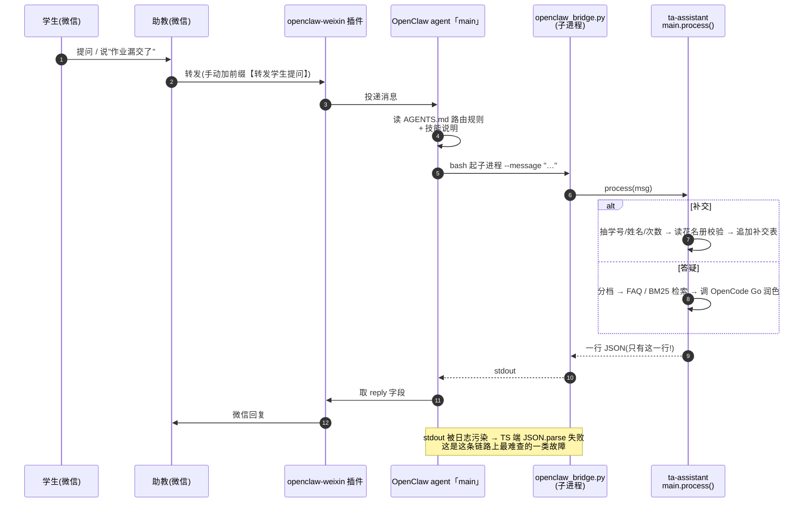

# 微信端到端跑通手册

> 记录时间:2026-09-17,最后更新 2026-09-20 · 环境:Windows 11 + WSL2 Ubuntu-24.04 + OpenClaw **2026.9.4** + Node 24.21
> 本文记录的是**实测跑通**的那条链路,每一步都附上可复制的命令和实测输出。
> 姊妹文档:`deployment.md`(从零部署)、`design.md`(内部设计)。
>
> **2026-09-17 变更记录**:MiniMax 额度用尽,全线切到 **OpenCode Go 套餐**(`deepseek-v4.1-flash`);
> OpenClaw 为支持 Go 从 2026.6.5 升级到 2026.9.4。升级过程中踩的坑见 §7.1。
>
> **2026-09-20 变更记录**:修掉"每条微信回复都挂 `↪️ Model Fallback: aipai/claude-opus-4-8`"。
> 根因是**运行时会话状态里被自动回退钉住了 aipai**,改配置无效。修法 = 给 opencode-go
> 显式声明模型 `contextWindow`(§4.3)+ 从 `modelPolicy.allow` 摘掉非 opencode-go 模型
> + 清掉会话状态里的覆盖字段。完整根因链与复现/修法见 **§7.5**。

---

## 0. 先说清楚:这条链路上谁负责什么

很多人(包括我)一开始会以为"ta-assistant 要自己去连微信"。**不是的。**

| 角色 | 是什么 | 职责 | 它挂了会怎样 |
|---|---|---|---|
| **微信** | 助教的微信号 + 学生 | 助教把学生消息**转发**给 Bot | — |
| **openclaw-weixin 插件** | OpenClaw 的微信渠道插件 | 连接微信侧网关,收消息、发回复 | 微信里 Bot 不吭声 |
| **OpenClaw agent** | 一个有 bash 工具的大模型智能体 | 判断消息类型,调后端,把结果发回微信 | Bot 回复变智障(自己瞎答) |
| **agent 的模型** | OpenCode Go 套餐(`deepseek-v4.1-flash`) | agent 自己的"大脑" | 回退到 `aipai/claude-opus-4-8`;见 §4.3 |
| **ta-assistant** | 本项目,一个**被调用**的 Python 程序 | 补交登记(写 Excel)/ 答疑(查资料 + 大模型) | 返回错误 JSON,agent 说"暂时不可用" |
| **OpenCode Go API** | 第三方大模型(同一套餐,独立配额) | 把检索到的资料组织成通顺回答;概念题允许用自己的通用知识讲解(见 §7.7) | 答疑降级为"资料原文"(仍可用) |

> **两个模型是两套独立配置**:agent 的在 `~/.openclaw/openclaw.json`,
> ta-assistant 的在 `~/ta-assistant/.env`。**改一个不会影响另一个**,排障时要分开看。
> 现在两边都用 OpenCode Go,但用的是两个不同的 Key 字段(`OPENCODE_API_KEY` vs `LLM_API_KEY`)。

**关键认知**:ta-assistant 不是常驻服务,它不主动连微信,也没有端口在监听。
它就是一个**命令行程序**:OpenClaw 每次需要处理学生消息时,起一个子进程调它,读一行 JSON,进程结束。

**一次转发到底经过谁**(顺序图;下面那张 ASCII 图是同一件事的"谁住在哪"视角):



```
                        ┌──────────────────────────────────────────────┐
   助教微信 ──转发──▶  │  OpenClaw(WSL, systemd 常驻)                 │
   带前缀的消息         │                                              │
                        │  ① openclaw-weixin 渠道收消息                │
                        │  ② 投递给 agent「main」会话                  │
                        │  ③ agent 读 AGENTS.md 路由规则 + 技能说明    │
                        │  ④ bash 起子进程:                            │
                        │     .venv/bin/python scripts/openclaw_bridge.py │
                        │  ⑤ 读回一行 JSON,把 reply 原样发回微信      │
                        └───────────────┬──────────────────────────────┘
                                        │ 子进程(stdin/stdout)
                        ┌───────────────▼──────────────────────────────┐
   助教微信 ◀──回复──   │  ta-assistant(被调用,跑完即退)             │
                        │  前缀过滤 → 分类 → 补交 handler / 答疑 handler │
                        │        │                  │                  │
                        │   写 Excel 补交表   分档 → FAQ / BM25 检索      │
                        │                       └─▶ OpenCode Go 大模型  │
                        └──────────────────────────────────────────────┘
```

---

## 1. 为什么接入方式是"技能 + AGENTS.md",而不是改代码

OpenClaw 的 agent 本身就能跑 shell,还支持 **workspace 技能**(`SKILL.md`)。
所以接 ta-assistant 的正确做法不是改它的源码,而是**用它的扩展点告诉它该调什么**:

| 接入件 | 装在哪 | 作用 |
|---|---|---|
| `deploy/openclaw/workspace/skills/ta-assistant/SKILL.md` | `~/.openclaw/workspace/skills/ta-assistant/SKILL.md` | 怎么调、返回 JSON 怎么处理、失败怎么办 |
| 路由规则段落 | 追加到 `~/.openclaw/workspace/AGENTS.md` 末尾 | 带前缀的消息**不许自己回答**,必须走后端 |

这样做的三个好处:

1. **不动 OpenClaw 的配置结构**(`openclaw.json` 一个字没改),它升级不会把我们覆盖掉
2. **接入件进版本库**,随 `ta-assistant` 一起同步、一起回滚
3. **失败可诊断**:"agent 没调用后端" 和 "后端自己挂了" 是两件事,分开查

> 升级路径:想要 100% 确定性、不经过大模型判断,可以把 ta-assistant 包装成 **MCP 工具**(`openclaw mcp add`),
> 让 agent 调工具而不是跑 shell。当前方案够用,先不引入(见 `deploy/openclaw/README.md`)。

---

## 2. 一键安装接入件

在 WSL 里:

```bash
cd ~/ta-assistant
bash scripts/install_openclaw_skill.sh
```

脚本做三件事(全部**幂等**,可以反复跑):

1. 拷贝技能文件到 `~/.openclaw/workspace/skills/ta-assistant/SKILL.md`(覆盖更新)
2. 把路由规则追加到 `AGENTS.md`(**只在没有标记时追加一次**;追加前自动备份成 `AGENTS.md.bak.<时间戳>`)
3. 自动跑一次 bridge 冒烟自检

实测输出:

```
==> 项目根目录 : /home/jj/ta-assistant
==> 目标 workspace: /home/jj/.openclaw/workspace
==> [1/3] 技能已装:/home/jj/.openclaw/workspace/skills/ta-assistant/SKILL.md
==> [2/3] 路由规则已追加到 AGENTS.md(旧文件已备份为 AGENTS.md.bak.*)
==> [3/3] 后端自检:
    bridge OK(exit=0),JSON 前 120 字:
    {"type": "question", "reply": "(LLM 暂不可用,以下是相关资料原文)\n【来源:...
```

确认 OpenClaw 真的看到了这个技能:

```bash
openclaw skills list | grep -i ta-assistant
openclaw skills info ta-assistant
```

实测:

```
│ ✓ ready  │ ta-assistant │ 数字电路实验课助教后端(ta-...  │ openclaw-workspace │

Details:
  Source: openclaw-workspace        ← 关键:来自 workspace,不是 bundled
  Path: ~/.openclaw/workspace/skills/ta-assistant/SKILL.md
  Visible to model: yes
```

**回滚方式**:删掉 `~/.openclaw/workspace/skills/ta-assistant/`,
再用备份还原 AGENTS.md:`cp ~/.openclaw/workspace/AGENTS.md.bak.<时间戳> ~/.openclaw/workspace/AGENTS.md`。

---

## 3. 五段健康检查(从小到大排障)

按这个顺序查,能一次定位问题出在哪一跳。

### 3.1 第一段:ta-assistant 本体(不涉及 OpenClaw)

```bash
/home/jj/ta-assistant/.venv/bin/python \
  /home/jj/ta-assistant/scripts/openclaw_bridge.py \
  --message '【转发学生提问】Proteus 在哪下载?'
```

期望:**stdout 恰好一行 JSON**,形如 `{"type": "question", "reply": "...", "sources": [...]}`,退出码 0。

```bash
# 看后端有没有记录这次调用(每次都会写)
tail -5 ~/ta-assistant/data/logs/$(date +%Y-%m).log
```

### 3.2 第二段:ta-assistant 的大模型通道是否可用

答疑会调大模型润色。额度/权限/网络有问题时,**整条链路不会崩**,而是降级:
答复变成"资料原文 + 来源列表"(格式是 `(LLM 暂不可用,以下是相关资料原文)`)。

**用项目自己的客户端探活**(比手搓 HTTP 准,因为带上了一样的请求头和重试逻辑,且不打印 Key):

```bash
cd ~/ta-assistant && .venv/bin/python -c "
import sys; sys.path.insert(0, '.')
from src.llm.minmax import MinMaxClient
c = MinMaxClient.from_env()
print('端点    :', c.endpoint)
print('模型    :', c.model)
print('Key 长度:', len(c.api_key), '(0 = 会退回旧 MiniMax 通道)')
print('会话头  :', c.session_header or '(不发送)')
out = c.chat('回答要简洁准确。', '用一句话说什么是竞争冒险。')
print('回答    :', out[:120] if out else '(空 —— 没调通)')
"
```

> 模块名还叫 `minmax.py` 是**历史原因**(为了不动 `handlers/` 里的 import),
> 它现在其实是个 **OpenAI 兼容客户端**,默认走 OpenCode Go。命名见 §7.1。

判读:

| 输出 | 含义 |
|---|---|
| 有非空回答,且 `data/logs/llm.log` 新增一行 `"ok": true` | 大模型正常 |
| 回答为空 + `llm.log` 里 `"ok": false` | 看 `llm.log` 的 `error` 字段 |
| 只要一调用就 400 `MissingSessionID` | 少了 `x-opencode-session` 头(客户端会自动带,除非 `LLM_SESSION_HEADER` 被清空) |
| 403 且提到 Cloudflare(code 1010) | UA 被拦,检查 `LLM_USER_AGENT` 是否被改成空 |
| `Key 长度: 0` | `.env` 里 `LLM_API_KEY` 没填,会静默走旧的 MiniMax 兜底通道 |

### 3.3 第三段:OpenClaw 网关与微信渠道

```bash
systemctl --user status openclaw-gateway.service     # 是否常驻在跑
openclaw channels list                               # 渠道是否配置
openclaw channels status                             # 渠道是否真的连着
```

实测:

```
openclaw-weixin default: installed, configured, enabled
openclaw-weixin af17203b49a1-im-bot: installed, configured, enabled

# channels status:
Gateway reachable.
- openclaw-weixin af17203b49a1-im-bot: enabled, configured, running, in:11h ago
```

`in:11h ago` = 该账号**最近一次收到入站消息**距今多久。如果这个数字一直不更新,
说明**微信侧根本没有消息进来**(网关没收到),问题在微信这一跳,不在 ta-assistant。

### 3.4 第四段:agent 是否能正确路由(不经过微信)

这是最有价值的一步:它绕开微信,直接给 agent 喂一条带前缀的消息。

```bash
cd ~/.openclaw/workspace
openclaw agent --agent main --message '【转发学生提问】什么是竞争冒险?'
```

> 注意必须带 `--agent main`,否则报 `No target session selected`。

**成功的样子**:agent 的回复**约等于** ta-assistant 的 `reply` 原文;
同时 `~/ta-assistant/data/logs/2026-09.log` **新增 3 行**(`process_input` / `classify` / `reply`)。

实测(2026-09-17 18:39,**大模型已通**):

```
$ openclaw agent --agent main --message "【转发学生提问】什么是竞争冒险?"
**竞争与冒险**

- **竞争**:在组合逻辑电路中,同一个信号经不同路径、不同延时到达某一会合点,
  导致到达时间有先有后,这种现象叫竞争。
- **冒险**:由竞争引起的电路输出端出现瞬间错误(毛刺)的现象,称为冒险。
...
参考:面试--数电.docx, 实验讲义2024.pdf, 数电模电电分复习.docx

$ wc -l < ~/ta-assistant/data/logs/2026-09.log
14   ← 调用前
17   ← 调用后(多了 process_input / classify / reply 三行)
```

> 如果回复是 `(LLM 暂不可用,以下是相关资料原文)`,说明链路是通的、只是大模型那一跳挂了
> —— 去跑 §3.2,不用查 OpenClaw。

**反例测试**(确认它不会乱调后端):

```bash
openclaw agent --agent main --message "今天下午三点开会"
# 期望:后端日志行数不变(agent 没有调用 bridge)
```

### 3.5 第五段:微信真机

前三段都过了,最后只剩"微信那一跳"。用你自己的微信给 Bot 发一条:

```
【转发学生提问】Proteus 在哪下载?
```

同时开一个窗口盯着后端日志:

```bash
tail -f ~/ta-assistant/data/logs/$(date +%Y-%m).log
```

- **日志有新行 + 微信收到回复** → 全链路通 ✅
- **日志无新行** → 消息没到达 agent。查 `openclaw channels status`(渠道是不是 running)、
  以及 OpenClaw 网关日志 `openclaw logs`
- **日志有新行但微信没回复** → agent 调了后端但没把结果发出去,查 agent 会话记录
  (`~/.openclaw/agents/main/sessions/`)

---

## 4. 日常运维

### 4.1 启动顺序(重启机器后)

```bash
# 1. OpenClaw 网关(systemd user 服务,开机自启,一般不用管)
systemctl --user status openclaw-gateway.service
systemctl --user restart openclaw-gateway.service   # 需要重启时

# 2. ta-assistant 不需要启动 —— 它是被调用的命令行程序
```

**ta-assistant 没有常驻进程,不需要启动、不会因为重启机器而失效。**

### 4.2 什么时候需要动配置

| 场景 | 要做什么 |
|---|---|
| 加/改转发前缀 | 改 `~/ta-assistant/.env` 的 `FORWARD_PREFIX`(逗号分隔,覆盖默认全部),同时**更新技能里的前缀说明**并重跑安装脚本 |
| 加新资料(PDF/DOCX) | 放进 `~/ykt_questions/materials/`,重跑 `python scripts/build_index.py` |
| 加新 FAQ | 往 `~/ykt_questions/常问问题.txt` 追加 `Q:` / `A:` 块,**不用**重建索引 |
| 换大模型 / 换 Key(**ta-assistant 侧**) | 改 `~/ta-assistant/.env` 的 `LLM_*`,重跑 §3.2 探活 |
| 换大模型 / 换 Key(**agent 侧**) | 改 `~/.openclaw/openclaw.json`(**key 要填两处**:`env.vars` 和 `models.providers`),重启网关,按 §4.3 验证 |
| 更新接入件 | 改仓库里 `deploy/openclaw/`,同步到 WSL,重跑 `install_openclaw_skill.sh` |

### 4.3 agent 用哪个模型(OpenCode Go 配置)

**这条链路上有两个大模型,别搞混**:

| 谁在用 | 干什么 | 配置在哪 |
|---|---|---|
| OpenClaw agent | 读消息、决定调不调后端、把 `reply` 发回微信 | `~/.openclaw/openclaw.json`(本节) |
| ta-assistant | 答疑时把检索到的资料组织成通顺回答(概念题可叠加模型自己的通用知识) | `~/ta-assistant/.env` 的 `LLM_*`(见 §3.2) |

OpenClaw **内置**了 OpenCode Go 接入(provider id `opencode-go`,带运行时模型发现),
但**光填一个 key 不够** —— 见下面的"⚠️ 关键坑"。

```json5
// ~/.openclaw/openclaw.json
{
  // ① key 放这里(环境变量形式,给子进程用)
  env: { vars: { OPENCODE_API_KEY: "PUT-YOUR-OPENCODE-GO-API-KEY-HERE" } },

  // ② ⚠️ 还必须显式声明 provider 并把 key 挂上去,否则实时模型发现不会开
  models: {
    providers: {
      "opencode-go": {
        api: "openai-completions",
        baseUrl: "https://opencode.ai/zen/go/v1",
        apiKey: "PUT-YOUR-OPENCODE-GO-API-KEY-HERE",   // ← 同一个 key,填两遍

        // ③ ⚠️⚠️ 还要**逐条声明模型元数据**,尤其是 contextWindow。见 §7.5。
        //    在线目录(/zen/go/v1/models)只返回一串裸 id,不带任何元数据;
        //    而 OpenClaw 自带种子表里漏了 deepseek-v4.1-flash。
        //    两处都没有 ⇒ 运行时认为这个模型"上下文窗口未知"。
        //    下面的窗口值照抄种子表里同族的 deepseek-v4-flash / -pro。
        models: [
          { id: "deepseek-v4.1-flash", name: "DeepSeek V4.1 Flash", input: ["text"],
            contextWindow: 1000000, maxTokens: 384000 },
          { id: "deepseek-v4-flash",   name: "DeepSeek V4 Flash",   input: ["text"],
            contextWindow: 1000000, maxTokens: 384000 },
          { id: "deepseek-v4-pro",     name: "DeepSeek V4 Pro",     reasoning: true, input: ["text"],
            contextWindow: 1000000, maxTokens: 384000 },
          { id: "kimi-k3",             name: "Kimi K3",             input: ["text", "image"],
            contextWindow: 1048576, maxTokens: 131072 },
        ],
      },
    },
  },

  agents: {
    defaults: {
      model: {
        primary: "opencode-go/deepseek-v4.1-flash",   // 默认模型(唯一在用的)
        fallbacks: [],                                 // ← 留空:不挂任何备用模型
      },
      // ④ 放行哪些模型允许被 --model 覆盖(不在表里会被拒:
      //    Model override "..." is not allowed for agent "main")
      //
      //    这份名单还有第二个作用:**它是运行时"自动回退"的候选池**。
      //    所以这里只留 opencode-go 的模型 —— 名单里只要还有别的家,
      //    一旦主模型被判"不可用",运行时就会自己挑一个顶上并**写进会话状态**,
      //    从此每轮都走那个模型,还在每条回复后面挂一行 fallback 通知(见 §7.5)。
      //    minimax 的额度已用尽、aipai 是特意不用的,都不能留在这里当候补。
      modelPolicy: {
        allow: [
          "opencode-go/deepseek-v4.1-flash",
          "opencode-go/deepseek-v4-flash",
          "opencode-go/deepseek-v4-pro",
          "opencode-go/kimi-k3",
        ],
      },
    },
  },
}
```

> aipai(claude)的 `models.providers.aipai` 段、`apiKey` 和别名 `AI派` 都**原样留着**当痕迹,
> 只是从 `modelPolicy.allow` 里摘掉,让它**不可能被自动选中**。

**⚠️ 关键坑(2026-09-17 踩了一整个下午)**:`env.vars` 里的 key **不会进网关自己的进程环境**
(它只在派子进程时注入),而 provider 的认证解析恰恰读的是自己的进程环境。
于是 `auth.discoveryApiKey` 永远是空,插件退回**内置静态模型表**;
静态表里**没有 `deepseek-v4.1-flash`**(只有 `deepseek-v4-flash` / `-pro`),
所以报 `FailoverError: Unknown model` → **静默回退到 `claude-opus-4-8`**。

网关启动日志里那句 `[gateway] agent model: opencode-go/deepseek-v4.1-flash`
**只是配置回显,不是校验结果**,别被它骗了 —— 真正的判据在下面"怎么确认真的在用 deepseek"。

**生效 + 验证(4 步)**:

```bash
# ① 改配置(用 patch,比手改 JSON 稳,会走 schema 校验)
openclaw config patch --file /tmp/patch.json5
openclaw config validate          # 期望:Config valid

# ② 重启网关
systemctl --user restart openclaw-gateway.service

# ③ 发一条真消息给 agent
openclaw agent --agent main --message '用一句话解释竞争冒险,不要调用任何工具。'

# ④ 看网关日志里"实际发出的请求"(唯一可信的证据)
grep -oE "provider=[a-z-]+ api=[a-z-]+ model=[a-z0-9.-]+" \
  /tmp/openclaw/openclaw-$(date +%Y-%m-%d).log | tail -3
grep -c "Fell back to" /tmp/openclaw/openclaw-$(date +%Y-%m-%d).log
```

**怎么确认真的在用 deepseek**:日志里必须出现

```
[model-fetch] start provider=opencode-go api=openai-completions model=deepseek-v4.1-flash
[model-fetch] response ... status=200
```

且**没有** `Model "opencode-go/..." not found. Fell back to "aipai/claude-opus-4-8".`
出现 fallback 就说明模型名没解析成功,回到本节看 §7.1。

> **为什么不挂 fallback**:2026-09-17 起 `fallbacks` **留空**。原因是原来的备用模型
> `aipai/claude-opus-4-8` 端点频繁超时(`ETIMEDOUT` 120s+ / `ECONNRESET`),
> 一旦切过去,整个 agent 会话就**卡死**(日志里的 `stalled session` / `repeated_model_requests_without_progress`),
> 而且还会把 "fallback" 这件事写进 agent 自己的记忆里反复念(见 §7.4)。
> **宁可报错,也不要静默降级到一个又慢又说不清的模型。**
>
> `aipai` 的 provider 块、apiKey、别名("AI派")都**原样保留**在配置里,
> 想临时启用手动 `--model aipai/claude-opus-4-8` 仍然可以(它在 `modelPolicy.allow` 里);
> 要恢复自动兜底,把 `fallbacks` 改回数组即可。

**换默认模型**:

```bash
openclaw config set agents.defaults.model.primary "opencode-go/kimi-k3"
systemctl --user restart openclaw-gateway.service
# 记得把它也加进 agents.defaults.modelPolicy.allow
```

Go 套餐常用模型 ref(完整列表 `curl -s https://opencode.ai/zen/go/v1/models`,
但**注意要带 `x-opencode-session` 头才不被拒**):

| model ref | 说明 |
|---|---|
| `opencode-go/deepseek-v4.1-flash` | **当前默认**,快、便宜 |
| `opencode-go/deepseek-v4-flash` | 内置静态表里有,保底可用 |
| `opencode-go/deepseek-v4-pro` | 1M 上下文,推理强 |
| `opencode-go/kimi-k3` | OpenClaw 官方给 Go 档的默认值 |
| `opencode-go/qwen3.8-max` | 通义旗舰,中文强 |

> 排障小抄:`openclaw models list` 看当前生效模型(带 `default` 标记);
> `openclaw config get agents.defaults.model` 看配置值;
> 改完配置**必须重启网关**,否则还是旧模型。
> **`openclaw models list --provider opencode-go` 显示 "No models found" 是正常的**
> (它只列"配置里显式声明"的),不代表模型用不了 —— 以网关日志为准。

### 4.4 看日志

```bash
tail -f ~/ta-assistant/data/logs/$(date +%Y-%m).log   # 后端逐条事件(JSON 行)
tail -f ~/ta-assistant/data/logs/llm.log              # 每次大模型调用的耗时/长度
openclaw logs                                          # OpenClaw 网关日志
openclaw channels logs --lines 50                      # 渠道收发日志

# agent 到底调了哪个模型(排"是不是又 fallback 了"最快的办法)
grep -oE "provider=[a-z-]+ api=[a-z-]+ model=[a-z0-9.-]+" \
  /tmp/openclaw/openclaw-$(date +%Y-%m-%d).log | tail -5
# 有没有回退
grep "Fell back to" /tmp/openclaw/openclaw-$(date +%Y-%m-%d).log | tail -3

# 网关日志是 JSON 行,想看清可读文本可以这样过滤
journalctl --user -u openclaw-gateway.service --since "10 min ago" --no-pager | \
  grep -oE '"(message|error)":"[^"]{0,160}"' | tail -20
```

---

## 5. 故障排查表

| 症状 | 最可能的原因 | 怎么查 / 怎么修 |
|---|---|---|
| 微信发消息,Bot 完全不理 | 渠道断了 / 微信侧掉线 | `openclaw channels status`,看 `running` 与 `in:... ago` |
| Bot 回"非学生消息,未处理" | 前缀被剥掉或被改字符 | 查后端日志的 `process_input` 事件,对比 `first_20_codepoints` 与 `prefix_used` |
| Bot 自己瞎答,没走后端 | agent 没读到路由规则/技能 | `openclaw skills info ta-assistant` 看 `Visible to model: yes`;确认 AGENTS.md 里有路由段落 |
| 答复变成"资料原文" | ta-assistant 的大模型通道挂了(额度/Key/网络) | 跑 §3.2 探活,看 `data/logs/llm.log` 的 `ok` / `error` |
| 微信 Bot 答得"不像 deepseek"(例如回退到昂贵的 claude) | agent 的模型名没解析成功,**静默回退**到 `fallbacks` | 日志里搜 `Fell back to`;§4.3 ⚠️ 关键坑 + §7.1 |
| **每条**回复后面都挂着 `↪️ Model Fallback: aipai/…` | 会话状态里被自动回退**钉住**了旧模型,配置改不动它 | `openclaw sessions` 看 Model 列;查 `session_nodes.entry_json` 的 `modelOverrideSource`;**§7.5** |
| Bot 每条回复都要提某个**配置里已经没有**的东西(模型名/fallback/旧规则) | agent 自己写的记忆被每轮召回 | `grep -rn "<那段话>" ~/.openclaw/workspace/`;§7.4 |
| Bot 长时间不回,会话"卡住" | 模型端点超时,`stalled session` | 日志搜 `stalled session`;确认 `fallbacks` 为空、主模型端点可达 |
| 答复是"知识库尚未构建" | 索引没建 / 资料目录变了 | `python scripts/build_index.py` |
| 补交没登记上 | 学号不在花名册 / 正则没抽到 | 看 `reply` 里的原因;核对成绩记分册里的学号 |
| `openclaw agent` 报 `No target session selected` | 没指定会话 | 加 `--agent main` |
| bridge stdout 不是纯 JSON | 某处 `print()` 污染了 stdout | 回归测试:`pytest test/test_bridge_stdout_clean.py -v` |

---

## 6. 三层验证清单(改完东西照着过一遍)

```bash
# ① 后端层(30 秒,不依赖 OpenClaw)
~/ta-assistant/.venv/bin/python ~/ta-assistant/scripts/openclaw_bridge.py \
  --message '【转发学生提问】Proteus 在哪下载?'
pytest ~/ta-assistant/test/ -q
# 检索有没有退化(改了语料/锚点/参数之后必跑;基线缺失也会返回 1)
cd ~/ta-assistant && ./.venv/bin/python scripts/eval_retrieval.py --compare

# ② agent 层(1 分钟,不依赖微信)
cd ~/.openclaw/workspace && openclaw agent --agent main --message '【转发学生提问】什么是竞争冒险?'

# ③ 微信层(需要手机)
#    自己在微信里给 Bot 发一条带前缀的消息,盯着后端日志
tail -f ~/ta-assistant/data/logs/$(date +%Y-%m).log
```

---

## 7. 已知问题与待办(2026-09-17 首次实测,2026-09-20 增补)

### 7.1 MiniMax 额度用尽 → 全线切 OpenCode Go(已解决 ✅)

**起因**:MiniMax Token Plan 额度用尽(探活返回 `status_code: 2056`),
答疑的"润色"环节降级成"资料原文"。于是把 **agent 和 ta-assistant 两边**都换成
OpenCode Go 套餐的 `deepseek-v4.1-flash`。

**ta-assistant 侧**:改 `.env` 即可,已跑通。
`src/llm/minmax.py` 被改写成 OpenAI 兼容客户端(**模块/类名故意没改**,免得动 `handlers/` 的 import)。
回滚开关:把 `.env` 里 `LLM_API_KEY` 清空,会自动退回旧 MiniMax 通道。

**OpenClaw 侧**:踩了三个坑,全部已解决 ——

| # | 坑 | 现象 | 解法 |
|---|---|---|---|
| 1 | 2026.6.5 根本用不了 Go | 静态模型表里没有 `deepseek-v4.1-flash`,且整个版本搜不到 `x-opencode-session` | 升级到 **2026.9.4**(要求 Node ≥24.16) |
| 2 | 升级后微信通道崩 | `channel exited: Package subpath './plugin-sdk/channel-runtime' is not defined by "exports"` —— 新版**删掉了这个导出**,而微信插件 2.4.3 还在 import 旧名字 | `openclaw plugins update @tencent-weixin/openclaw-weixin@latest`(2.4.3 → 2.4.9)。**注意插件被 pin 住,`update --all` 不会升它** |
| 3 | 升级后仍 fallback 回 claude-opus | 见 §4.3 ⚠️ 关键坑:`env.vars` 的 key 进不了 provider 认证,实时模型发现不开,退回静态表 → `Unknown model` | 在 `models.providers["opencode-go"]` 里显式挂 `apiKey` |

**升级 OpenClaw 的正确姿势**(下次别再踩):

```bash
# ① 先停网关(数据库迁移要求离线),再备份
systemctl --user stop openclaw-gateway.service
cp ~/.openclaw/openclaw.json ~/.openclaw/openclaw.json.bak.$(date +%Y%m%d-%H%M%S)
cp ~/.openclaw/agents/main/agent/openclaw-agent.sqlite ~/.openclaw/openclaw-agent.sqlite.bak.$(date +%Y%m%d-%H%M%S)

# ② 升级(npm 11 会默认跳过 postinstall 脚本,必须显式放行,否则内置插件装不上)
npm i -g openclaw@latest --allow-scripts=openclaw,@google/genai,koffi,tree-sitter-bash,protobufjs

# ③ 修配置 + 迁移数据库(一条命令全干)
openclaw doctor --fix

# ④ 校验后启动
openclaw config validate
systemctl --user start openclaw-gateway.service
```

> **坑中坑**:`openclaw config patch` 在配置**不合法时会拒绝写入**,
> 而配置不合法恰恰就是你要改它的原因 —— 这时只能靠 `openclaw doctor --fix` 破局。
>
> 版本间 schema 变了:`env.OPENCODE_API_KEY` → `env.vars.OPENCODE_API_KEY`,
> 另外 `meta.lastTouchedAt`、`gateway.controlUi.allowInsecureAuth`、`gateway.tailscale.resetOnExit`、
> `gateway.nodes.denyCommands`、`plugins.bundledDiscovery` 这 5 个键**被彻底删除**(不是挪位置)。
> `agents.defaults.models`(旧)→ `agents.defaults.modelPolicy.allow`(新)。
>
> 回滚:`npm i -g openclaw@2026.6.5` + 还原 sqlite/配置备份
> (前提是**没跑过** `doctor --fix`,跑过就必须一起还原 sqlite)。

### 7.2 FAQ 文件缺失

`~/ykt_questions/常问问题.txt` 不存在,日志里每次都会提示:

```
[FAQRetriever] FAQ 文件不存在:/home/jj/ykt_questions/常问问题.txt
```

FAQ 是"第一级高速通道"(精确匹配、不花大模型额度),缺了会直接掉到 BM25 + 大模型。
**注意**:只有**课程事务类**提问(交作业/截止/成绩/考试)才会走这条速通;
概念题和具体题号一律要查资料并调大模型 —— 这是 2026-09-20 晚的分档改造,
详见 `docs/knowledge_base.md` §6 与 §7.7。
把文件放到位即可,不需要重建索引。

### 7.3 补交去重(24 小时窗口)未实现

重复提交会**追加**一条新记录,而不是标记"重复"。助教核对时需要自己看。

### 7.4 agent 的"自传记忆"会把旧话题一直挂在嘴边 ⚠️

**现象**:修好 fallback 之后,微信 Bot **每条回复都还要提一句"fallback 备用模型是 aipai/claude-opus-4-8"**。

**原因**:OpenClaw 的 `memory-core` 插件会**自动把会话里的事写进 workspace 的记忆文件**
(`~/.openclaw/workspace/memory/YYYY-MM-DD.md`),而且**每轮对话都会召回**。
它自己写了这么一段:

```markdown
- 12:57 / 16:06 用户两次问「你是什么模型?」→ 我两次错误回答为 `aipai/claude-opus-4-8`。
- **模型身份必须以当前 turn 的 Runtime/系统上下文为准**…更不要把 fallback 别名当作当前模型报给用户。
```

这段被召回进上下文 → 模型就顺着聊 fallback。**配置改对了也没用,因为污染源不在配置里。**

> 排查手法:回复里出现了配置里已不存在的东西时,`grep -rn "<那段话>" ~/.openclaw/workspace/`。

**处理**:

```bash
# ① 备份后重写记忆文件,删掉污染内容
cp ~/.openclaw/workspace/memory/2026-09-17.md{,.bak.$(date +%Y%m%d-%H%M%S)}
#    …编辑该文件…

# ② 重建派生索引(否则旧文本还留在索引里,照样被召回)
openclaw memory reset --yes    # 清掉派生索引 + 向量缓存(不删会话)
openclaw memory index          # 从文件重建

# ③ 验证(用新文件里确实存在的词,证明检索本身是好的)
openclaw memory search fallback   # 期望 No matches
openclaw memory search 运行时      # 期望能搜到新内容
```

> `memory reset` 在非交互模式下**必须加 `--yes`**,否则报 `Memory reset requires confirmation`。
>
> 顺带一提:日志里 `memory_index_chunks_vec not updated — semantic vector embeddings unavailable`
> 是因为没配 embedding provider,**不影响**上面这套关键词召回。

### 7.5 每条微信回复都挂着 `↪️ Model Fallback: aipai/claude-opus-4-8 …` ⚠️⚠️

**现象**(2026-09-20):配置早就改对了 —— `primary` 是 deepseek、`fallbacks: []`、
aipai 也不在任何自动链路里 —— 但**每条**微信回复后面都跟着:

```
↪️ Model Fallback: aipai/claude-opus-4-8 (selected opencode-go/deepseek-v4.1-flash; selected model unavailable)
```

`selected model unavailable` 这半句很误导:它**不是**真实诊断,而是
`buildFallbackReasonSummary()` 在**一次请求都没发过**(`attempts` 为空)时的占位文案。

**这段通知是怎么来的**(源码 `dist/agent-runner.runtime-*.mjs`):

```js
function buildFallbackNotice(params) {
  const selected = formatProviderModelRef(params.selectedProvider, params.selectedModel); // 配置里选的
  const active   = formatProviderModelRef(params.activeProvider, params.activeModel);     // 这一轮实际用的
  if (areRuntimeModelRefsEquivalent(selected, active, { config: params.cfg })) return null;
  return `↪️ Model Fallback: ${active} (selected ${selected}; ${buildFallbackReasonSummary(params.attempts)})`;
}
```

**只要"这一轮实际用的模型" ≠ "配置里选的模型",就挂这行通知。** 所以问题不是"为什么回退",
而是"**为什么实际在用 aipai**"。

**根因(三层,缺一不可)**:

1. **运行时目录里 `deepseek-v4.1-flash` 没有上下文窗口。**
   - OpenClaw 的 `opencode-go` provider 靠在线发现拿模型列表,而
     `https://opencode.ai/zen/go/v1/models` **只返回一串裸 id,不带 `context_length` / `modalities`**:
     ```
     id=deepseek-v4.1-flash ctx=None max_out=None mod=None
     ```
   - OpenClaw 自带的种子表(`dist/provider-catalog-*.mjs`)是唯一的元数据来源,
     但它**整份 dist 里 0 次出现 `deepseek-v4.1-flash`**(同族的 `deepseek-v4-flash` /
     `-pro` 都在,声明了 `contextWindow: 1e6`)。
   - 两处都没有 ⇒ 目录里这个模型是 `Input: -  Ctx: -`。
2. **会话涨到 131k token,预检判定"选中的模型装不下"**(窗口未知 ⇒ 预算按内置默认 200k 算,
   而会话已经压线)。这一轮**连 HTTP 请求都没发出去**就换了模型 —— 这正是
   `attempts` 为空、通知里出现"selected model unavailable"占位串的原因。
   → 运行时从 **`modelPolicy.allow`(候选池)** 里挑下一个可用模型 = `aipai/claude-opus-4-8`
   (它声明了 128k,`Input: text+image`,是名单里唯一"有窗口"的备选)。
3. **这次自动回退被持久化进了会话状态。** 这是最关键、也最容易被忽略的一层:

```
$ python3 -c "…读 session_nodes.entry_json…"
modelProvider              : opencode-go
model                      : deepseek-v4.1-flash
providerOverride           : aipai                ← ★
modelOverride              : claude-opus-4-8      ← ★
modelOverrideSource        : auto                 ← ★ "auto" = 自动回退留下的
modelOverrideFallbackOriginProvider : opencode-go
modelOverrideFallbackOriginModel    : deepseek-v4.1-flash
authProfileOverride        : aipai:models-json    ← ★ 连认证 profile 都被钉到 aipai
authProfileOverrideSource  : auto
fallbackNotice             : { selectedModel: opencode-go/deepseek-v4.1-flash,
                               activeModel: aipai/claude-opus-4-8, reason: selected model unavailable }
```

**配置改一百遍也没用 —— 这枚钉子钉在会话状态里(sqlite),不在配置里。**
而且因为 `fallbacks: []`,运行时的 "selected" 永远是配置里的 deepseek,
"active" 永远是会话里钉住的 aipai,两者恒不相等 ⇒ **每轮都满足发通知的条件**。

**排查手法(三步锁定)**:

```bash
# ① 会话列表直接会显示它到底在跑哪个模型 + 上下文占用
openclaw sessions
#    │ direct │ agent:main:openc...wechat │ Model: claude-opus-4-8 │ 131k/128k (103%) │

# ② 逐轮比对"入站消息 → 实际请求的 provider"
python3 - <<'EOF'
import json,pathlib,re
for line in pathlib.Path("/tmp/openclaw/openclaw-$(date +%F).log").read_text(errors="ignore").splitlines():
    if "[model-fetch] start provider=" in line or "inbound: from=" in line:
        d=json.loads(line); print(d["time"][11:19], str(d.get("message"))[:110])
EOF
#   00:55:07  → opencode-go/deepseek-v4.1-flash     ← 第 1 轮好好的
#   00:55:23  → aipai/claude-opus-4-8               ← 第 2 轮一上来就是 aipai,没试过 deepseek

# ③ 直接读会话状态里的覆盖字段(上面那段)
```

**处理(2026-09-20 已做,`+` 号表示新加的)**:

```bash
# ① 配置:给 opencode-go 逐条声明 models(补上 contextWindow),并把非 opencode-go 的
#    模型从 modelPolicy.allow 里摘掉(见 §4.3)
cp ~/.openclaw/openclaw.json{,.bak.$(date +%Y%m%d-%H%M%S)}
#    …编辑… 然后校验:
openclaw config validate          # 期望:Config valid

# ② 停网关 —— 必须先停!否则内存里的旧会话状态会写回 sqlite
systemctl --user stop openclaw-gateway.service

# ③ 备份 sqlite
DB=~/.openclaw/agents/main/agent/openclaw-agent.sqlite
cp -a "$DB" "$DB.bak.pin.$(date +%Y%m%d-%H%M%S)"

# ④ 清掉会话状态里的模型 / 认证覆盖(这 9 个字段):
#    providerOverride, modelOverride, modelOverrideSource, modelOverrideRouteResolution,
#    modelOverrideFallbackOriginProvider, modelOverrideFallbackOriginModel,
#    authProfileOverride, authProfileOverrideSource, authProfileOverrideCompactionCount,
#    fallbackNotice
#    (用 python 读 session_nodes.entry_json → 删键 → UPDATE 回去,见 logs/)

# ⑤ 重启 + 验证
systemctl --user start openclaw-gateway.service
openclaw models list              # 期望 opencode-go 四行都有 Ctx:1000k / Input:text
openclaw sessions                 # 期望 Model 列变成 deepseek-v4.1-flash,131k/1000k (13%)
```

**实跑验证(不往微信发消息的办法)**:`openclaw agent` 的 `--deliver` **默认是 false**,
所以可以拿一次性会话跑真轮次,只把结果打到终端:

```bash
openclaw agent --session-key agent:main:selftest-$(date +%H%M%S) \
  -m "只回答两个字:收到" --json | python3 -c "
import json,sys; m=json.load(sys.stdin)['result']['meta']['agentMeta']
print(m['provider'], m['model'], m['contextTokens'], m['contextTokensSource'])"
# 期望:opencode-go deepseek-v4.1-flash 1000000 resolved
#        ↑ contextTokensSource 从"未知"变成 resolved,说明窗口真的解析到了
```

日志侧应对应上 `[model-fetch] start provider=opencode-go … status=200`,且**没有**任何
`Fell back to` / `embedded run failover decision` 行。

**教训**:

- 只看配置("我明明改对了")会一直卡住。**OpenClaw 的会话状态里有一层模型/认证覆盖,
  优先级高于配置,而且 `fallbacks: []` 挡不住它** —— 它走的是"自动回退"这条独立通路。
- `modelPolicy.allow` **不只是"允许手工切换的名单",它就是自动回退的候选池**。
  名单里留着一个能用但不想用的模型,等于给它留了一个随时被自动顶上的后门。
- 通知里的 reason 文案可信度有限:`selected model unavailable` 只是 `attempts` 为空时的占位串,
  不代表真的发过请求并失败。
- 判断"到底在用什么模型"的**唯一可信来源**是运行时日志的 `[model-fetch]` 行和
  `session_nodes.entry_json`,不是配置文件、也不是模型的自我陈述。

> 与 §7.4 的关系:7.4 解决的是"agent 在**对话里提到** fallback"(记忆污染),
> 7.5 解决的是"运行时**主动挂上** fallback 通知"(会话状态覆盖)。两件事都修了才算干净。

### 7.6 资料目录名 —— 已确认(2026-09-20 结案)

`src/config.py` 里 `MATERIALS_DIR = ~/ykt_questions/materials`,**就是实际在用的那份**,不用改配置。

一度以为要用的是 Windows 侧那份 `C:\Users\52880\Downloads\ykt_questions\`(旧部署文档里是这么写的),
但 2026-09-17 的补交表比对给出了结论:运行时后端在 **`~/ykt_questions/`** 下新建了
`补交表.xlsx`(工作表 `补交记录`,9 行,日期 2026-09-17),而 Windows 那份还是 4 月 21 日的
150 行成绩记分册。**所以 `~` 那份才是活的**,Windows 那份是历史遗留。
没有改动 `WINDOWS_ROOT`,也就不会把已登记的补交记录孤儿掉。

2026-09-20 已把 Windows 旧库里的数电资料搬进 `~/ykt_questions/materials/`,两份合流。
**知识库的完整说明(内容、来源、重建步骤、已知限制)见 [`knowledge_base.md`](knowledge_base.md)。**

### 7.7 概念题会回"这个我不确定,建议问任课老师" —— 已改 ✅(2026-09-20 晚)

助教反馈:问「什么是叠加原理」这种概念题,机器人只会回"建议问任课老师",
这不合理 —— 概念性的内容应当让大模型讲清楚,并**结合库里已布置的作业题**帮学生理解。

根因是提示词写死了"**只依据资料作答**,资料里没有就说不知道"。这条规则本身是为了治
"资料里没有却凭自己的知识瞎讲",但**做过头了**:知识库里只有**作业答案**、没有教材正文,
于是所有概念题都被这堵墙挡住。

现在把"资料里没有"拆成三档(`src/handlers/qa.py` 的 `_classify()` + `_SYSTEM_PROMPT`):

| 档 | 例子 | 行为 |
|---|---|---|
| 具体题号 | 1.36 怎么做 | 只认资料里那道题的解答;没有就明说没找到,**不许自己解**(版次不同题号会串) |
| 课程事务 | 怎么交作业、截止、成绩、考试安排 | **一个字都不许猜**,资料没有就回"这个我不确定,建议问任课老师" |
| 学科概念 | 什么是叠加原理 | **先看检索到的「教材」或「讲义」**(中文版第 6 版教材 / 张老师课件);有就以它为准,**没有**才用自己的通用教材知识(须自报「通用教材知识,供参考」)。两种情况都要挂上库里相关作业题当例子 |

顺带:FAQ 快路(命中就**不查资料**)现在**只留给事务题** —— 概念题即使命中 FAQ 也照常查资料,
把 FAQ 当补充材料一起喂进去;具体题号则连 FAQ 都不加(问 1.36 时那条"作业怎么提交"纯属噪声)。

> ⚠️ 这里原来写的是"命中就不调大模型",**是错的**:事务题命中 FAQ 时只是不查资料,
> 答复仍然由大模型润色(28 条实测:FAQ 原文里的数字**一条都没丢**,但会换写法、也会增补)。
> 四份文档同时写错了同一件事,勘误与实测见 [`knowledge_base.md`](knowledge_base.md) §5.4。

**注意:没有联网**。① 档的讲解**优先来自库里的教材/讲义**,两者都没有时才落回模型自己的
知识(这时才需要自报"通用教材知识")。但无论哪一路,都不是实时搜索结果 ——
`src/llm/minmax.py` 是纯 chat completion,没有 tool calling。要联网得先加搜索步骤。
完整说明与实测记录见 [`knowledge_base.md`](knowledge_base.md) §6。

> 教材进来之后(§7.9),这一档的"资料里有"覆盖面大了很多 —— 全书 19 章都有正文,
> 而讲义只覆盖 11 章、作业答案只覆盖 13 章。

### 7.8 作业答案用**中文版**的参数,不用国际版的 —— 已改 ✅(2026-09-20 深夜)

助教反馈:国际版教材和中文版作业册**个别题目的参数/单位不一样**(例如公里变成了英里),
所以**课后题答案要以中文版作业用书为准**。原先库里只有英文版 Soln,答出来的数可能是
错的那一版。

处理办法**不是**再加一套答案,而是让同一道题**落进同一个文件**:

```
materials/电路基础/1第一章/1.36.md
    【…参考答案(中文版)】 ← 标题头;正文与结论以此为准
    【中文详细解析】       ← 大模型按**中文原文**重新生成
    【原文(核对用,未经改动)】← 中文版原文
    【英文版对照(仅参考)】 ← 国际版原文降级到这里,并注明"数值一律以中文版为准"
```

优先级写在**文件结构**里,而不是靠提示词自觉 —— 中英两段同时在文件里时,
中文在前、英文那段顶着"仅参考"的帽子。提示词里另钉了一遍(`_SYSTEM_PROMPT` 的
【中文版优先】段),但那是第二道保险,不是第一道。

**对回答的实际影响**:同一道题问两遍不会再出两个数;学生照着算出来的答案和作业册一致。
中文版没布置的题(第 13、19 章等 12 道)**原样保留**,不受影响。

**注意**:本次**只重写了有中文版的那 56 题**的解析(英文版独有的题沿用旧解析,它们本就
不该被覆盖),所以大模型调用只多了 56 次。原理见 [`knowledge_base.md`](knowledge_base.md) §3.3。

### 7.9 中文版第 6 版教材 OCR 进库 —— 已完成 ✅(2026-09-20 深夜)

这是 7.7 那个问题的**根治**:概念题以前没有教材正文可依,只有 PPT 提纲和作业答案。
助教点名要的"中文版第六版教材"一直是库里唯一进不去的东西 —— 它 266 MB / 711 页,
是**纯扫描件**,`pdfplumber` 一个字都抽不出来。

现在用 RapidOCR 全量 OCR 后进了索引:**21 个文件 / 2106 块**(全书 19 章 + 附录 + 译者序)。

> **勘误(2026-09-20 更晚)**:同上那天稍后做了一轮教材语料审计,丢掉了 1 页
> 扫描仪元信息页,所以现在的数字是 **2105 块**(全库 3165 块)。
> 同一轮还修了 `Ω` 被 OCR 认成 `Q`(1932 处)和页码标记覆盖率(35.8% → 99.7%),
> 见 [`knowledge_base.md`](knowledge_base.md) §3.5.1。**本节下面的数字都是当时的实测值,
> 保留原样**;要引用就用 §3.5.1 那份。

| | |
|---|---|
| 引擎 | RapidOCR(ONNX)。选它不是因为效果好,是因为 `sudo` 要密码、装不了 tesseract |
| 耗时 | 711 页 / 12 进程 / **47.9 分钟**(约 3.2 秒每页),74.4 万字符 |
| 落盘 | `~/ykt_questions/materials/电路基础/教材/教材-第N章-<章名>.md` |
| 教材正文 | `/mnt/c/Users/52880/Downloads/202509电路理论基础/电路基础-中文版-原书第6版（扫描版）.pdf` |
| 中间产物 | `~/ykt_questions/_ocr_cache/电路基础-6th/p####.txt`(**按页缓存,不在 `materials/` 下**,不进索引) |

**三件必须知道的事:**

1. **页码对得上。** `印刷页 = PDF 页 − 16`(书前 16 页是罗马数字页码)。
   所以答复里说「教材第188页」,学生翻书就能找到 —— 错误集锦写的也是**书上页码**。
   这个偏移有 711 页逐页书眉自查兜底,零不一致。
2. **每页都带 `[教材 P{印刷页}]` 标记**,这是教材比讲义强的地方(PPT 没有页码)。
3. **公式是 OCR 出来的,会乱码。** 正文很准,公式/上下标常有错。提示词里因此加了一条:
   引用要给页码,看到不成句的公式就照实说"OCR 得不清楚,请对照教材 P某页",**不要猜**。

**没有把答案挤出去 —— 这是量出来的。** 教材占全库 66%,入库前后跑了同一组提问对照:
带题号的提问(`1.36 怎么做`、`13.11 那题怎么做`)答案文件**依然占满 top-7 而且分数还涨了**
(16.05→19.57、16.97→20.20),错误集锦仍在最前;而 `什么是叠加原理` 从
"讲义一句 + 数电噪声"变成"讲义 + **教材第4章/第10章**"。
完整对照表见 [`knowledge_base.md`](knowledge_base.md) §9.5。

**这一轮没有做的事**:题图仍然看不到(要到切图 + 挂题号那一步),
英文教材正文和 4th 版答案手册仍然不进索引(理由没变)。

### 7.10 检索质量的"闸门":修 IDF 兜底 + 建常驻评测 —— 已完成 ✅(2026-09-20 更晚)

**和微信链路本身无关,但会直接影响微信里回出来的话**,所以记在这里。
起因是助教验收「叠加原理」之后让我自己再找问题 —— 结果量出来一个**真错**:
问`什么是叠加原理`,`教材-第5章-运算放大器.md`(13.53 分)排在了**第 4 名**(13.47 分)前面,
两章毫无关系。

**根因在检索库的兜底,不在语料**:`rank_bm25` 对出现在**半数以上分块**里的词,
IDF 算出来是负数,它一律**兜底成同一个正数**。实测本库 `的`/`是`/`原理`
**全部等于 1.6994** —— 于是 `什么`+`是`+`原理` 给每一章白送 7.3 分,
**"什么词都匹配"成了证据**。换成 Lucene 的 IDF 写法后 `原理` 1.70 → **0.28**。

| 做了什么 | 效果 |
|---|---|
| 换 Lucene IDF(`apply_lucene_idf`) | ch4/ch5 名次反转**已纠正**;17 条评测用例仍 **17/17**,MRR 0.956 |
| 教材语料审计 | `Ω`→`Q` 修回 **1932** 处;页码标记覆盖 35.8% → **99.7%** |
| 建评测闸门 | `scripts/eval_retrieval.py` + `test/test_retrieval_recall.py`(共用 17 条真实提问)+ 基线 JSON |

**如实说**:严格表上的"无关教材章"只从 **8 条降到 7 条,没有归零** ——
剩下的是**真正的词形匹配**(第 17 章的"叠加"指谐波叠加、第 10 章确有叠加的交流应用),
**再调 IDF 也降不下去**,要归零得换向量检索或按课程分索引。

**这一轮的教训里有一条和微信运维直接相关**:
**"闸门失效"必须当成失败来报。** 评测基线一度只存在于 WSL 侧,
被一次带 `--delete` 的同步删掉了,而 `--compare` 缺基线时**返回 0** ——
闸门整个失效却一路绿灯。现在缺基线返回 **1**,并加了 `test/test_eval_baseline.py` 守着基线。
细节见 [`knowledge_base.md`](knowledge_base.md) §3.6 / §9.6。

---

## 8. 附录:路径与端口速查

| 东西 | 路径 / 值 |
|---|---|
| 项目代码(WSL) | `/home/jj/ta-assistant/` |
| 项目代码(Windows) | `C:\Users\52880\Downloads\ta-assistant\` |
| Python 解释器(项目) | `/home/jj/ta-assistant/.venv/bin/python` |
| Python 解释器(**OCR 专用**) | `/home/jj/ocr-venv/bin/python`(RapidOCR + ONNX Runtime,不装进项目 venv) |
| bridge 入口 | `/home/jj/ta-assistant/scripts/openclaw_bridge.py` |
| 后端日志 | `/home/jj/ta-assistant/data/logs/YYYY-MM.log`、`llm.log` |
| RAG 索引 | `/home/jj/ta-assistant/data/index/bm25_index.pkl` |
| **检索评测基线**(要随代码提交) | `/home/jj/ta-assistant/data/eval/retrieval_baseline.json` |
| 业务数据根目录 | `/home/jj/ykt_questions/`(资料 `materials/`、`常问问题.txt`、补交表 xlsx) |
| 教材 OCR 缓存(中间产物,不进索引) | `/home/jj/ykt_questions/_ocr_cache/电路基础-6th/p####.txt` |
| 教材语料(进索引) | `/home/jj/ykt_questions/materials/电路基础/教材/` |
| OpenClaw 配置 | `/home/jj/.openclaw/openclaw.json` |
| OpenClaw agent workspace | `/home/jj/.openclaw/workspace/`(`AGENTS.md`、`skills/`) |
| OpenClaw agent 数据库 | `/home/jj/.openclaw/agents/main/agent/openclaw-agent.sqlite`(升级前必须备份) |
| OpenClaw 网关端口 | `18789`(systemd user: `openclaw-gateway.service`) |
| OpenClaw CLI | `/home/jj/.npm-global/bin/openclaw` |
| OpenClaw 网关日志 | `/tmp/openclaw/openclaw-YYYY-MM-DD.log` |
| 版本 | OpenClaw **2026.9.4** · Node **v24.21.0** · 微信插件 **2.4.9** |

### 本文档的 HTML 版本

```bash
cd ~/ta-assistant
python scripts/md2html.py docs/wechat_end_to_end.md   # → docs/wechat_end_to_end.html
```

生成的 HTML 是**单文件、内联样式**,双击就能在浏览器里看,也可以直接发给别人。
